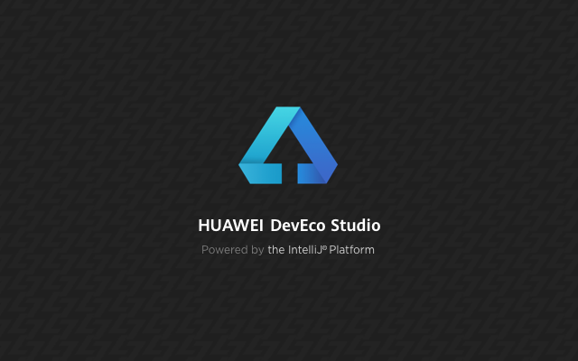
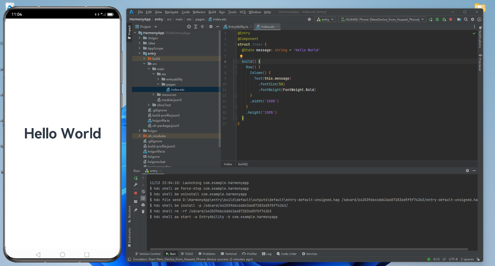
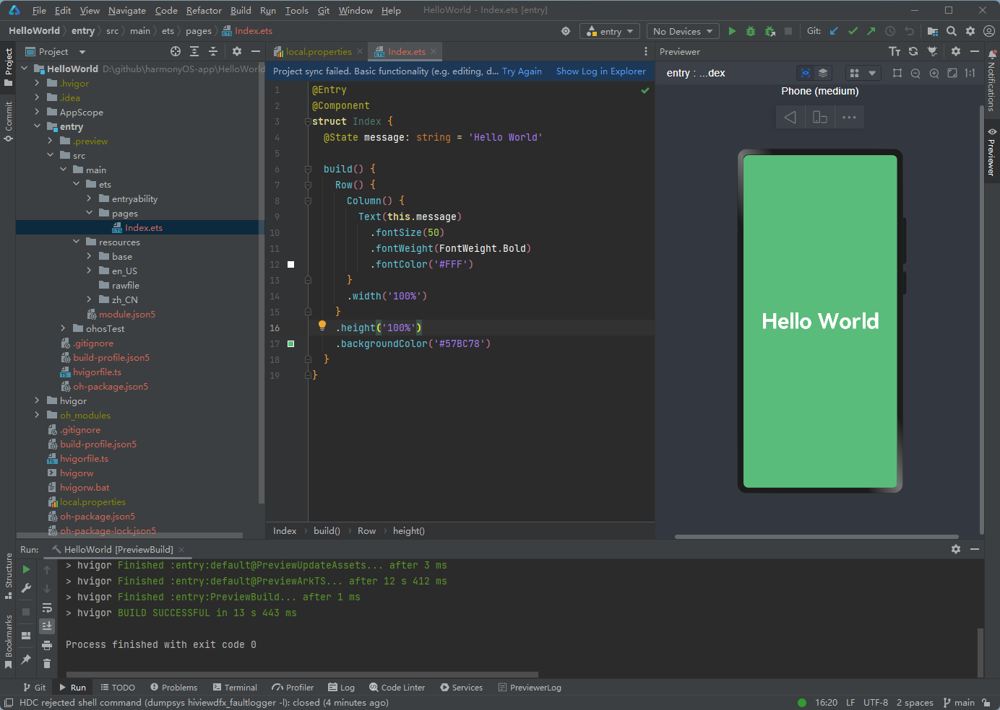
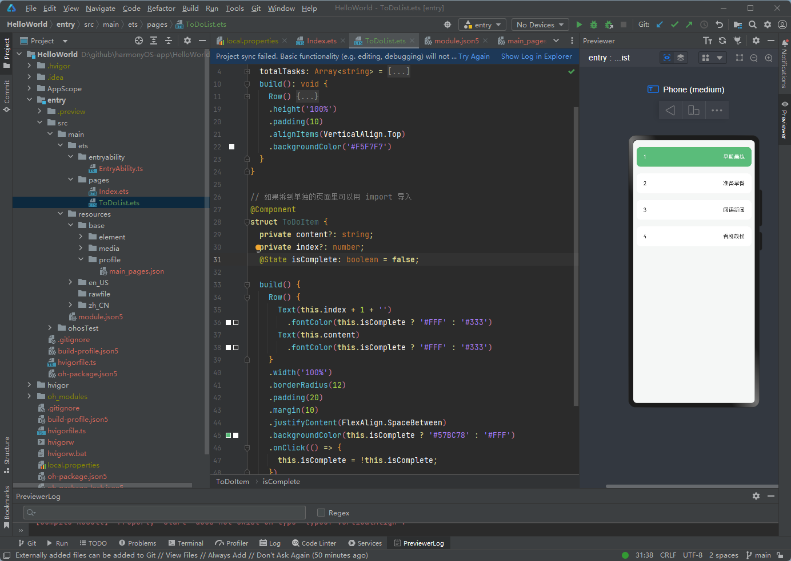
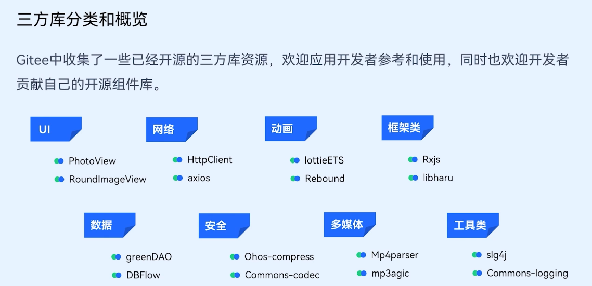

# HarmonyOS鸿蒙应用开发初体验

### 开发环境
直接下载安装好官方开发工具 DevEco Studio，这个长得和 vscode 很像，logo 晃眼一看还以为是 vscode 的弟弟。里面有集成开发环境，整体界面、菜单和 Java 的 IntelliJ IDEA 很像。

安装好开发工具后还需要安装 nodejs，而且版本要求在 v14.19.1 - v17.0.0 之间（不包括17.0.0），还有 ohpm（类似前端里常用的 npm，用来管理安装第三方包）、HarmonyOS SDK。


### Hello World
直接按照官方文档新建一个空项目，操作步骤和界面和 Android Studio 类似，一些内置的模板、安装模拟器这些也都差不多，毕竟都是做app开发的，都是这些东西。

官方的模拟器还是挺精致的，边框都是金光闪闪的，开机动画也很高级，比 Android Studio 的高档。


### ArkTS 开发语言
官方支持用 Java、ArkTS、JS 和 C/C++ 开发，不过 Java 最新版本已经不支持了，主推的是 ArkTS，这个是在 TypeScript 基础上扩展的，所以如果 TypeScript 玩得溜也没啥难度。适配的设备主要是手机 Phone 和平板 Tablet，其他还有 TV、Wearable、Car。

构建UI界面的方式和 Flutter 很像，可能习惯了 web 里的 html、css、js 分离的写法后很不适应，就跟在 vue 里直接写 render 函数去渲染组件一样，逻辑、结构、样式都在一块，一层套一层。

预览既可以通过上方的 devices 设备管理里安装模拟器来预览，也可以点击开发工具右侧的 Previewer 来预览页面效果，Previewer 可以实时预览当前操作的页面，调试更加方便。


### 项目结构
整个项目结构跟 Java 项目类似，module.json5 里配置项目信息(比如入口文件 srcEntry)，pages 目录下添加页面文件，resources\base\profile\main_pages.json 文件里定义页面路径配置信息。

新建页面直接在 pages 目录下右键新建一个 Page，会生成默认页面代码，然后在 main_pages.json 里配置路径，@Entry 是页面入口组件，普通组件只用加 @Component，构建UI的语法和 Flutter 类似，也和 react 的类组件很像，样式大部分都跟 css 一样，只不过换个写法，注意样式设置单个 margin、padding 时要传一个对象分别去设置：margin({ top: 5 })、padding({ left: 5 })，点击事件可以直接用 onClick 绑定：


### 应用程序框架

生命周期：
* UIAbility 实例生命周期：onCreate、（onWindowStageCreate）onForeground、onBackground、（onWindowStageDestroy）onDestroy
* 页面生命周期，被 @Entry 修饰：onPageShow、onPageHide、onBackPress
* 组件生命周期，被 @Component 修饰：aboutToAppear、aboutToDisappear

一些公共配置或者静态资源可以放在 resources/base 目录下，页面通过 $r('app.xx.xx'）就能获取到，比如全局颜色定义、图片...注意只要涉及到网络数据的，都需要在 module.json5 文件中添加 ohos.permission.INTERNET 权限，比如网络图片、http 请求、web组件加载网络页面这些。

开发中要打印调试信息可以用 console.info('xx')，对标前端常用的 console.log。

#### 路由
页面跳转需要用到 router，参数可以放到 params 中，页面接收参数需要用到 router.getParams() 方法，返回上一页 router.back()：
```ts
import router from '@ohos/router'

router.pushUrl({
    url: 'pages/index',
    params: {}
})
```

#### 网络请求
发送请求需要用到 @ohos.net.http 包，直接 http.createHttp() 就能创建出一个 http 对象，然后就可以用来发送 http 请求了。
```ts
import http from '@ohos.net.http'
let httpRequest = http.createHttp()

let promise = httpRequest.request('https://EXAMPLE_URL', {
    method: http.RequestMethod.POST,
    extraData: { // post 参数
        "param1": "value1",
        "param2": "value2"
    }
})

promise.then((data) => {
    if (data.responseCode === http.ResponseCode.OK) {
        console.info('Result:' + data.result)
    }
}).catch((err) => {
    console.info('error:' + JSON.stringify(err))
})
```

#### 模块化
模块化用 import 导入，export、export default 导出，和咱平时前端开发一样：
```ts
// 导入组件
import CustomComponent from './components/CustomComponent'

// 导出组件
@Component
export default struct CustomComponent {
    build() {
        Text('我是一个自定义组件')
    }
}
```

#### 依赖管理
最新的 API version 9 版本包管理工具需要用 ohpm，跟 npm 类似，依赖配置文件 oh-package.json5、oh-package-lock.json5 也跟前端常用的 package.json 一样，安装需要的第三方库跟前端一样：ohpm install xxx，安装好的依赖在 oh_modules 目录下，HarmonyOS 官方推荐的一些第三方库：


官方有提供很多学习课程，可以在下方的文档里查看，[HarmonyOS应用开发者基础认证](https://developer.huawei.com/consumer/cn/training/dev-cert-detail/101666948302721398)这个课程学习完，考过了还会给你发一个认证证书，都是比较基础的内容，一天就能学习完：


### 文档
* [HarmonyOS Developer](https://developer.harmonyos.com/)
* [HarmonyOS应用开发者基础认证](https://developer.huawei.com/consumer/cn/training/dev-cert-detail/101666948302721398)