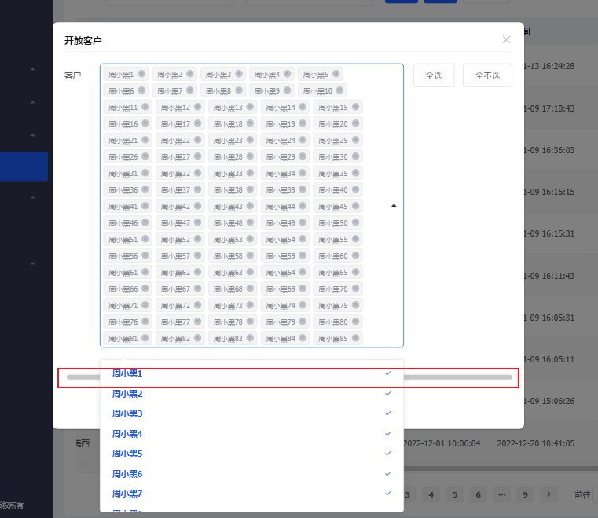
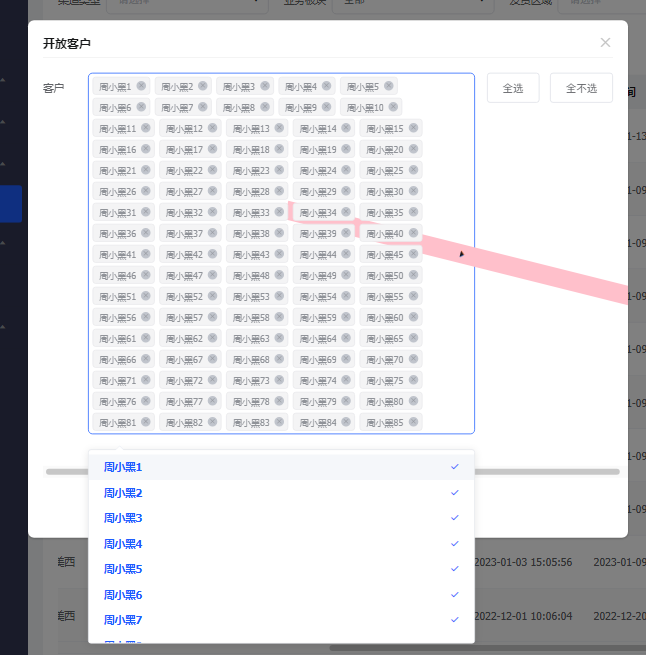
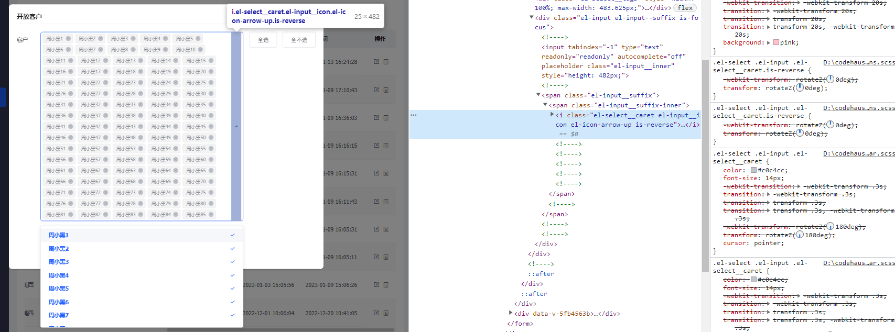

# element-ui下拉框el-select多选出现滚动条闪现

弹窗组件中放置了el-select下拉框组件，多选项较多时，聚焦弹出下拉选择框时，下方会出现一个横向滚动条闪现一下，虽然不影响使用，但是作为一个追求完美的码农肯定是受不了的。



### 原因

通过不懈的努力终于发现了原来是组件右侧的箭头图标旋转动画旋转时造成的页面布局被撑开。

按正常的做法只用给那个箭头图标加一个旋转动画就行了，但是呢element偷懒直接给加给了图标组件的外层，那货又跟选择框高度一样高，直接把这个长条条旋转了180度，当整个多选框的高度旋转到0度时如果超出了弹窗就会出现滚动条：



因为动画是设置的 0.3s，速度比较快不容易排查，我们可以自己额外把动画时间改大点，再给图标的盒子加个背景色，就很容易复现出来了，给 el-input__icon 类名加上如下样式：transition: transform 20s; background: pink;



### 解决方式

* 一种方式我们可以直接给弹窗的盒子加个 overflow: hidden 隐藏掉滚动条
* 另一种方式就是去覆盖 el-select 的右侧图标旋转动画，把动画加到图标上，代码如下：

```scss
.el-input__suffix .el-input__suffix-inner { // 解决聚焦的时候会有闪现一下滚动条
  .el-input__icon {
    transform: rotateZ(0deg);
    // transition: transform 20s;
    // background: pink;
    &::before {
      display: inline-block;
      transition: transform .3s;
      transform: rotateZ(180deg);
    }
    &.is-reverse::before {
       transform: rotateZ(0deg);
    }
  }
}
```