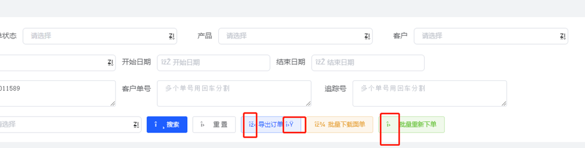
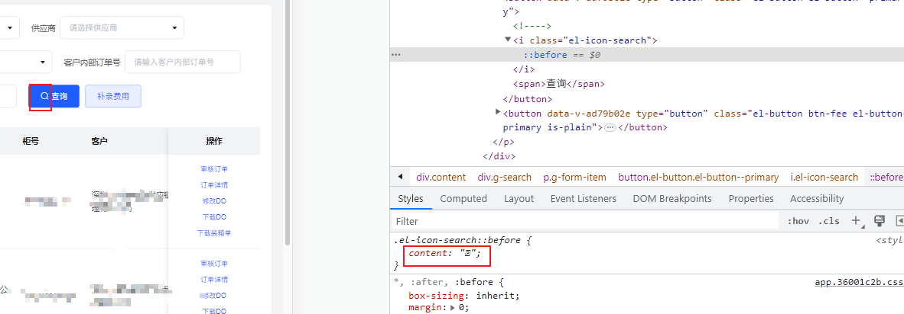
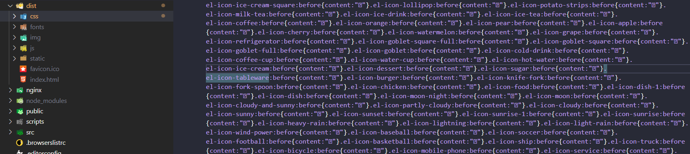
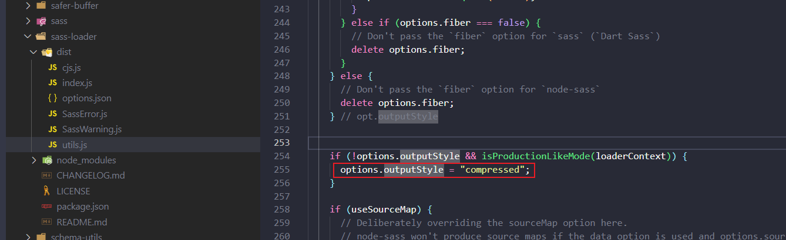
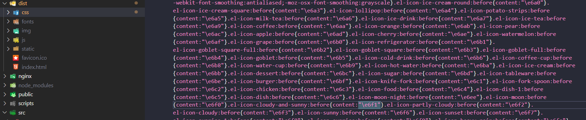
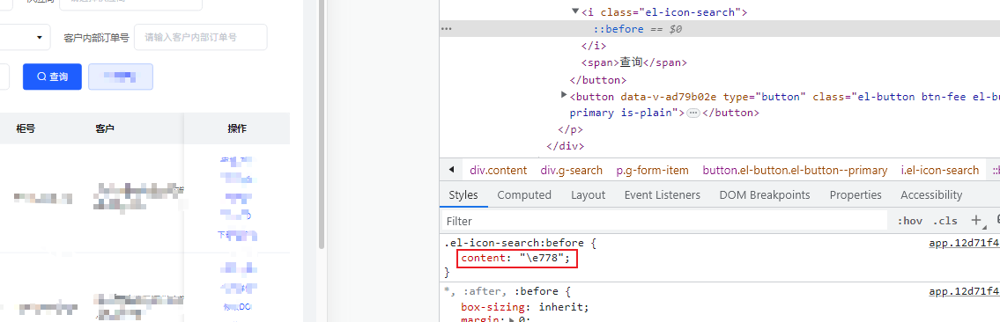
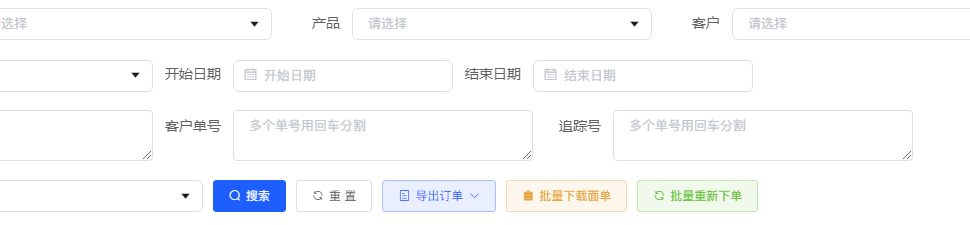

# element-ui图标偶现乱码问题的原因和修复方法

之前很老的一个 webpack3 前端项目，用 vue-cli5 重构了一下，根据 vue-cli 文档安装的 sass 版本 ^1.32.7，sass-loader 版本 ^12.0.0，各种自测感觉没问题了就部署到线上了。

然后第二天测试就在群里截图大喊：啥鸡毛玩意儿，这是啥新型样式吗？


立马跑到线上去排查，在自己电脑上登录进去看样式也没啥问题呀，然后审查元素才看到字体图标的 content 里确实是乱码：


自己在本地 build 打包看了下源码，dist/css/app.xxx.css，里面的字体图标的 content 也确实是乱码：


### 解决方式

网上搜了下，很多人遇到这个问题，偶现发生，一般刷新下页面又好了，解决方式主要有3个：

* 由 dart-sass 改回 node-sass
* 自己额外引入 element-ui 的图标 css 文件
* sass 版本更新到 1.39.0，并且修改 vue.config.js 配置文件的 css.loaderOptions.sass.sassOptions.outputStyle 为 expanded

权衡之下选择了最优雅的最后一种，不过并没有去更改 sass 和 sass-loader 的版本，只修改了 outputStyle 配置，这个不设置默认会是 compressed：


修改后的 vue.config.js 配置文件：
```js
module.exports = {
  transpileDependencies: ['element-ui'],
  css: {
    loaderOptions: {
      scss: {
        additionalData: `@import "@/styles/var.scss";`, // 不同版本的 sass，此属性不同：data、prependData、additionalData
        sassOptions: { outputStyle: 'expanded' } // fix: 解决 element-ui 图标 icon 偶现乱码问题
      }
    }
  },
  devServer: {
    proxy: {
      '/api': {
        target: 'http://dev.xxx.com',
        changeOrigin: true
      },
    }
  }
}
```

注意很多人分享的都是去设置 sass.sassOptions.outputStyle，如果你的项目中页面都是用的 scss，那这个地方是要去设置 scss.sassOptions.outputStyle 才有效的。sass 和 scss 其实是同一种东西，我们平时都称之为 sass，scss 是 sass 3 引入新的语法，说白了 scss 就是 sass 的升级版。

[dart-sass](https://sass-lang.com/documentation/cli/dart-sass) 只支持两种输出格式outputStyle：
* expanded：输出跟我们平时开发中手写的css样式很像，选择器、属性等各占一行，属性根据选择器缩进，而选择器不做任何缩进
* compressed：输出方式删除所有无意义的空格、空白行、以及注释，将文件体积压缩到最小，同时也会做出其他调整，比如会自动替换占用空间最小的颜色表达方式

修改后重新编译部署发现源码和浏览器中加载的样式都没问题了：




element-ui 官方仓库 Issuse：
* [使用dart-sass打包element icon出现乱码](https://github.com/ElemeFE/element/issues/21763)
* [页面刷新有时候elementui 的字体图标会乱码](https://github.com/ElemeFE/element/issues/19247)
* [sass官网](https://sass-lang.com/)
* [Vue CLI文档](https://cli.vuejs.org/zh/guide/css.html)
