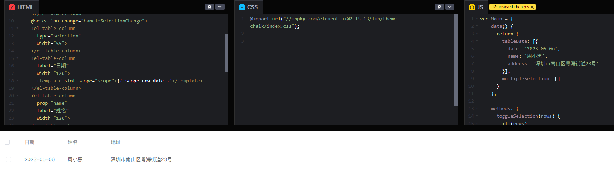
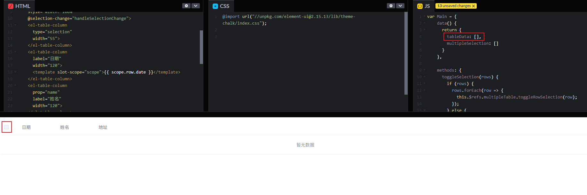
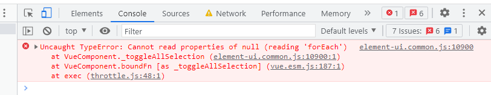
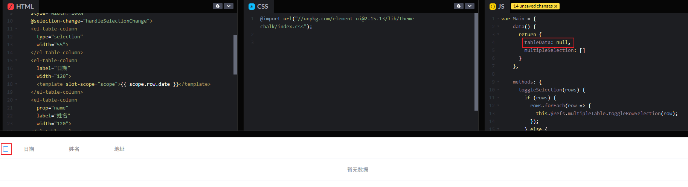
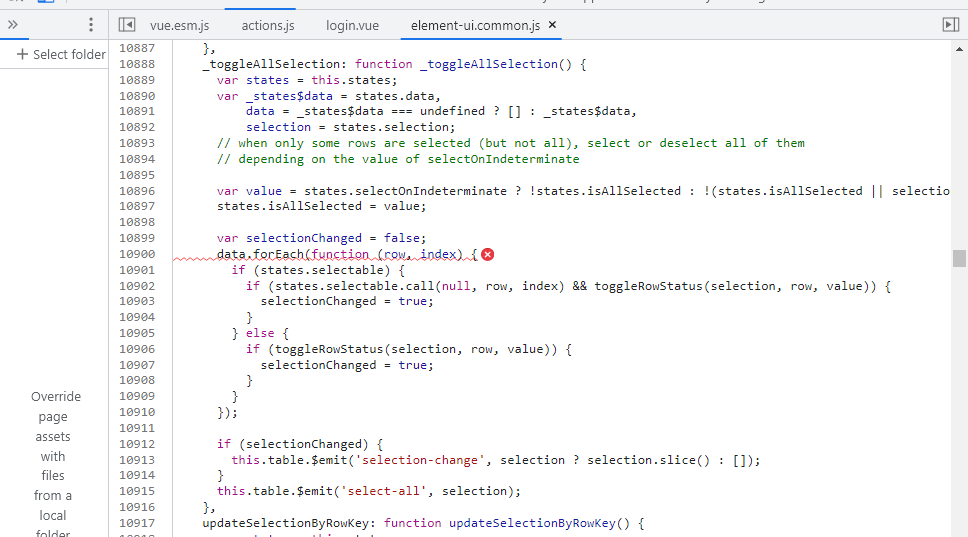
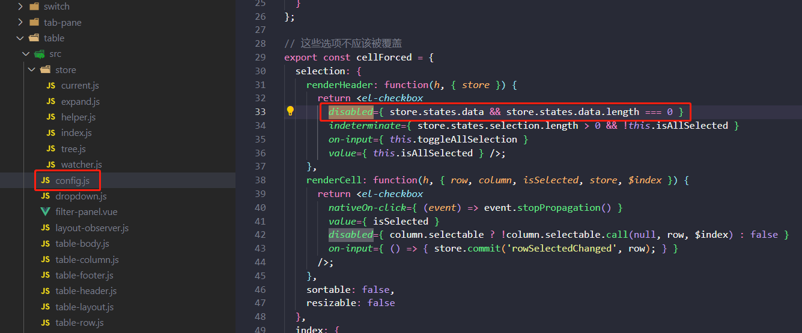

# element-ui表格组件el-table多选时报错

项目中用 element-ui 的表格组件 el-table 渲染列表数据，刚开始进入页面数据为空时，第一列的全选勾选会直接是禁止状态，当表格有数据时全选勾选才是可选状态，这样是没问题的。

有数据时，全选按钮可勾选：

数据为空时，全选按钮为禁选状态：

但是当点击筛选项再次调后端接口查询时，当无数据时全选勾选框居然是可选状态，而且一勾选还会报错：Uncaught TypeError: Cannot read properties of null (reading 'forEach')

刚开始以为是 element-ui 的bug，再 github 仓库里搜了一圈好像也没人遇到类似的问题，最终翻看组件源码才找到问题所在：

上面的报错就是因为 el-table 的 data 数据呗传了一个 null 值进去，引起了报错。

在 element-ui的 el-table 源码中找到，全选狂的禁选判断状态是根据：store.states.data && store.states.data.length === 0，当我们直接传一个 null 进去时，根据判断全选勾选框是不会被禁选掉的，触发勾选事件时直接用 null 来 forEach 遍历引起了报错。

el-table 的文档上有明确 data 的类型为 array，所以如果正常传数组是没问题的，就怕遇到辣鸡后端啥空值都喜欢搞个 null，前端如果不处理下直接用就容易出问题。