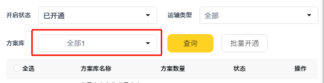
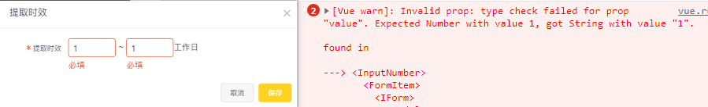

## iview 组件踩坑记


### select组件加了filterable选择后输入框的值前后有空格的问题

可搜索 filterable 设置成 true 后，选择后输入框的值前后有空格会多出很多空格，造成显示错乱



最后发现是代码格式化的问题，加了 filterable 后选项 Option 里的文字不要换行，只要格式化换行了就会造成前后空格：
```vue
<template>
    <!-- 有问题的写法 -->
    <Select
        v-model="form.name"
        :filterable="true"
        clearable
        transfer
    >
        <Option
            v-for="(n, i) in options"
            :value="n.value"
            :key="i"
        >
            {{ n.name }}
        </Option>
    </Select>

    <!-- 推荐显示正常的写法：版本1 -->
    <Select
        v-model="form.name"
        :filterable="true"
        clearable
        transfer
    >
        <Option v-for="(n, i) in options" :value="n.value" :key="i">{{ n.name }}</Option>
    </Select>


    <!-- 推荐显示正常的写法：版本2 -->
    <Select
        v-model="form.name"
        :filterable="true"
        clearable
        transfer
    >
        <Option v-for="(n, i) in options" :value="n.value" :key="i" :label="c.name" />
    </Select>

    <!-- 额外发现的问题 -->
    <!-- 如果用了 Option 来自定义选项内容，记得一定要给 Option 加上 label 来指定选中后的显示值，否则选中后会出现选不中或者显示出自定义选项里面的全部内容 -->
    <Select
        v-model="form.name"
        :filterable="true"
        clearable
        transfer
    >
        <Option v-for="(n, i) in options" :value="n.value" :key="i" :label="n.name">
            <span>{{ n.name }}</span>
            <span style="float:right;color:#ccc">{{ n.statusName }}</span>
        </Option>
    </Select>
</template>
```
微信小程序里的 text 组件之前也遇到类似的问题，text 组件里的文字如果换行格式化，空格也会被保留，造成页面布局错乱。

### page 分页组件

切换页数的 on-page-size-change 事件监听页数改变，我们一般会直接将传过来的 size 赋值给页数，然后手动载获取一下数据。但是这里 iview 有坑：在页码非第一页时会自动去触发页码改变事件获取数据，如果我们手动再去获取一次，其实会调用两次接口，如果是第一页，iview又不会主动去获取数据，通过查看组件源码：

```js
// 页码改变
changePage (page) {
    if (this.disabled) return;
    if (this.currentPage != page) { // 在第一页改变页码时不会主动去获取数据
        this.currentPage = page;
        this.$emit('update:current', page);
        this.$emit('on-change', page);
    }
},

// 页数改变
onSize (pageSize) {
    if (this.disabled) return;
    this.currentPageSize = pageSize;
    this.$emit('on-page-size-change', pageSize);
    this.changePage(1);
},
```

改变页码获取数据时，最好加一个判断 this.page.index === 1 的判断再手动去获取数据或者自己手动改下 index = 1 再去获取数据，否则 在末尾几页触发 handlePageSize 在 index 还没变的时候去获取实际没有的页数数据会返回空（而这次的异步接口如果比自动触发的晚显示可能造成页面暂无数据）

```js
handlePage(pageNum) {
    this.page.index = pageNum
    this.getList()
},

handlePageSize(size) {
    this.page.size = size

    // 页码为非1时会自动触发获取数据
    if (this.page.index === 1) this.getList()

    // 或者下面这样（不过非第一页会调两次接口，不推荐）
    // this.page.index = 1
    // this.getList()
},
```

### Form 表单里的 InputNumber 组件校验一直不通过

明明输入框里已经有值了，校验一直报红，看控制台还报错：
```js
[Vue warn]: Invalid prop: type check failed for prop "value". Expected Number with value 1, got String with value "1"
```



这里就是因为初始赋值的时候，直接将数值字符串直接赋值给了 InputNumber，Form 表单里的校验规则 rules 里又有指定 type 为 number，类型不一致导致校验不通过。