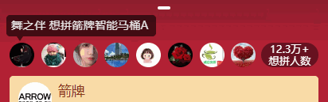
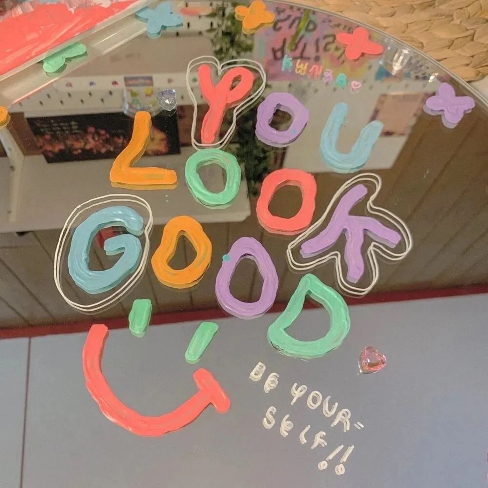

# 旋转边框头像放大出现和不断向上漂浮出现表情动画

### 旋转边框头像放大出现动画



分成两个动画，放大出现的头像，旋转的 border 虚线边框，直接可以用 css3 里的 animation 和 @keyframes 关键帧动画实现，为了方便观看效果，可以给动画加上无限循环 infinite

<div class="avatar-box">
    <div class="avatar">
        
    </div>
    <div class="avatar">
        
    </div>
    <div class="avatar">
        
    </div>
    <div class="avatar">
        
    </div>
</div>

完整代码
```vue
<template>
    <div class="avatar-box">
        <div class="avatar">
            
        </div>
    </div>
</template>

<style scoped>
.gif-avatar {
    margin-top: 20px;
}
.avatar-box {
    background: #57bc78;
    padding: 40px;
    margin-top: 10px;
    display: inline-block;
}

.avatar {
    position: relative;
    /* animation: imgAnimation .48s ease-out forwards infinite; */
    animation: imgAnimation .48s ease-out forwards;
}

.img-avatar {
    width: 56px;
    height: 56px;
    border-radius: 50%;
}

@keyframes imgAnimation {
  0% {
      opacity: 0;
      transform: scale(.1);
  }

  50% {
      opacity: 1;
  }

  90% {
      transform: scale(1.1);
  }

  to {
      transform: scale(1);
  }
}

.avatar:after {
    animation: borderAnimation 1s linear infinite;
    /* animation: borderAnimation 1s linear; */
    animation-delay: .48s;
    border: 2px dashed #FFF;
    border-radius: 50%;
    content: "";
    display: block;
    height: 60px;
    width: 60px;
    opacity: 0;
    position: absolute;
    top: -4px;
    left: -4px;
}

@keyframes borderAnimation {
  27%,72% {
      opacity: 1;
  }

  to {
      opacity: 0;
      transform: rotate(60deg);
  }
}
</style>
```


### 不断向上漂浮出现表情的动画
同样是用 animation 和 @keyframes 关键帧动画实现的，主要用到位移 translate，配合 animation-duration 和 animation-delay 延迟来实现交错向上漂浮

<div class="emoji-box">
    <div class="emoji-item" style="animation-duration: 1.2s;">
        <div class="emoji-inner">
            
        </div>
    </div>
    <div class="emoji-item" style="animation-duration: 2s;">
        <div class="emoji-inner">
            
        </div>
    </div>
    <div class="emoji-item fly-one" style="animation-duration: 1.8s;">
        <div class="emoji-inner">
            
        </div>
    </div>
    <div class="emoji-item fly-two" style="animation-duration: 1.4s;">
        <div class="emoji-inner">
            
        </div>
    </div>
    <div class="emoji-item fly-three" style="animation-duration: 1.8s;">
        <div class="emoji-inner">
            
        </div>
    </div>
    <div class="emoji-item fly-four" style="animation-duration: 1.8s;">
        <div class="emoji-inner">
            
        </div>
    </div>
</div>

```vue
<template>
    <div class="emoji-box">
        <div class="emoji-item" style="animation-duration: 1.2s;">
            <div class="emoji-inner">
                
            </div>
        </div>
        <div class="emoji-item" style="animation-duration: 2s;">
            <div class="emoji-inner">
                
            </div>
        </div>
        <div class="emoji-item fly-one" style="animation-duration: 1.8s;">
            <div class="emoji-inner">
                
            </div>
        </div>
        <div class="emoji-item fly-two" style="animation-duration: 1.4s;">
            <div class="emoji-inner">
                
            </div>
        </div>
        <div class="emoji-item fly-three" style="animation-duration: 1.8s;">
            <div class="emoji-inner">
                
            </div>
        </div>
        <div class="emoji-item fly-four" style="animation-duration: 1.8s;">
            <div class="emoji-inner">
                
            </div>
        </div>
    </div>
</template>

<style scoped>
.emoji-box {
  position: relative;
  margin-top: 200px;
}

.img-emoji {
  height: 48px;
  width: 48px;
}

.emoji-inner {
  border-radius: 100%;
  bottom: 0;
  height: 100%;
  left: 0;
  opacity: 0;
  position: relative;
  transform: scale(0);
  width: 100%;
  animation-delay: inherit;
  animation-duration: inherit;
  animation-iteration-count: inherit;
  animation-name: opacityAnimation;
  animation-timing-function: linear
}

.emoji-item {
  animation-iteration-count: infinite;
  animation-timing-function: linear;
  pointer-events: none;
  position: absolute;
  top: 0;
  left: 0;
}

.fly-one {
    animation-name: flyOne;
    animation-delay: .6s;
}

.fly-two {
    animation-name: flyTwo;
    animation-delay: .8s;
}

.fly-three {
    animation-name: flyThree;
    animation-delay: 1s;
}

.fly-four {
    animation-name: flyFour;
    animation-delay: 1.2s;
}

@keyframes opacityAnimation {
  0% {
    opacity: 0;
    transform: scale(.3)
  }

  50% {
    opacity: 1
  }

  70% {
    opacity: 1;
    transform: scale(1)
  }

  to {
    opacity: 0;
    transform: scale(1)
  }
}

@keyframes flyOne {
  0.0000% {
    transform: translate(0)
  }

  9.7574% {
    transform: translate(14px, -26px)
  }

  19.7168% {
    transform: translate(22px, -52px)
  }

  32.2412% {
    transform: translate(24px, -88px)
  }

  42.9965% {
    transform: translate(16px, -118px)
  }

  63.6185% {
    transform: translate(-14px, -172px)
  }

  73.9017% {
    transform: translate(-22px, -200px)
  }

  85.8341% {
    transform: translate(-18px, -234px)
  }

  100.0000% {
    transform: translateY(-272px)
  }
}

@keyframes flyTwo {
  0.0000% {
    transform: translate(0)
  }

  14.7131% {
    transform: translate(-4px, -21px)
  }

  21.2434% {
    transform: translate(-3px, -31px)
  }

  29.7747% {
    transform: translate(2px, -42px)
  }

  47.6231% {
    transform: translate(2px, -62px)
  }

  58.0677% {
    transform: translate(27px, -76px)
  }

  72.9442% {
    transform: translate(31px, -97px)
  }

  87.6092% {
    transform: translate(3px, -119px)
  }

  100.0000% {
    transform: translate(27px, -137px)
  }
}

@keyframes flyThree {
  0.0000% {
    transform: translate(0)
  }

  13.6752% {
    transform: translate(4px, -18px)
  }

  34.2952% {
    transform: translate(-20px, -80px)
  }

  60% {
    transform: translate(8px, -180px)
  }

  100.0000% {
    transform: translate(20px, -200px)
  }
}

@keyframes flyFour {
  0.0000% {
    -webkit-transform: translate(0);
    transform: translate(0)
  }

  9.2756% {
    transform: translate(1px, -9px)
  }

  17.9054% {
    transform: translate(18px, -19px)
  }

  26.6948% {
    transform: translate(25px, -3px)
  }

  36.5039% {
    transform: translate(29px, -44px)
  }

  62.1746% {
    transform: translate(33px, -81px)
  }

  100.0000% {
    transform: translate(34px, -137px)
  }
}
</style>
```

<style scoped>
/* 不断向上漂浮出现表情的动画 */
.emoji-box {
  position: relative;
  margin-top: 240px;
  padding-bottom: 10px;
}

.img-emoji {
  height: 48px;
  width: 48px;
}

.emoji-item {
  animation-iteration-count: infinite;
  animation-timing-function: linear;
  pointer-events: none;
  position: absolute;
  top: 0;
  left: 40%;
}

.fly-one {
    animation-name: flyOne;
    animation-delay: .6s;
}

.fly-two {
    animation-name: flyTwo;
    animation-delay: .8s;
}

.fly-three {
    animation-name: flyThree;
    animation-delay: 1s;
}

.fly-four {
    animation-name: flyFour;
    animation-delay: 1.2s;
}

.emoji-inner {
  border-radius: 100%;
  bottom: 0;
  height: 100%;
  left: 0;
  opacity: 0;
  position: relative;
  transform: scale(0);
  width: 100%;
  animation-delay: inherit;
  animation-duration: inherit;
  animation-iteration-count: inherit;
  animation-name: opacityAnimation;
  animation-timing-function: linear
}

@keyframes opacityAnimation {
  0% {
    opacity: 0;
    transform: scale(.3)
  }

  50% {
    opacity: 1
  }

  70% {
    opacity: 1;
    transform: scale(1)
  }

  to {
    opacity: 0;
    transform: scale(1)
  }
}

@keyframes flyOne {
  0.0000% {
    transform: translate(0)
  }

  9.7574% {
    transform: translate(14px, -26px)
  }

  19.7168% {
    transform: translate(22px, -52px)
  }

  32.2412% {
    transform: translate(24px, -88px)
  }

  42.9965% {
    transform: translate(16px, -118px)
  }

  63.6185% {
    transform: translate(-14px, -172px)
  }

  73.9017% {
    transform: translate(-22px, -200px)
  }

  85.8341% {
    transform: translate(-18px, -234px)
  }

  100.0000% {
    transform: translateY(-272px)
  }
}

@keyframes flyTwo {
  0.0000% {
    transform: translate(0)
  }

  14.7131% {
    transform: translate(-4px, -21px)
  }

  21.2434% {
    transform: translate(-3px, -31px)
  }

  29.7747% {
    transform: translate(2px, -42px)
  }

  47.6231% {
    transform: translate(2px, -62px)
  }

  58.0677% {
    transform: translate(27px, -76px)
  }

  72.9442% {
    transform: translate(31px, -97px)
  }

  87.6092% {
    transform: translate(3px, -119px)
  }

  100.0000% {
    transform: translate(27px, -137px)
  }
}

@keyframes flyThree {
  0.0000% {
    transform: translate(0)
  }

  13.6752% {
    transform: translate(4px, -18px)
  }

  34.2952% {
    transform: translate(-20px, -80px)
  }

  60% {
    transform: translate(30px, -160px)
  }

  100.0000% {
    transform: translate(-30px, -240px)
  }
}

@keyframes flyFour {
  0.0000% {
    -webkit-transform: translate(0);
    transform: translate(0)
  }

  9.2756% {
    transform: translate(1px, -9px)
  }

  17.9054% {
    transform: translate(18px, -19px)
  }

  26.6948% {
    transform: translate(25px, -3px)
  }

  36.5039% {
    transform: translate(29px, -44px)
  }

  62.1746% {
    transform: translate(33px, -81px)
  }

  100.0000% {
    transform: translate(34px, -137px)
  }
}

.gif-avatar {
    margin-top: 20px;
}
.avatar-box {
    background: #57bc78;
    padding: 40px;
    margin-top: 10px;
    display: flex;
    justify-content: space-around;
}

.avatar {
    position: relative;
    /* animation: imgAnimation .48s ease-out forwards infinite; */
    animation: imgAnimation .48s ease-out forwards;
}

.img-avatar {
    width: 56px;
    height: 56px;
    border-radius: 50%;
}

@keyframes imgAnimation {
  0% {
      opacity: 0;
      transform: scale(.1);
  }

  50% {
      opacity: 1;
  }

  90% {
      transform: scale(1.1);
  }

  to {
      transform: scale(1);
  }
}

.avatar:after {
    animation: borderAnimation 1s linear infinite;
    /* animation: borderAnimation 1s linear; */
    animation-delay: .48s;
    border: 2px dashed #FFF;
    border-radius: 50%;
    content: "";
    display: block;
    height: 60px;
    width: 60px;
    opacity: 0;
    position: absolute;
    top: -4px;
    left: -4px;
}

@keyframes borderAnimation {
  27%,72% {
      opacity: 1;
  }

  to {
      opacity: 0;
      transform: rotate(60deg);
  }
}
</style>