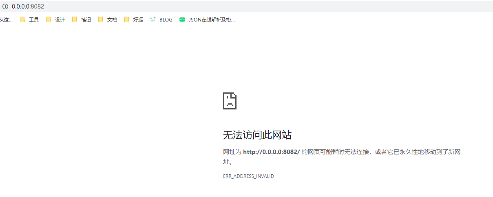
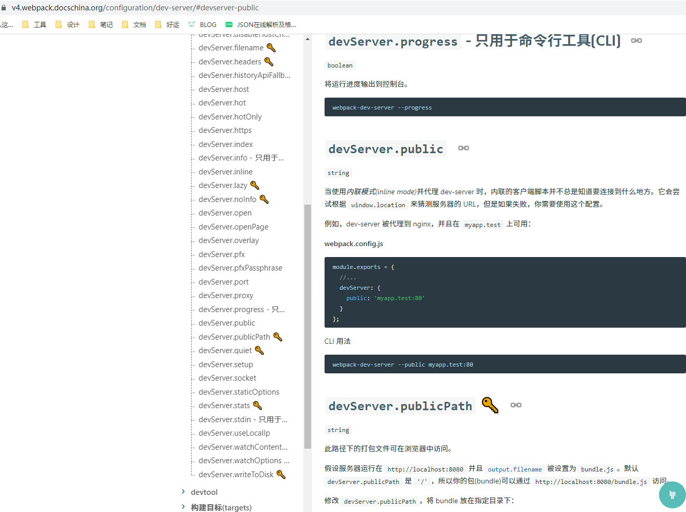
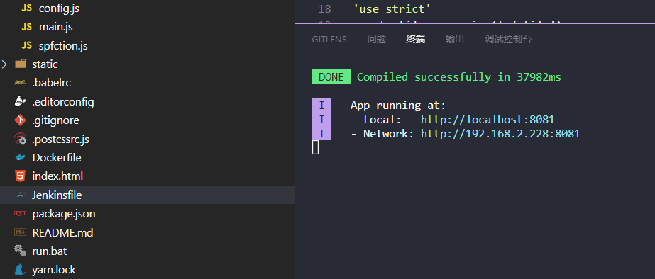

# vue项目中webpack-dev-server的open和host0.0.0.0配置冲突

一个比较老的公司项目，webpack 用的 v3 版本，为了实现localhost、127.0.0.1和本机ip可以同时访问，webpack的devServer里的 host 我们一般会设置成 0.0.0.0，这样本机所有 ipv4 地址都可以实现访问。

比如我们要将本地运行的前端项目，分享给公司的后端、产品、测试...预览效果，如果 host 直接设置的 localhost，运行后打开的地址 http://localhost:8080，直接分享给别人是没法打开的。

为了解决上面局域网共享的问题，我们就需要将前端服务运行在 0.0.0.0，然后将本机的 ipv4 地址如：http://192.168.2.228:8080 分享给别人，同一局域网内的用户就可以直接访问了。

## 浏览自动打开了http://0.0.0.0:8080

但是当我们设置之后，默认自动打开的浏览器地址和终端输出的运行地址也变成了：http://0.0.0.0:8080，更要命的是这个地址在 windows 上是被当成无效地址没法访问的，mac上是可以直接访问。



查看 webpack 配置，注意只保留了相关的主要代码：
```js
// webpack.dev.conf.js
'use strict'
const utils = require('./utils')
const webpack = require('webpack')
const config = require('../config')
const merge = require('webpack-merge')
const baseWebpackConfig = require('./webpack.base.conf')
const FriendlyErrorsPlugin = require('friendly-errors-webpack-plugin')
const portfinder = require('portfinder')

const HOST = process.env.HOST
const PORT = process.env.PORT && Number(process.env.PORT)

const devWebpackConfig = merge(baseWebpackConfig, {
  devServer: {
    host: HOST || config.dev.host,
    port: PORT || config.dev.port,
    open: config.dev.open,
  }
})

module.exports = new Promise((resolve, reject) => {
  portfinder.basePort = process.env.PORT || config.dev.port
  portfinder.getPort((err, port) => {
    if (err) {
      reject(err)
    } else {
      // publish the new Port, necessary for e2e tests
      process.env.PORT = port
      // add port to devServer config
      devWebpackConfig.devServer.port = port

      // Add FriendlyErrorsPlugin
      devWebpackConfig.plugins.push(new FriendlyErrorsPlugin({
        compilationSuccessInfo: {
          messages: [`Your application is running here: http://${devWebpackConfig.devServer.host}:${port}`],
        },
        onErrors: config.dev.notifyOnErrors
        ? utils.createNotifierCallback()
        : undefined
      }))

      resolve(devWebpackConfig)
    }
  })
})
```

当设置了自动打开浏览器 open 时，打开的地址会直接用我们设置的 host，所以会打开 http://0.0.0.0:8080。首先需要将服务运行的地址和我们浏览器里打开的地址分开设置，服务运行地址我们需要固定成 0.0.0.0，但浏览器里打开的地址我们不需要这个。

第一点我们可以直接通过 scripts 里的命令来设置 --host 参数指定 0.0.0.0，直接在命令行里传递的参数优先级最高，修改 package.json:
```json
{
  "name": "front-end",
  "version": "1.0.0",
  "description": "客户端",
  "author": "cafehaus",
  "private": true,
  "scripts": {
    "predev": "yarn",
    "dev": "webpack-dev-server --inline --progress --host 0.0.0.0 --config build/webpack.dev.conf.js",
    "start": "npm run dev",
    "build": "node build/build.js"
  },
}
```

## devServer.public 配置浏览器地址

然后可以通过 devServer.public 配置来设置浏览器要打开的地址，不过只能webpack的v3和v4版本使用，而且这个必须设置完整的 host:port，但是这个地方的port我们又不能写成固定的，因为如果自己设置的端口被占用了，webpack-dev-server实际运行起来会帮我们找一个系统未被占用的端口。



我们可以借助 portfinder-sync 来查找系统的可用端口，然后设置给 public，大概的代码思路如下：

```js
const config = require('../config')
const portFinderSync = require('portfinder-sync')
const port = portFinderSync.getPort(config.dev.port)

const devServer = {
  host: 'localhost',
  open: true,
  port,
  public: `localhost:${port}`,
},
```

## 终极解决方案

要获取实际使用的端口，webpack 其实有用到 portfinder 这个包，我们直接在 webpack.dev.conf.js 里改下最后面的配置就可以了，直接在 portfinder 那设置下 devWebpackConfig.devServer.public 就可以了，我们还可以借助 address 来获取本机的 ipv4 地址，用 chalk 来美化输出：

```js
'use strict'
const utils = require('./utils')
const webpack = require('webpack')
const config = require('../config')
const merge = require('webpack-merge')
const baseWebpackConfig = require('./webpack.base.conf')
const FriendlyErrorsPlugin = require('friendly-errors-webpack-plugin')
const portfinder = require('portfinder')
const address = require('address')
const chalk = require('chalk')

const HOST = process.env.HOST || config.dev.host || '0.0.0.0' // 服务地址，设置成 0.0.0.0 可以让本机上所有 ipv4 地址访问
const LOCAL_HOST = config.dev.host || 'localhost' // 本地访问地址
const LOCAL_IP = address.ip() // 本地 ip
const PORT = (process.env.PORT && Number(process.env.PORT)) || config.dev.port || 8080 // 端口

const devWebpackConfig = merge(baseWebpackConfig, {
  devServer: {
    host: HOST,
    port: PORT,
    open: config.dev.autoOpenBrowser,
  }
})

module.exports = new Promise((resolve, reject) => {
  portfinder.basePort = PORT
  portfinder.getPort((err, port) => {
    if (err) {
      reject(err)
    } else {
      // publish the new Port, necessary for e2e tests
      process.env.PORT = port
      // add port to devServer config
      devWebpackConfig.devServer.port = port
      devWebpackConfig.devServer.public = `${LOCAL_HOST}:${port}`,

      // Add FriendlyErrorsPlugin
      devWebpackConfig.plugins.push(new FriendlyErrorsPlugin({
        compilationSuccessInfo: {
          messages: [
            `  App running at:`,
            `  - Local:   ` + chalk.cyan(`http://${LOCAL_HOST}:${port}`),
            `  - Network: ` + chalk.cyan(`http://${LOCAL_IP}:${port}`)
          ],
        },
        onErrors: config.dev.notifyOnErrors
        ? utils.createNotifierCallback()
        : undefined
      }))

      resolve(devWebpackConfig)
    }
  })
})
```


## webpack-dev-server 的几个相关配置

### devServer.host
配置访问地址，host：主机、服务机，v3 和 v4 版本默认 localhost，v5 版本默认是 0.0.0.0

### devServer.port
端口

### devServer.public
可以用来设置默认打开浏览器的地址，注意 v3 和 v4 版本才有这个配置，webpack v5 版本已经没有这项配置了


### 相关文档
* [portfinder](https://github.com/http-party/node-portfinder#readme)，获取端口
* [portfinder-sync](https://github.com/jaridmargolin/portfinder-sync)，基于 portfinder 的同步版
* [friendly-errors-webpack-plugin](https://github.com/geowarin/friendly-errors-webpack-plugin#readme)
* [webpack-dev-server open and host opens wrong URL](https://stackoverflow.com/questions/47683934/webpack-dev-server-open-and-host-opens-wrong-url)
