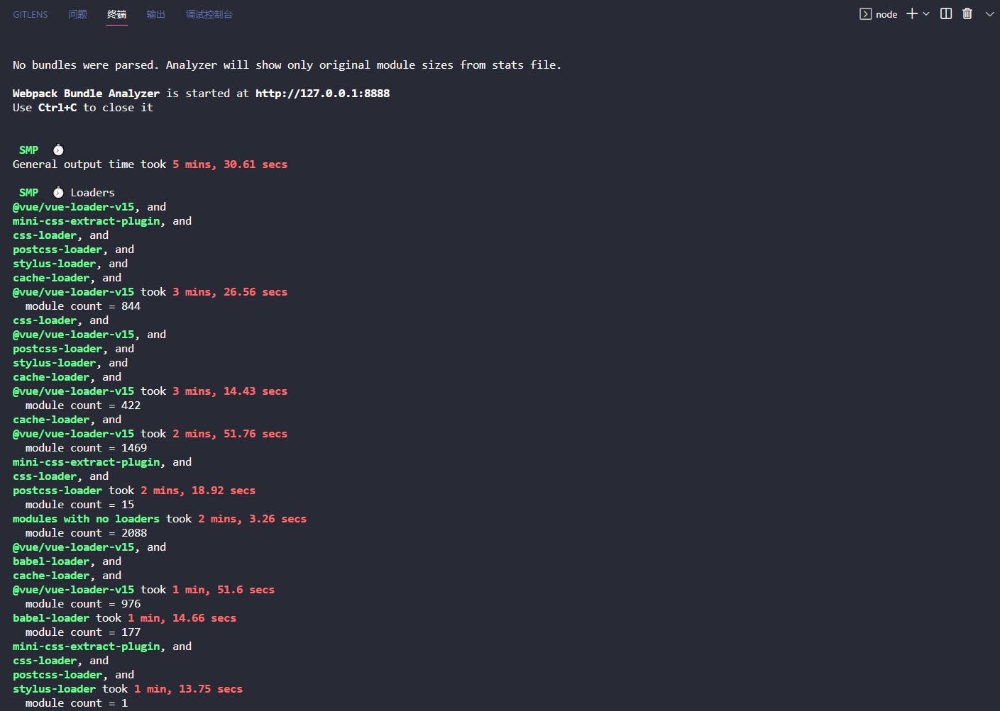
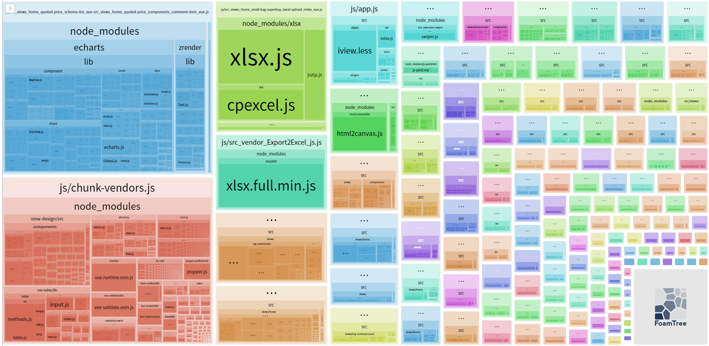
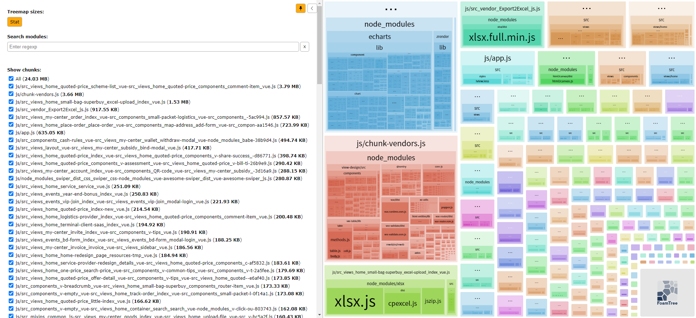
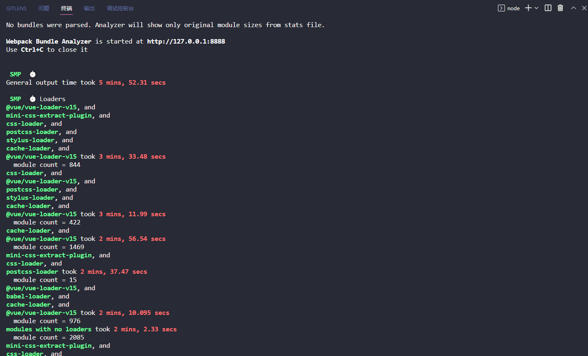
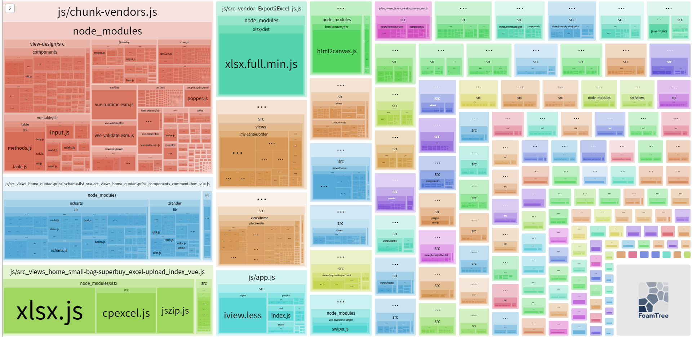
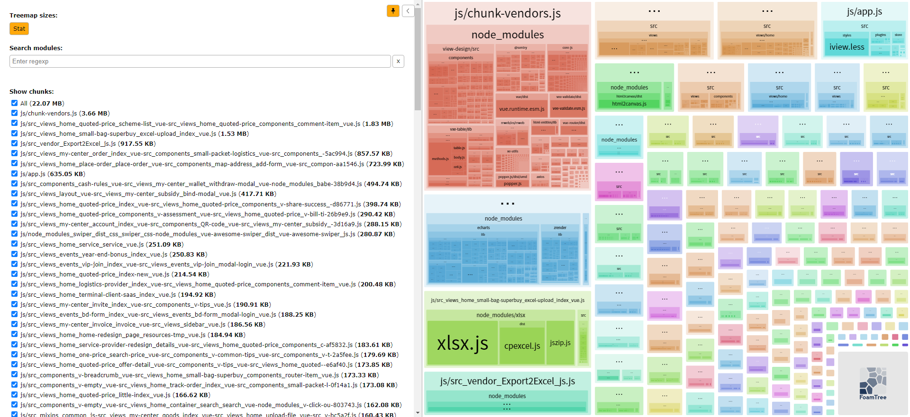

# 探寻webpack打包vue项目特别慢问题

前端 vue2 项目中，多人开发，从一段时间开始发现打包变得特别慢，每次线上更新也至少要10几20分钟，正常项目线上更新一般也就1、2分钟，新需求开发拉新分支本地运行也要至少5、6分钟才能运行的起来。

## 查找问题

为了找出打包慢的原因，我们首先得找到到底是哪些文件太大还是耗时太久？这中间用到了两个插件：

* [webpack-bundle-analyzer](https://github.com/webpack-contrib/webpack-bundle-analyzer)：分析打包过后的包的大小
* [speed-measure-webpack-plugin](https://github.com/stephencookdev/speed-measure-webpack-plugin)：分析各个插件和loader打包用时


1. 安装 webpack-bundle-analyzer
```bash
# NPM
npm install --save-dev webpack-bundle-analyzer

# Yarn
yarn add -D webpack-bundle-analyzer
```

2. 安装 speed-measure-webpack-plugin
```bash
# NPM
npm install --save-dev speed-measure-webpack-plugin

# Yarn
yarn add -D speed-measure-webpack-plugin
```

3. 配置 webpack 这两个插件
```js
// vue.config.js
const BundleAnalyzerPlugin = require('webpack-bundle-analyzer').BundleAnalyzerPlugin
const SpeedMeasurePlugin = require('speed-measure-webpack-plugin')

module.exports = {
  configureWebpack: config => {
    config.plugins.push(new BundleAnalyzerPlugin())
    config.plugins.push(new SpeedMeasurePlugin())
  }
}
```

## 插件分析结果

* 打包总时间：5分30.61秒
* 打包文件总大小：24.03 MB
* 打包时间比较长的插件和loader：@vue/vue-loader-v15、mini-css-extract-plugin、css-loader、postcss-loader、stylus-loader、cache-loader
* 打包最大的单个文件：依赖了 echarts 的页面，大小为3.79MB，还有 xlsx 和 html2canvas 也比较大





猜测大饱满可能是 echarts 造成的，项目里是直接全部导入的 echarts 库，其实项目中只用到了一个折线图，先改成按需导入

## 按需导入 echarts 打包分析结果

[echarts 官方文档](https://echarts.apache.org/zh/index.html)

按需引入封装的 echarts.js，项目中只用到了一个折线图，所以只需引入 LineChart：

```js
// 引入 echarts 核心模块 和 Canvas 渲染器
import * as echarts from 'echarts/core'
import { CanvasRenderer } from 'echarts/renderers'

// 引入折线图图表
import { LineChart } from 'echarts/charts'

// 引入图表里用到的组件
import {
  LegendComponent,
  GridComponent,
} from 'echarts/components'

// 注册必须的组件
echarts.use([
  LegendComponent,
  GridComponent,
  CanvasRenderer,
  LineChart
])

export default echarts
```

```vue
<template>
  <div>
    <div ref="canvas" />
  </div>
</template>
<script>
  import echarts from './echarts.js'
  let LineChart = null // 图表实例

  export default {
    methods: {
      chartInit() {
        if (!LineChart) LineChart = echarts.init(this.$refs.canvas)

        // 设置参数
        LineChart.setOption({
          // ...
        }
      }
    }
  }
</script>
```

* 打包总时间：5分52.31秒
* 打包文件总大小：22.07 MB
* 打包后的 echarts 的只有1点多MB

打包的文件大小确实有变小，但是打包时间缺变得更长了。





注意上面的分析都是基于 npm run dev 打的开发包。这一下下的，给我搞得都不废了，最终打包慢的问题还在寻找中...

