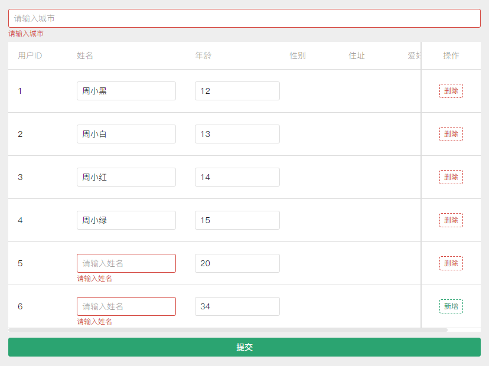

# tdesign动态表单校验和自动滚动到错误处

之前一直用iview 和 element-ui，这两个UI库很多组件实现和使用方式类似，所以用过其中一个再用另一个能很快上手。一下切换到 tdesign 的 vue3 版本：tdesign-vue-next 还是有很大的不习惯，并且组件的使用和实现方式跟之前的组件库也有很大的差别。

表单校验是我们平时项目中很常见的一个需求，其中的动态表单校验稍微复杂。动态表单我们一般又会结合表格 table 组件去修改表格里面的数据。

下面是一个基于 vue3 + tdesign-vue-next + TypeScript + t-form + t-table 实现的一个动态表单校验 demo，如果页面或表格里出现滚动条，还可以自动滚动到第一个校验不通过的元素处。



```vue
<template>
  <div class="form">
    <t-form :data="form" :rules="rules" ref="$form">
      <t-form-item name="city" labelWidth="0">
        <t-input v-model="form.city" placeholder="请输入城市" />
      </t-form-item>

      <t-table ref="$table" class="table-box" :data="form.tableData" :columns="columns" row-key="id" :loading="loading">
        <template #name="{ rowIndex }">
          <t-form-item
            :name="`tableData[${rowIndex}].name`"
            labelWidth="0"
            :rules="[{ required: true, message: '请输入姓名', type: 'error', trigger: 'change' }]"
          >
            <t-input v-model="form.tableData[rowIndex].name" placeholder="请输入姓名" :autofocus="rowIndex === 0" />
            <!-- 第一个输入框自动聚焦，全部都加上 autofocus 会聚焦到最后一个 -->
          </t-form-item>
        </template>
        <template #hobby="{ rowIndex }">
          <t-form-item
            :name="`tableData[${rowIndex}].hobby`"
            labelWidth="0"
            :rules="[{ required: true, message: '请输入爱好', type: 'error', trigger: 'change' }]"
          >
            <t-input v-model="form.tableData[rowIndex].hobby" placeholder="请输入爱好" :autofocus="rowIndex === 0" />
          </t-form-item>
        </template>
        <template #age="{ rowIndex }">
          <t-form-item
            :name="`tableData[${rowIndex}].age`"
            labelWidth="0"
            :rules="[
              { required: true, message: '请输入年龄' },
              { max: 100, number: true, message: '年龄最大不能超过 100', type: 'error', trigger: 'change' },
              { min: 1, message: '年龄最小为 1', type: 'error', trigger: 'change' },
            ]"
          >
            <t-input-number
              v-model="form.tableData[rowIndex].age"
              theme="normal"
              min="1"
              max="100"
              :decimalPlaces="0"
              placeholder="请输入年龄"
            />
          </t-form-item>
        </template>
        <template #action="{ rowIndex }">
          <t-button
            v-if="rowIndex === form.tableData.length - 1"
            variant="dashed"
            theme="success"
            size="small"
            @click="handleAdd"
          >
            新增
          </t-button>
          <t-button v-else variant="dashed" theme="danger" size="small" @click="handleDelete({ rowIndex })">删除</t-button>
        </template>
      </t-table>
    </t-form>

    <t-button block theme="success" @click="submit">提交</t-button>
  </div>
</template>

<script setup lang="ts">
  const props = defineProps({
    isEdit: {
      type: Boolean,
      default: false,
    },
  })

  // 表头
  const columns = [
    {
      title: '用户ID',
      align: 'left',
      width: 100,
      colKey: 'id',
    },
    {
      title: '姓名',
      width: 200,
      colKey: 'name',
    },
    {
      title: '年龄',
      width: 160,
      colKey: 'age',
    },
    {
      title: '性别',
      width: 100,
      colKey: 'sex',
    },
    {
      title: '住址',
      width: 100,
      colKey: 'address',
    },
    {
      title: '爱好',
      width: 100,
      colKey: 'hobby',
    },
    {
      title: '操作',
      align: 'center',
      width: 100,
      fixed: 'right',
      colKey: 'action',
    },
  ]

  const rules = {
    city: [{ required: true, message: '请输入城市', type: 'error', trigger: 'change' }]
  }

  // 表格数据
  const form = ref({
    city: '',
    tableData: [],
  })
  const loading = ref(false)
  const fetchData = () => {
    loading.value = true

    setTimeout(() => {
      loading.value = false
      form.value.tableData = [
        { id: '1', name: '周小黑', age: 12 },
        { id: '2', name: '周小白', age: 13 },
        { id: '3', name: '周小红', age: 14 },
        { id: '4', name: '周小绿', age: 15 },
      ]
    }, 2000)
  }

  // 新增
  const handleAdd = () => {
    const len = form.value.tableData.length || 0
    if (len) {
      form.value.tableData.push({
        id: (len + 1).toString(),
        name: '',
        age: Math.floor(Math.random() * 100),
      })
    }
  }
  // 删除
  const handleDelete = ({ rowIndex }) => {
    form.value.tableData.splice(rowIndex, 1)
  }

  // 提交
  const $form = ref()
  const $table = ref()
  const submit = async () => {
    const validateResult = await $form.value.validate()
    if (validateResult !== true && validateResult && Object.keys(validateResult).length) {
      // const first: any = Object.values(validateResult)[0] || []
      // const firstError = first?.find((f) => !f.result)
      // const errMsg = firstError?.message
      // if (errMsg) MessagePlugin.warning(errMsg)
      scrollToError()
      return
    }

    alert('校验成功')
  }

  // 校验不通过自动滚动到错误元素处
  const scrollToError = () => {
    function scrollIntoView() {
      const elements = document.querySelectorAll('.table-container .t-is-error')
      if (elements && elements.length) {
        elements[0].scrollIntoView({
          behavior: 'smooth',
          block: 'center',
          // inline: 'end',
        })
      }
    }

    nextTick(() => {
      // 有错误时表格自动滚动到最右边
      const table = $table.value
      const tableContent = table.baseTableRef.tableContentRef
      const w = tableContent.scrollWidth
      tableContent.scrollLeft = w

      // 滚动到表格中时，要先更新表格的滚动条
      // 这里也用 nextTick 有时不更新
      setTimeout(() => {
        scrollIntoView()
      }, 200)
    })
  }

  onMounted(() => {
    fetchData()
  })
</script>

<style lang="stylus" scoped>
.form
  width 800px
  .table-box
    margin 10px 0
    :deep(.t-form__item)
      padding 8px 0
      .t-is-error .t-input__extra
        text-align left
</style>
```