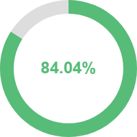

# 用单例模式封装canvas环形进度条

项目中需要一个请求进度效果，尝试了下自己用 canvas 来绘制一个环形进度条，动效直接用的休眠函数加随机数来模拟。用到了 es6 里的 class 类，用单例模式的懒汉模式来实例化对象，不像 Java 这种纯面向对象的语言，写着还是有点别扭。



```js
import NP from 'number-precision'

/**
 * 休眠函数
 * @param {Number} wait
 */
function sleep(wait) {
  return new Promise((resolve) => {
    setTimeout(resolve, wait)
  })
}

export default class CanvasProgress {
  constructor({ elementId, height = 200, width = 200 }) {
    if (elementId) {
      this.canvas = document.getElementById(elementId) // canvas 节点
      this.canvas.height = height
      this.canvas.width = width
      this.elementId = elementId
      this.height = height
      this.width = width
      this.cxt = canvas.getContext('2d') // 绘图上下文
    }

    // this.instance = null
    this.reset()
  }

  /**
   * 设置进度
   * @param {boolean} value
   */
  setStep(value) {
    this.step = value
  }

    /**
   * 设置是否暂停
   * @param {boolean} value
   */
  setIsPause(value) {
    this.isPause = value
  }

  /**
   * 设置是否结束
   * @param {boolean} value
   */
  setIsEnd(value) {
    this.isEnd = value
  }

  /**
   * 重置
   */
  reset() {
    this.setStep(0)
    this.setIsPause(false)
    this.setIsEnd(false)
  }

  /**
   * 获取实例，单例模式
   * @param {Object} config
   * @returns {CanvasProgress} 实例对象
   */
  static getInstance(config) {
    const { elementId, height, width } = config

    // 这里比较要用 instance 实例，不能直接用 this
    const ins = this.instance
    if (!ins || (ins && (elementId !== ins.elementId || height !== ins.height || width !== ins.width))) {
      this.instance = new CanvasProgress(config)
    }
    return this.instance
  }

  /**
   * 初始化
   * @param {string} e 初始化类型：restart-重启
   */
  async init(e) {
    const restart = e === 'restart'
    let isStarted = false // 是否已经开启了
    let isPaused = false // 是否已经暂停了

    if (!restart) {
      isStarted = this.step > 0
      isPaused = this.isPause || this.step === 100
      this.reset()
    }

    this.start({ isStarted, isPaused })
  }

  /**
   * 开启
   * @param {boolean} param.isStarted 是否已经开启，若开启了只用修改 step 数据，继续使用开启的 while 循环
   * @param {boolean} param.isPaused 是否已经暂停，若暂停了需重新开启 while 循环
   */
  async start({ isStarted, isPaused } = {}) {
    while( this.step < 100) {
      if (this.isPause) return
      if (isStarted) {
        if (isPaused) this.start() // 暂停了的要重新开启个循环
        return
      }

      if (this.isEnd) {
        await sleep(50)

        this.step = parseInt(this.step)
        if (this.step < 100) {
          this.step++
        }
        this.draw()
        continue
        // return
      }

      // 生成 1-9之间的随机数
      const random = Math.round(Math.random() * 8) + 1
      const num = NP.divide(random, Math.pow(10, random))

      if (this.step < 80) {
        await sleep(100)
        this.step = NP.plus(this.step, (random > 5 ? random - 5 : random))
      } else if (this.step >= 80 && this.step < 99.98) {
        await sleep(10 * random)
        this.step = NP.plus(this.step, num).toFixed(2)
      } else {
        // 接口还没返回数据要处理下，否则无限死循环会内存溢出
        // await sleep(1000)
        // continue
        // 直接 return 或暂停了，成功时再重启
        this.pause()
      }

      // 大于100时修正
      if (this.step > 100) this.step = 100
      this.draw()
    }
  }

  /**
   * 暂停
   */
  pause() {
    this.setIsPause(true)
  }

  /**
   * 重启
   */
  restart() {
    this.setIsPause(false)
    this.init('restart')
  }

  /**
   * 结束
   */
  end() {
    this.setIsEnd(true)
    if (this.isPause) this.restart()
  }

  /**
   * 绘图
   */
  draw() {
    this.clearRect()

    const x = this.width / 2
    const y = this.height / 2

    // 灰色背景
    this.cxt.beginPath()
    this. cxt.moveTo(x, y)
    this.cxt.arc(x, y, x, 0, Math.PI * 2)
    this.cxt.fillStyle='#ddd'
    this.cxt.fill()
    this.cxt.closePath()

    // 进度
    this.cxt.beginPath()
    this.cxt.moveTo(100,100)
    // arc(圆的中心x坐标, 圆的中心y坐标, 圆半径, 起始角, 结束角[, 逆/顺时针])
    this.cxt.arc(x, y, x, -Math.PI * 0.5, Math.PI * 2 * this.step / 100 - Math.PI * 0.5, false)
    this.cxt.fillStyle='#57bc78'
    this.cxt.fill()
    this.cxt.closePath()

    // 顶层中间白色圆圈遮挡
    this.cxt.beginPath()
    this.cxt.moveTo(x, y)
    this.cxt.arc(x, y, 80, 0, Math.PI * 2)
    this.cxt.fillStyle="#fff"
    this.cxt.fill()
    this.cxt.closePath()

    // 文字
    this.cxt.textAlign = 'center'
    this.cxt.fillStyle='#57bc78'
    this.cxt.textBaseline = 'middle'
    this.cxt.font = 'bold 24px Arial'
    this.cxt.fillText(this.step + '%', x, y)
  }

  /**
   * 清除绘图区域
   */
  clearRect() {
    this.cxt.clearRect(0, 0, this.width, this.height)
  }

  /**
   * 保存图片
   */
  saveImg() {
    const url = this.canvas.toDataURL()
    let a = document.createElement('a')
    a.setAttribute('href', url)
    a.setAttribute('download', 'img.png')
    a.setAttribute('target', '_blank')
    document.body.appendChild(a)
    a.dispatchEvent(new MouseEvent('click'))
    document.body.removeChild(a)
  }
}
```