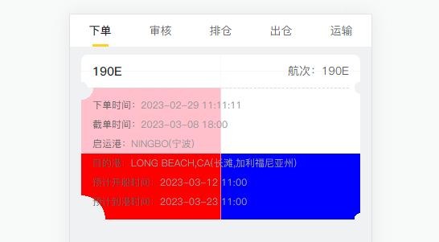

# 利用径向渐变radial-gradient封装stylus、sass函数制作半圆透明切角效果

前端项目中为了制作半圆切角效果，一般多用于优惠券类似效果：


最开始的版本，只通过一个 bottom 或 top 的参数来封装调用，只能满足上下四个角半圆切角的效果，满足的场景有限：
```stylus
$radial-gradient-half-circle($positon = 'bottom', $size = 16rpx, $bg = skyblue)
  if $positon == 'bottom'
    background radial-gradient(circle at top left, $bg, $bg 0) top left,
    radial-gradient(circle at top right, $bg, $bg 0) top right,
    radial-gradient(circle at bottom right, transparent $size, $bg 0) bottom right,
    radial-gradient(circle at bottom left, transparent $size, $bg 0) bottom left
  if $positon == 'top'
    background radial-gradient(circle at top left, transparent $size, $bg 0) top left,
    radial-gradient(circle at top right, transparent $size, $bg 0) top right,
    radial-gradient(circle at bottom right, $bg, $bg 0) bottom right,
    radial-gradient(circle at bottom left, $bg, $bg 0) bottom left
  background-size 50% 50%
  background-repeat no-repeat
```

然后就想能不能尝试提取更多的参数，满足更多的场景，比如可以设置具体哪个角、大小和背景色。

### 写法一：失败
每一行末尾加了逗号会报错 Failed to compile...unexpected "else"，如果去掉逗号后面的 if else 又都没有效果：
```stylus
$radial-gradient-half-circle(
  $top-left = false, // 左上角是否为透明半圆
  $top-right = false, // 右上角是否为透明半圆
  $bottom-right = false, // 右下角是否为透明半圆
  $bottom-left = false, // 左下角是否为透明半圆
  $size = 16rpx, // 半圆半径
  $bg = #FFF, // 背景色
)
  if $top-left
    background radial-gradient(circle at top left, transparent $size, $bg 0) top left,
  else
    background radial-gradient(circle at top left, $bg, $bg 0) top left,
  if $top-right
    radial-gradient(circle at top right, transparent $size, $bg 0) top right,
  else
    radial-gradient(circle at top right, $bg, $bg 0) top right,
  if $bottom-right
    radial-gradient(circle at bottom right, transparent $size, $bg 0) bottom right,
  else
    radial-gradient(circle at bottom right, $bg, $bg 0) bottom right,
  if $bottom-left
    radial-gradient(circle at bottom left, transparent $size, $bg 0) bottom left
  else
    radial-gradient(circle at bottom left, $bg, $bg 0) bottom left
  background-size 50% 50%
  background-repeat no-repeat
```

### 写法二：成功
只保留第一个 if else，后面的全部改成三元表达式，注意要逗号前面的要用括号括起来，否则也会报错，可以正常编译，但是后面的三元表达式重复写了两遍，不够简洁和优雅：
```stylus
$radial-gradient-half-circle(
  $top-left = false, // 左上角是否为透明半圆
  $top-right = false, // 右上角是否为透明半圆
  $bottom-right = false, // 右下角是否为透明半圆
  $bottom-left = false, // 左下角是否为透明半圆
  $size = 16rpx, // 半圆半径
  $bg = #FFF, // 背景色
)
  if $top-left
    background radial-gradient(circle at top left, transparent $size, $bg 0) top left,
    ($top-right ? radial-gradient(circle at top right, transparent $size, $bg 0) top right : radial-gradient(circle at top right, $bg, $bg 0) top right),
    ($bottom-right ? radial-gradient(circle at bottom right, transparent $size, $bg 0) bottom right : radial-gradient(circle at bottom right, $bg, $bg 0) bottom right),
    $bottom-left ? radial-gradient(circle at bottom left, transparent $size, $bg 0) bottom left : radial-gradient(circle at bottom left, $bg, $bg 0) bottom left
  else
    background radial-gradient(circle at top left, $bg, $bg 0) top left,
    ($top-right ? radial-gradient(circle at top right, transparent $size, $bg 0) top right : radial-gradient(circle at top right, $bg, $bg 0) top right),
    ($bottom-right ? radial-gradient(circle at bottom right, transparent $size, $bg 0) bottom right : radial-gradient(circle at bottom right, $bg, $bg 0) bottom right),
    $bottom-left ? radial-gradient(circle at bottom left, transparent $size, $bg 0) bottom left : radial-gradient(circle at bottom left, $bg, $bg 0) bottom left
  background-size 50% 50%
  background-repeat no-repeat
```

### 写法三：成功
在上面的版本中全部改成三元表达式，更加简洁，可以正常编译：
```stylus
$radial-gradient-half-circle(
  $top-left = false, // 左上角是否为透明半圆
  $top-right = false, // 右上角是否为透明半圆
  $bottom-right = false, // 右下角是否为透明半圆
  $bottom-left = false, // 左下角是否为透明半圆
  $size = 16rpx, // 半圆半径
  $bg = #FFF, // 背景色
)
  background ($top-left ? radial-gradient(circle at top left, transparent $size, $bg 0) top left : radial-gradient(circle at top left, $bg, $bg 0) top left),
  ($top-right ? radial-gradient(circle at top right, transparent $size, $bg 0) top right : radial-gradient(circle at top right, $bg, $bg 0) top right),
  ($bottom-right ? radial-gradient(circle at bottom right, transparent $size, $bg 0) bottom right : radial-gradient(circle at bottom right, $bg, $bg 0) bottom right),
  $bottom-left ? radial-gradient(circle at bottom left, transparent $size, $bg 0) bottom left : radial-gradient(circle at bottom left, $bg, $bg 0) bottom left
  background-size 50% 50%
  background-repeat no-repeat
```

### 写法四：终极版，成功
为了满足更多的场景，提供更多的参数，满足每个角可以单独设置大小和颜色：
```stylus
$radial-gradient-half-circle(
  $top-left = false, // 左上角是否为透明半圆
  $top-right = false, // 右上角是否为透明半圆
  $bottom-right = false, // 右下角是否为透明半圆
  $bottom-left = false, // 左下角是否为透明半圆
  $size-top-left = 16rpx, // 左上角半圆半径
  $size-top-right = 16rpx, // 右上角半圆半径
  $size-bottom-right = 16rpx, // 右下角半圆半径
  $size-bottom-left = 16rpx, // 左下角半圆半径
  $bg-top-left = #FFF, // 左上角背景色
  $bg-top-right = #FFF, // 右上角背景色
  $bg-bottom-right = #FFF, // 右下角背景色
  $bg-bottom-left = #FFF, // 左下角背景色
)
  background ($top-left ? radial-gradient(circle at top left, transparent $size-top-left, $bg-top-left 0) top left : radial-gradient(circle at top left, $bg-top-left, $bg-top-left 0) top left),
  ($top-right ? radial-gradient(circle at top right, transparent $size-top-right, $bg-top-right 0) top right : radial-gradient(circle at top right, $bg-top-right, $bg-top-right 0) top right),
  ($bottom-right ? radial-gradient(circle at bottom right, transparent $size-bottom-right, $bg-bottom-right 0) bottom right : radial-gradient(circle at bottom right, $bg-bottom-right, $bg-bottom-right 0) bottom right),
  $bottom-left ? radial-gradient(circle at bottom left, transparent $size-bottom-left, $bg-bottom-left 0) bottom left : radial-gradient(circle at bottom left, $bg-bottom-left, $bg-bottom-left 0) bottom left
  background-size 50% 50%
  background-repeat no-repeat
```
可以自定义每个角的大小和背景色，不传会取默认值，使用示例：$radial-gradient-half-circle(true, true, true, true, 30rpx, , , 60rpx, pink, , blue, red)



### 注意
* 手机屏幕显示问题：注意背景色大小 background-size 可以比 50% 多设置点，比如设置成 52%，防止在部分手机屏幕上看着中间会有一条缝隙
* sass 版本和 stylus 类似