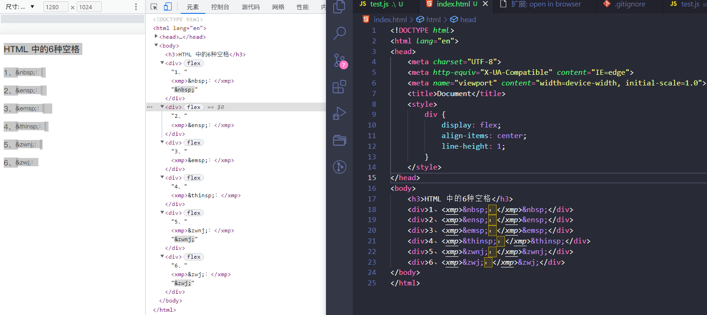

# mysql中执行 sql 语句报语法错误引出的代码空格问题

执行 sql 创建 mysql 表的时候，一直出现如下报错：

```bash
1064 - You have an error in your SQL syntax; check the manual that corresponds to your MySQL server version for the right syntax to use near...
```
根据报错提示 sql 语法错误，错误状态码 1064，网上很多人说是使用了 mysql 保留关键字，没用反单引号``包起来，或者普通字符串使用了反单引号这些...反正大部分都是说引号这块出了问题，但一遍遍地检查确实又都没发现问题。


执行的 sql 代码：
```sql
-- 有问题的版本
CREATE TABLE `name_table` (
  `id` bigint(20) unsigned NOT NULL AUTO_INCREMENT COMMENT '主键',
  `name` varchar(128) NOT NULL COMMENT '名称',
  PRIMARY KEY (`id`)
) ENGINE=InnoDB DEFAULT CHARSET=utf8mb4 COMMENT='名称表';

-- 正常的版本
CREATE TABLE `name_table` (
  `id` bigint(20) unsigned NOT NULL AUTO_INCREMENT COMMENT '主键',
  `name` varchar(128) NOT NULL COMMENT '名称',
  PRIMARY KEY (`id`)
) ENGINE=InnoDB DEFAULT CHARSET=utf8mb4 COMMENT='名称表';
```

一个字符一个字符地对比，明明一毛一样的代码，为啥第一个就报错，第二个就可以正常执行！实在想不到哪出问题了，找了一个在线代码比对工具，发现字段名前面的空格似乎不太一样：


然后翻看具体的 html 源代码，确实不一样，有问题的空格是 \&nbsp;，没问题的就是一个普通的空格，里面没有内容：


经测试发现有问题的版本字段名语句前面的空格用的是全角空格，而没问题的用的是2个半角空格，两者外表看起来确实一毛一样，但是实际上不一样，也就引发了语法报错。

## 计算机中的全角和半角符号

计算机中的符号按占用存储空间的大小可分为半角符号和全角符号

* 半角符号占1个字节，也就是1byte，用的是 ASCII 中的字符，如：a,b.c;d
* 全角符号占2个字节，也就是2byte，用的是 GB2312-80(unicode编码)，如：ａ，ｂ。ｃ；ｄ

一般来说，英文符号都是半角符号，中文符号都是全角符号，全角和半角对于计算机而言是不同的字符，需区别对待。

## 三种空格

1. 不间断空格，unicode码：\u00A0，主要用在office中，让一个单词在结尾处不会换行显示，快捷键 ctrl+shift+space
2. 半角空格(英文符号)，unicode码：\u0020，代码中常用
3. 全角空格(中文符号)，unicode码：\u3000，中文中使用

## HTML 中的6种空格

HTML提供了5种空格实体（space entity），它们拥有不同的宽度，非断行空格（\&nbsp;）是常规空格的宽度，可运行于所有主流浏览器。其他几种空格（\&ensp; \&emsp; \&thinsp; \&zwnj; \&zwj;）在不同浏览器中宽度各异。

### 1. \&nbsp;

它叫不换行空格，全称No-Break Space，它是最常见和我们使用最多的空格，大多数的人可能只接触了\&nbsp;，它是按下space键产生的空格。在HTML中，如果你用空格键产生此空格，空格是不会累加的（只算1个）。要使用html实体表示才可累加，该空格占据宽度受字体影响明显而强烈。

### 2. \&ensp;

它叫\&ldquo;半角空格\&rdquo;，全称是En Space，en是字体排印学的计量单位，为em宽度的一半。根据定义，它等同于字体度的一半（如16px字体中就是8px）。名义上是小写字母n的宽度。此空格传承空格家族一贯的特性：透明的，此空格有个相当稳健的特性，就是其 占据的宽度正好是1/2个中文宽度，而且基本上不受字体影响。

### 3. \&emsp;
它叫\&ldquo;全角空格\&rdquo;，全称是Em Space，em是字体排印学的计量单位，相当于当前指定的点数。例如，1 em在16px的字体中就是16px。此空格也传承空格家族一贯的特性：透明的，此空格也有个相当稳健的特性，就是其 占据的宽度正好是1个中文宽度，而且基本上不受字体影响。

### 4. \&thinsp;

它叫窄空格，全称是Thin Space。我们不妨称之为\&ldquo;瘦弱空格\&rdquo;，就是该空格长得比较瘦弱，身体单薄，占据的宽度比较小。它是em之六分之一宽。

### 5. \&zwnj;

它叫零宽不连字，全称是Zero Width Non Joiner，简称\&ldquo;ZWNJ\&rdquo;，是一个不打印字符，放在电子文本的两个字符之间，抑制本来会发生的连字，而是以这两个字符原本的字形来绘制。Unicode中的零宽不连字字符映射为\&ldquo;\&rdquo;（zero width non-joiner，U+200C），HTML字符值引用为： \&zwnj;

### 6. \&zwj;

它叫零宽连字，全称是Zero Width Joiner，简称\&ldquo;ZWJ\&rdquo;，是一个不打印字符，放在某些需要复杂排版语言（如阿拉伯语、印地语）的两个字符之间，使得这两个本不会发生连字的字符产生了连字效果。零宽连字符的Unicode码位是U+200D (HTML: \&zwj; \&zwj;）。

此外，浏览器还会把以下字符当作空白进行解析：空格（\&#x0020;）、制表位（\&#x0009;）、换行（\&#x000A;）和回车（\&#x000D;）还有（\&#12288;）等等。

