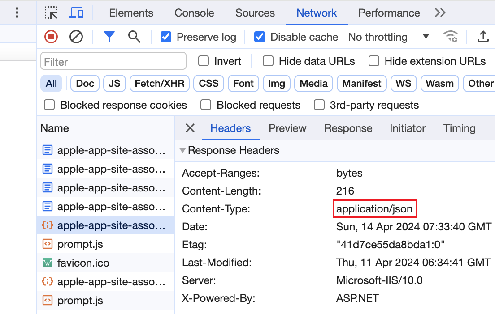

# 苹果app开发apple-app-site-association文件配置

### apple-app-site-association 是什么？
apple-app-site-associon 是苹果公司提供的一种能让app和网站关联起来的配置文件格式，用于在app中实现Universal Links。该文件包含app与网站之间的关联信息，使得用户在点击网站链接时可以直接唤起手机上的app，实现跳转到app内对应页面的功能，提升用户体验。

微信小程序里提供的 URL Scheme 和 URL Link，我们通过h5链接唤起小程序实际就是依赖这个实现的，只不过 apple-app-site-association 这个配置文件是微信 app 自己去配置的。

这个比较常见的应用场景就是短信里的链接点击直接打开 app，我们手机上经常收到的各个 app 发送的各种活动信息，里面的让你惦记链接参加活动之类的也是用这实现的。

### 配置 apple-app-site-association 文件
需要新建一个名为 apple-app-site-association 无文件后缀的文件，里面的内容为：
```
{
    "applinks": {
        "apps": [],
        "details": [
            {
                "appID": "{TeamID}.{BundleID}",
                "paths": ["/app/*", "/applink/*"]
            }
        ]
    }
}
```

然后将此文件上传到服务器根目录下的 .well-known 目录下，也可以直接上传到根目录，Apple 校验的时候会先去 .well-known 目录下找，没找到的话会继续去根目录下找。

在服务器上上传了配置文件后，可以通过如下 3 个链接访问测试：
```
https://{你的域名}/.well-known/apple-app-site-association

https://{你的域名}/apple-app-site-association

https://app-site-association.cdn-apple.com/a/v1/{你的域名}
```

看下是否能直接访问到上传的 json 文件，如果访问时浏览器是直接下载文件，看下请求地址的响应头 Content-Type，必须要是 application/json 才能直接显示：



如果不是 application/json，自己在服务器上增加一个 MIME 类型，文件扩展名就是一个点 .，值 application/json，这样访问的时候浏览器就能正确解析显示 json 内容了。

如果能在 iphone 的备忘录中直接点击链接或者在 safari 浏览器中访问 https://cafe123.cn/applink/ 能打开手机上的 app，就说明配置成功了。注意配置好之后，实际 Apple 那边可能会有 24-48 小时左右的延迟，所以最好等 1 天在验证功能是否可用。

* [苹果 Sign in with Apple](https://developer.apple.com/documentation/sign_in_with_apple)
* [苹果 apple-app-site-association](https://developer.apple.com/documentation/xcode/supporting-associated-domains)
* [微信移动应用iOS接入指南](https://developers.weixin.qq.com/doc/oplatform/Mobile_App/Access_Guide/iOS.html)
* [Donut 多端应用 Universal Link 配置](https://dev.weixin.qq.com/docs/framework/guideline/web/universal-link-guide.html)