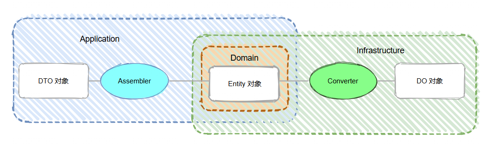

# DDD架构中assembler和converter的区别

DDD四层架构模式中，各层的对象我们需要借助assembler或converter来进行转换，但在实际项目中assembler和converter大家使用都很随意，很多项目中每一层都建了一个assembler目录，里面有的是 XxooAssembler，有的是 XxooConverter，看着也没什么规范也不知道是根据啥定义出来的，所以萌生了想要一探这两者区别的想法。

### 英文释义
先从英文的含义上来寻找答案：
* assembler：n.汇编程序，汇编器(将指令转变为机器码)、装配工
* converter：n.转换器、(改变无线电信号的)变频器、变流器、整流器、使发生转化的人(或物)
这里从英文意思上似乎找不到区别的方法，assembler 虽然有将指令转变为机器码的含义，但开发中实际也不是拿来转换成机器码，和 converter 一样是拿来做对象之间的转换。

### 按语义区分
#### 1、assembler
assembler（装配器）从语义上理解，装配强调的是将多个组合在一起形成一个完整的整体。比如把从不同数据源或者不同业务处理阶段获取到的零散的、相关的数据信息，按照特定的业务规则进行拼接、组装成一个符合领域业务场景要求的完整对象实例。实际开发中例如在电商场景下，一个订单聚合根对象可能需要由订单信息、用户信息、物流信息等多个部分组成，assembler 的任务就是将这些各个信息装配成一个完整的订单聚合根对象，使得这个新的对象在领域层，能够进行后续的诸如订单计算、状态变更等业务逻辑处理。

#### 2、converter
converter（转换器）的语义侧重于改变事物的表现形式或格式。侧重的是对单个对象（也可能是包含多个对象的集合，但主要针对整体的表现形式改变）的属性、数据结构等进行调整，以便让其能在不同的层次（如从领域层到表现层）、不同的系统（如从内部到外部）之间以更合适的形式进行传递、展示或交互。还是比如在电商系统中，领域层有一个包含了详细用户信息（如姓名、年龄、性别、联系方式、收货地址等）的用户对象。当前端要在用户界面（UI）展示用户列表时，我们并不需要展示所有的这些信息，可能只需要展示用户名、头像，converter 的作用就是将这个领域层的用户对象进行转换、提取并重新组织相关属性，生成一个适合在 UI 层展示的视图对象。

### 按模型层区分
也有一种观点就是这两者属于不同的结构层，assembler 属于接口层和应用层，其作用是将前端参数、或领域对象转换成 DTO（数据传输对象），或将 DTO 转换回领域对象；converter 属于基础层，其作用是将领域对象转换成数据库DO对象，或将 DO 转换回领域对象。

两种区分方法似乎都有其合理性，但是按语义区分的方式实际在开发中很难明确区别出来，也就很容易造成后续开发者不明其理随意使用。这里个人感觉还是按照模型层来区分比较合理，实际开发中也大都是拿来做对象转换，Interface、Application层都定义成assembler，Infrastructure层定义成converter，这样容易区分也不会出现混在一起随意定义使用的情况。

还有在实际开发中，很多人可能偷懒喜欢直接将对象之间的转换代码写到业务逻辑里，这样一方面会造成方法越来越臃肿，另一方面也不方便单元测试和复用，所以这类转换代码还是很推荐通过 assembler、converter 抽离成单独的方法。