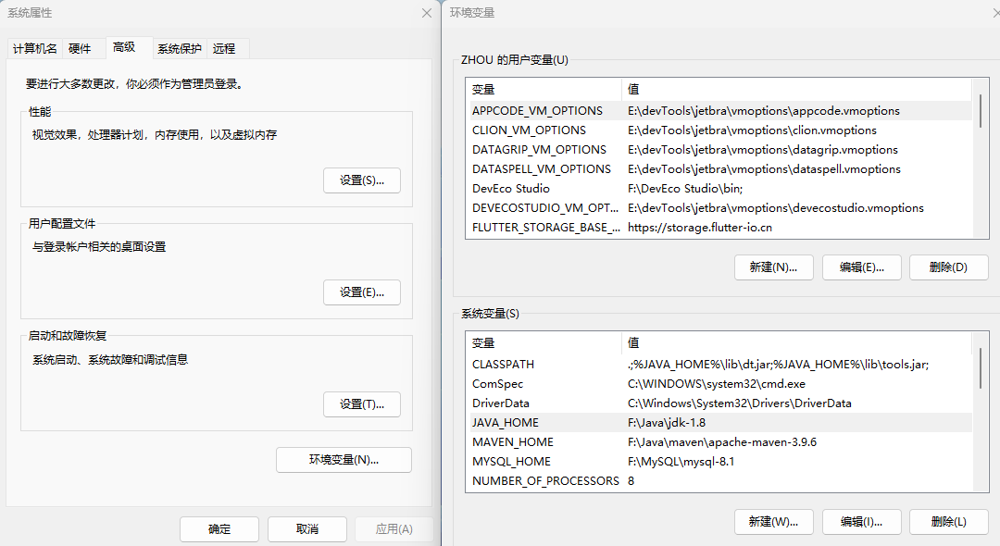
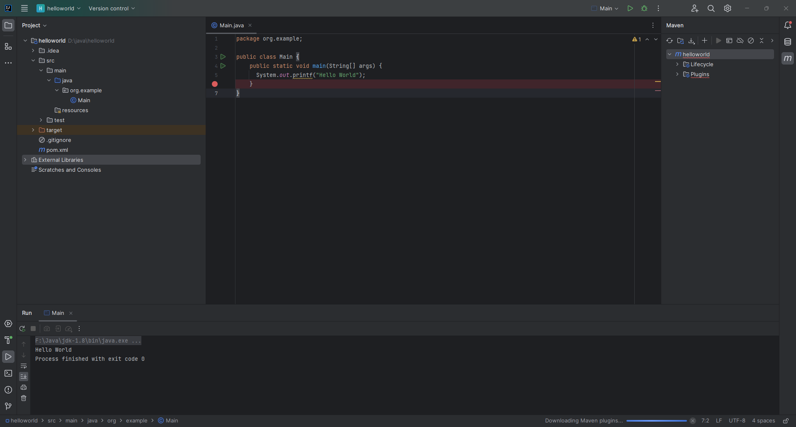

# java本地开发环境搭建

### java
[jdk8 官方下载地址](https://www.oracle.com/java/technologies/downloads/#java8)，下载解压后，先在环境变量中添加 JAVA_HOME 和 CLASSPATH 这2个变量，然后再添加到 Path 变量中：
* JAVA_HOME
```
F:\Java\jdk-1.8 // 修改成自己的实际 jdk 的解压地址
```
* CLASSPATH
```
.;%JAVA_HOME%\lib\dt.jar;%JAVA_HOME%\lib\tools.jar; // 注意不要少了前面的 "." 和后面的 ";"
```
* Path
直接新建下面两个变量到 Path 变量中：
```
%JAVA_HOME%\bin
%JAVA_HOME%\jre\bin
```

这一步相当于前端开发中我们需要安装 nodejs 环境，然后才能在本地利用 node 提供的一些系统能力。

### maven
[maven 官方下载地址](https://maven.apache.org/download.cgi)，下载好后直接解压，然后添加系统环境变量：

先在环境变量中添加一个 MAVEN_HOME 变量，值对应 maven 的解压地址，如 F:\Java\maven\apache-maven-3.9.6，然后在 path 环境变量中添加：
```
%MAVEN_HOME%\bin
```

接着修改下 setting.xml 配置文件，在解压包的 config 目录下，如 F:\Java\maven\apache-maven-3.9.6\conf，用编辑器打开 setting.xml，主要修改本地仓库地址（windows 不修改默认会在 c 盘用户目录的 .m2/repository 目录下，建议修改到其他盘地址）和中央仓库国内镜像源：

* 本地仓库
```
<localRepository>F:/Java/maven/repo</localRepository>
```
* 镜像源
```
<mirror>
    <id>aliyunmaven</id>
    <mirrorOf>*</mirrorOf>
    <name>阿里云公共仓库</name>
    <url>https://maven.aliyun.com/repository/public</url>
</mirror>
```
这一步相当前端开发中我们常用的 npm，只不过 nodejs 中自带了 npm，在 java 开发中我们一般会选择自己安装 maven，然后在项目中管理依赖。

### ItelliJ IDEA
[JetBrains 官网下载地址](https://www.jetbrains.com/idea/)，这是付费软件，首次安装可以试用 30 天，不过刚开始学习可以直接选择安装免费的社区版。市面上开发工具有很多，比如我们前端中常用的 vscode，也可以用来开发 java 程序，不过还是推荐直接使用专业的 ItelliJ IDEA。


### Hello world
先来跑个简单的 Hello world，直接打开 ItelliJ IDEA 然后 New Project，新建一个 maven 示例项目，项目结构如下：



可以看到里面 src 目录就是咱的代码目录，pom.xml 就是项目配置文件，相当于前端项目中的 package.json 文件。