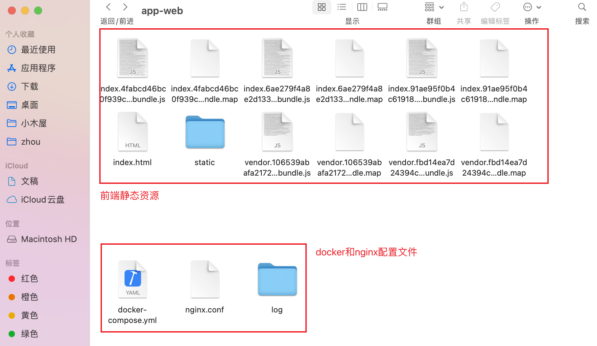
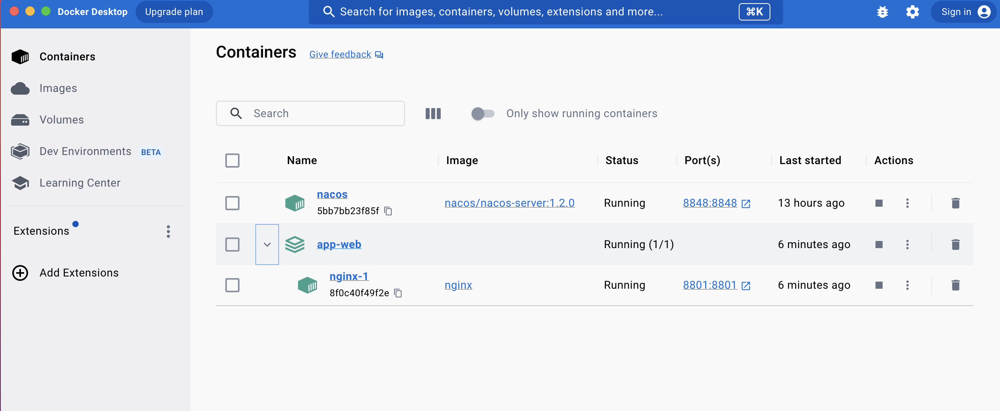

# 用docker和nginx部署前端项目访问本地java网关gateway服务

需求背景：本地开发 java 微服务项目，但是拿到的对应的web前端项目只有打包编译过后的 dist 目录里的静态资源（里面只有一个index.html和一些编译过后的 js、css文件），前端接口需要先访问到 java 的网关服务，然后网关里再做转发。



因为没有前端源码，也不能像正常开发中的前端项目一样，我们可以随便修改代理访问任意服务地址，而且只能通过 nginx 之类的服务器实现部署访问和代理接口地址。

### 解决步骤
通过在本地安装docker来运行nginx服务器

#### 一、安装 docker
直接去docker官网下载安装好docker，windows、mac都有对应的版本

#### 二、拉取 nginx 镜像
直接拉取最新版本的nginx
```bash
docker pull nginx
```

#### 三、添加 docker-compose 配置文件
直接利用docker-compose来启动容器，就不需要自己手动一行一行来敲命令了。在前端静态资源目录里新建 docker-compose.yml 文件：

```yml
version: "3"
services:
  nginx:
    image: nginx
    ports:
        - "8801:8801" # 前端项目访问端口(宿主机:容器内)
    volumes: # 数据卷目录映射(宿主机:容器内)
        - ./nginx.conf:/etc/nginx/nginx.conf # 配置文件
        - ./:/usr/share/nginx/html  # 项目html文件
        - ./log:/var/log/nginx  # 日志文件(方便排查问题，不要也可以)
```

#### 四、添加 nginx 配置文件
在前端静态资源目录里新建 nginx.conf 文件：

```conf
#user  nobody;
worker_processes  1;
events {
    worker_connections  1024;
}
http {
    include       mime.types;
    default_type  application/octet-stream;
    sendfile        on;
    keepalive_timeout  65;
	upstream app-gateway { # 负载均衡
        server host.docker.internal:51601; # 网关服务的地址和端口
    }
    server {
        listen 8801;
        location / {
            root /usr/share/nginx/html;
            index index.html;
        }

        location ~/app/(.*) {
            proxy_pass http://app-gateway/$1;
            proxy_set_header HOST $host; # 不改变源请求头的值
            proxy_pass_request_body on; # 开启获取请求体
            proxy_pass_request_headers on; # 开启获取请求头
            proxy_set_header X-Real-IP $remote_addr; # 记录真实发出请求的客户端IP
            proxy_set_header X-Forwarded-For $proxy_add_x_forwarded_for; # 记录代理信息
        }
    }
}
```

* 注意 nginx 里的前端目录/usr/share/nginx/html和配置文件/etc/nginx/nginx.conf，在上面第三步里已经通过 docker 的数据卷 volumns 挂载到宿主机目录里了。

还有就是因为前端项目是运行在 docker 容器里的，但是前端接口是要访问宿主机上的网关服务，这就涉及到 docker 容器和外部宿主机通信的问题，所以上面的网关地址不能写 localhost 或 127.0.0.1（这实际是在访问docker内的本地服务），而是要写成真实的 ip，可以通过 ipconfig 或 ifconfig（mac、linux系统）命令查看。

不过上面用命令获取到的这个本机ip地址是可能会变的，所以最好的方式是直接写成 host.docker.internal，这个就指代宿主机的真实ip，注意低版本的docker不支持这个。

#### 五、运行前端服务
直接在前端静态资源目录里输入命令：docker-compose up，运行成功了，就可以在本地浏览器里访问前端和后端网关服务了：




