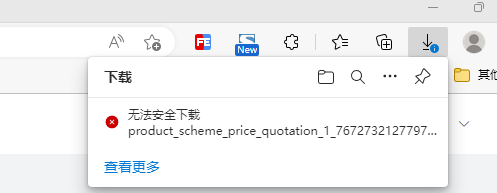

# a标签下载图片谷歌chrome浏览器无反应

项目中用 a 标签来下载第三方服务器图片资源，在谷歌浏览器里本地开发调试都是没问题的，部署到测试服务器上怎么点击都没反应，开始还以为是 a 标签下载的兼容性啥的影响了，明明一毛一样的代码，其他地方都是可以下载。

然后换到 edge 浏览器中就发现问题了，edge 会弹出一个不安全内容的提示框：

进一步查看资源链接时，发现是 http 的，浏览器在 https 网站中打开 http 资源时，会被默认当成不安全的内容屏蔽拦截，谷歌浏览器临时解决可以在浏览器的设置里设置：隐私设置合安全性 - 网站设置 -更多内容设置 - 不安全内容。

我们在本地开发时运行的项目都是运行在 http://localhaost:8080、http://127.0.0.1:8080 ...，直接打开 http 资源是不会被当成不安全的，也就解释了为什么本地明明可以。测试环境是部署在 https://test.xxx.com 下的，所以会出现问题，线上正常也都会是 https，所以要注意下这个问题，很容易就暴露到生产环境。