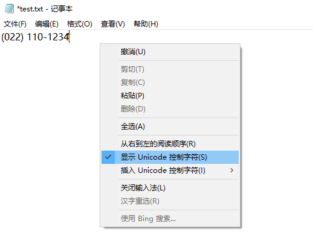
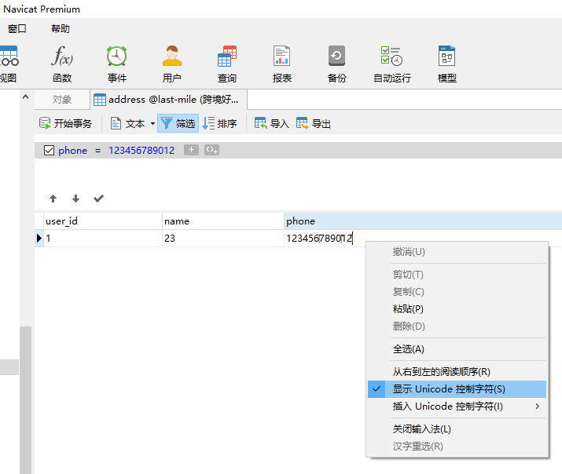
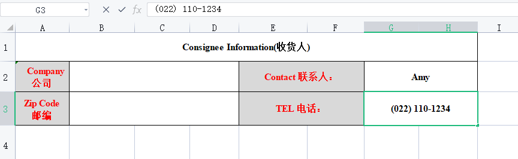

# input输入unicode零宽字符前端踩坑

### Unicode 统一码
也叫万国码、单一码，是计算机科学领域里的一项业界标准，包括字符集、编码方案等。统一码是为了解决传统的字符编码方案的局限而产生的，它为每种语言中的每个字符设定了统一并且唯一的二进制编码，以满足跨语言、跨平台进行文本转换、处理的要求。


### Unicode 零宽字符
Unicode字符中有一类特殊的字符叫做零宽字符 ZWJ（zero width joiner），也叫非打印字符、不可见字符。正则的断言即叫零宽断言，意思即本身并不占用宽度，如比较出名的零宽空格ZWSP：U+200B。

零宽字符本质也是字符，对于计算机来说，它依然会占用空间，在 Unicode 字符集中拥有独立的编码，你在 Word 键入这一字符它仍会被计入字数统计，同样在代码中打印这类字符的长度可以看到也是会占用长度的。

零宽字符的宽度为 0，对于肉眼而言不可见，在我们常用的一些软件中并不会显示，比如浏览器、Excel...，这些字符通常被用于在阿拉伯文与印度语系等文字中，用于控制字符间是否产生连字的效果，在其他大多数语言中，你并不能直接打出这类字符。

#### 常见的几种零宽字符有：
* 零宽空格：U+200B
* 零宽连接符：U+200D，常见的复杂Emoji表情即用到了该字符，用于表示多字符关系从而合成复杂新字符
* 零宽非连接符：U+200C
* 零宽非断空格符：U+FEFF
* 左至右符：U+200E
* 右至左符：U+200F
* 蒙古文元音分隔符：U+180E

### 怎么能看见零宽字符？
直接复制到开发工具如 vscode 里，是可以直接看到这类字符的 unicode 码的。

在 windows 记事本中-右键，选择 “显示 Unicode 控制字符”，也可以‭看到这类特殊符号。



navicat 中查看mysql中的数据，也可以像记事本一样右键选择“显示 Unicode 控制字符”，光标聚焦的时候也可以看到有特殊符号显示出来。



还有复制粘贴进网页、记事本、输入框中，移动光标的时候，也可以发现，这类字符也是需要靠光标移动的。

### 零宽字符的应用场景
* 字符加密解密
* 数据防爬
* 隐形水印
* 缩短网址
* 敏感词分隔过审
* 空白评论、空白用户名
* 输入内容翻转如：花了‮7万5‬千，其中的7万5会被翻转成5万7

### 零宽字符踩坑
之所以发现这个问题，也是从客户的一个 excel 模板中粘贴电话号码，最终发现莫名有特殊字符，开始还以为是输入组件的bug。


数据库是支持这种字符的，所以如果前后端未进行数据过滤，是会被直接存储到数据库中的，正常也是没什么问题。但是如果有搜索功能，用户在应用中直接手动输入检索的时候，因为手动输入是不包含特殊字符的，所以有可能导致匹配不出来，给人的感觉就是：明明看着一毛一样，一个字母一个字母对着敲的，咋就搜不出来呢！

在前端表单中，如果用户输入时是直接从其他地方如 excel 里复制的，就有可能包含这类看不见的零宽字符，据说从 iphone 手机的通讯录里复制的电话号码粘贴进excel中就有可能包含零宽字符。

当用户提交时，前端在控制台打印或者network里看提交的接口参数里也是看不到这类字符的，还有如果 input 输入框有限制最大输入长度 max-length，零宽字符也是会占用输入框的长度的。

### 前端解决方案
前端解决可以直接在输入或提交表单的时候通过 unicode 码去过滤这类特殊字符，但是每个输入框都要这样去做工作量太大了，而且都是重复性工作，最终想到了用 vue 的全局指令自己封装一个 v-trim 统一去过滤数据，正好项目中用的 elment-ui 的输入框组件 trim 修饰符也有bug，直接一块解决了，后期使用和维护都比较方便。

directives目录下的 index.js，利用webpack提供的 require.context，自动注册目录下的指令文件，直接将文件名作为指令名：
```js
// require.context是webpack提供的api用来创建上下文作用域
// 三个参数分别为：目录、是否搜索子文件夹、匹配文件名的正则
const fileInfo = require.context('./', false, /^\.\/(?!index.js).*\.js$/)
const fileNameLsit = fileInfo.keys() || []

export default {
  // 插件为对象时，Vue.use()会默认调用install
  install: function(Vue) {
    fileNameLsit.forEach(fileName => {
      const directive = fileInfo(fileName)
      // 提取路径中的文件名作为指令名称
      const directiveName = fileName.replace(/^(\.\/)([a-zA-Z0-9-_]+)\.js$/, '$2')
      // 注册指令
      Vue.directive(directiveName, directive.default || directive)
    })
  }
}
```

directives目录下的 trim.js，去除输入框首尾空格和过滤零宽字符：
```js
/**
 * 去除输入框首尾空格
 * ❶ element-ui 的输入框el-input加了 trim 会导致字符中间不能输入空格(文档上有说：不支持 v-model 修饰符)
 * ❷ 需同时过滤掉输入内容里的零宽字符，一般是用户直接从 excel 中直接复制粘贴进来的内容
 */

const TRIM = {
  inserted: el => {
    // 兼容第三方输入组件，如el-input
    const inputTag = el.tagName !== 'INPUT' ? el.querySelector('input') : el
    const handler = function(event) {
      const oldVal = event.target.value || ''
      // 过滤掉零宽字符和首尾空格
      const newVal = oldVal.replace(/[\u200b-\u200f\uFEFF\u202a-\u202e]/g, '').trim()
      if (oldVal != newVal) {
        event.target.value = newVal
        dispatchEvent(inputTag, 'input')
      }
    }
    el.inputTag = inputTag
    el._blurHandler = handler
    inputTag.addEventListener('blur', handler)
  },

  unbind: el => {
    const { inputTag } = el
    inputTag.removeEventListener('blur', el._blurHandler)
  }
}

function dispatchEvent(el, type) {
  const evt = document.createEvent('HTMLEvents')
  evt.initEvent(type, true, true)
  el.dispatchEvent(evt)
}

export default TRIM
```

在 vue 入口文件 main.js 中注册全局指令：

> Vue.use 本身是一个函数，如果需要注册的插件是一个对象，就需提供 insatll 方法，Vue 会去执行它，同时传递一个Vue构造函数作为第一个参数，以及 use 中的其他参数，不依赖Vue去运行的我们可以直接用 Vue.prototype 去挂载到原型上就行了；需要和 Vue 构造函数进行交互的时候，才使用 Vue.use，如全局组件（像iview、element-ui）、全局过滤器、全局指令这些。
```js
import Vue from 'vue'
import App from './App'
import router from './router'

// 全局指令
import directives from '@/directives'
Vue.use(directives)

new Vue({
  el: '#app',
  router,
  template: '<App/>',
  components: {
    App
  },
})
```

在vue页面中的输入框中使用：
```vue
<template>
  <div>
    <input v-trim />
    <el-input v-trim />
  </div>
</template>
```

参考文档
* [Unicode 官网](https://home.unicode.org/)
* [How to use Unicode controls for bidi text](https://www.w3.org/International/questions/qa-bidi-unicode-controls)
* [Unicode Character Categories](https://www.compart.com/en/unicode/category)
* [后端过滤隐藏字符（零宽度字符）](https://zhuanlan.zhihu.com/p/473650467)


