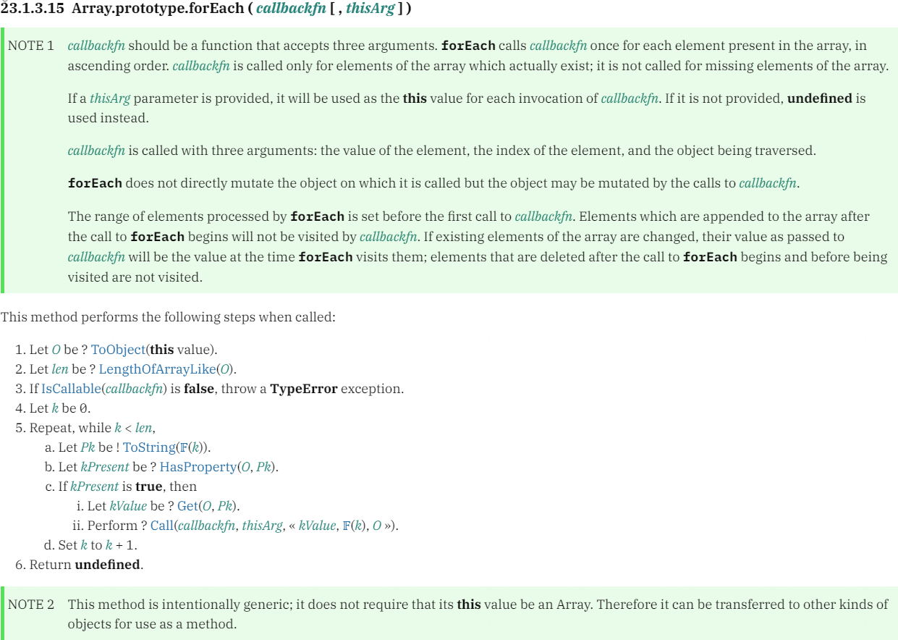

# 谁说forEach不支持异步代码，只是你拿不到异步结果而已

在前面探讨 forEach 中异步请求后端接口时，很多人都知道 forEach 中 async/await 实际是无效的，很多文章也说：forEach 不支持异步，forEach 只能同步运行代码，forEach 会忽略 await 直接进行下一次循环...

当时我的理解也是这样的，后面一细想好像不对，直接上我前面一篇文章用到的示例代码：

```javascript
async function getData() {
    const list = await $getListData()

    // 遍历请求
    list.forEach(async (item) => {
        const res = await $getExtraInfo({
            id: item.id
        })
        item.extraInfo = res.extraInfo
    })

    // 打印下最终处理过的额外数据
    console.log(list)
}
```

上面 $getListData、$getExtraInfo 都是 promise 异步方法，按照上面说的 forEach 会直接忽略掉 await，那么循环体内部拿到的 res 就应该是 undefined，后面的 res.extraInfo 应该报错才对，但是实际上代码并没有报错，说明 await 是有效的，内部的异步代码也是可以正常运行的，所以 forEach 肯定是支持异步代码的。

### 手写版 forEach
先从自己实现的简版 forEach 看起：

```javascript
Array.prototype.customForEach = function (callback) {
  for (let i = 0; i < this.length; i++) {
    callback(this[i], i, this)
  }
}
```

里面会为数组的每个元素执行一下回调函数，实际拿几组数组测试和正宗的 forEach 方法效果也一样。可能很多人还是会有疑问你自己实现这到底靠不靠谱，不瞒你说我也有这样的疑问。

### MDN 上关于 forEach 的说明
先去 MDN 上搜一下 forEach，里面的大部分内容只是使用层面的文档，不过里面有提到：“forEach() 期望的是一个同步函数，它不会等待 Promise 兑现。在使用 Promise（或异步函数）作为 forEach 回调时，请确保你意识到这一点可能带来的影响”。

### ECMAScript 中 forEach 规范
继续去往 javascript 底层探究，我们都知道执行 js 代码是需要依靠 js 引擎，去将我们写的代码解释翻译成计算机能理解的机器码才能执行的，所有 js 引擎都需要参照 ECMAScript 规范来具体实现，所以这里我们先去看下 ECMAScript 上关于 forEach 的标准规范：



### 谷歌 V8 的 forEach 实现
常见的 js 引擎有：谷歌的 V8、火狐 FireFox 的 SpiderMonkey、苹果 Safari 的 JavaScriptCore、微软 Edge 的 ChakraCore...后台都很硬，这里我们就选其中最厉害的谷歌浏览器和 nodejs 依赖的 V8 引擎，V8 中对于 forEach 实现的主要源码：

```javascript
transitioning macro FastArrayForEach(implicit context: Context)(
    o: JSReceiver, len: Number, callbackfn: Callable, thisArg: JSAny): JSAny
    labels Bailout(Smi) {
  let k: Smi = 0;
  const smiLen = Cast<Smi>(len) otherwise goto Bailout(k);
  const fastO = Cast<FastJSArray>(o) otherwise goto Bailout(k);
  let fastOW = NewFastJSArrayWitness(fastO);
  // Build a fast loop over the smi array.
  for (; k < smiLen; k++) {
    fastOW.Recheck() otherwise goto Bailout(k);
    // Ensure that we haven't walked beyond a possibly updated length.
    if (k >= fastOW.Get().length) goto Bailout(k);
    const value: JSAny = fastOW.LoadElementNoHole(k)
        otherwise continue;
    Call(context, callbackfn, thisArg, value, k, fastOW.Get());
  }
  return Undefined;
}
```
源码是 .tq 文件，这是 V8 团队开发的一个叫 Torque 的语言，语法类似 TypeScript，所以对于前端程序员上面的代码大概也能看懂，想要了解详细的 Torque 语法，可以直接去 V8 的官网上查看。

从上面的源码可以看到 forEach 实际还是依赖的 for 循环，没有返回值所以最后 return 的一个 Undefined。看完源码是不是发现咱上面的手写版也大差不差，只不过 V8 里实现了更多细节的处理。

### 结论：forEach 支持异步代码
最后的结论就是：forEach 其实是支持异步的，循环时并不是会直接忽略掉 await，但是因为 forEach 没有返回值，所以我们在外部没有办法拿到每次回调执行过后的异步 promise，也就没有办法在后续的代码中去处理或者获取异步结果了，改造一下最初的示例代码：

```javascript
async function getData() {
    const list = await $getListData()

    // 遍历请求
    list.forEach(async (item) => {
        const res = await $getExtraInfo({
            id: item.id
        })
        item.extraInfo = res.extraInfo
    })

    // 打印下最终处理过的额外数据
    console.log(list)
    setTimeout(() => {
        console.log(list)
    }, 1000 * 10)
}
```
你会发现 10 秒后定时器中是可以按照预期打印出我们想要的结果的，所以异步代码是生效了的，只不过在同步代码中我们没有办法获取到循环体内部的异步状态。

如果还是不能理解，我们对比下 map 方法，map 和 forEach 很类似，但是 map 是有返回值的，每次遍历结束之后我们是可以直接 return 一个值，后续我们就可以接收到这个返回值。这也是为什么很多文章中改写 forEach 异步操作时，使用 map 然后借助 Promise.all 来等待所有异步操作完成后，再进行下面的逻辑来实现同步的效果。

### 参考文档
* [MDN forEach 文档](https://developer.mozilla.org/zh-CN/docs/Web/JavaScript/Reference/Global_Objects/Array/forEach)
* [ECMAScript 中 forEach 规范](https://tc39.es/ecma262/#sec-array.prototype.foreach)
* [谷歌 V8 中 forEach 源码](https://chromium.googlesource.com/v8/v8.git/+/refs/heads/9.0-lkgr/src/builtins/array-foreach.tq#70)
* [谷歌 V8 中 map 源码](https://chromium.googlesource.com/v8/v8.git/+/refs/heads/9.0-lkgr/src/builtins/array-map.tq#192)
* [谷歌 V8 官网](https://v8.dev)
* [谷歌 V8 源码](https://github.com/v8/v8)