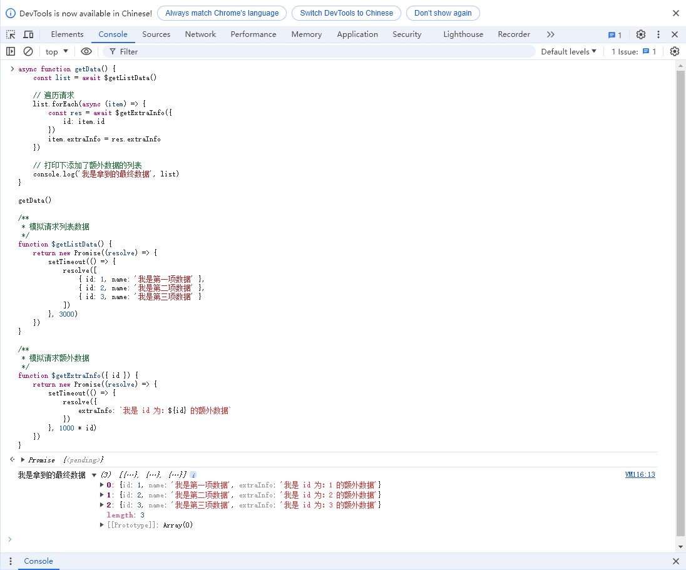
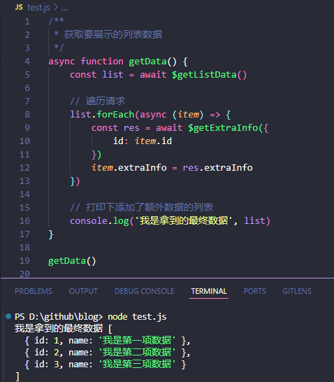

# 遍历请求后端数据引出的数组forEach异步操作的坑

有一个列表数据，每项数据里有一个额外的字段需要去调另外一个接口才能拿到，后端有现有的这2个接口，现在临时需要前端显示出来，所以这里需要前端先去调列表数据的接口拿到列表数据，然后再遍历请求另外一个接口去拿到对应的字段数据，最后再塞到列表数据里，具体可以看下面的示例代码。

### forEach 中异步操作
```javascript
/**
 * 获取要展示的列表数据
 */
async function getData() {
    const list = await $getListData()

    // 遍历请求
    list.forEach(async (item) => {
        const res = await $getExtraInfo({
            id: item.id
        })
        item.extraInfo = res.extraInfo
    })

    // 打印下最终处理过的额外数据
    console.log(list)
}
getData()

/**
 * 模拟请求列表数据
 */
function $getListData() {
    return new Promise((resolve) => {
        setTimeout(() => {
            resolve([
                { id: 1, name: '我是第一项数据' },
                { id: 2, name: '我是第二项数据' },
                { id: 3, name: '我是第三项数据' }
            ])
        }, 3000)
    })
}

/**
 * 模拟请求额外数据
 */
function $getExtraInfo({ id }) {
    return new Promise((resolve) => {
        setTimeout(() => {
            resolve({
                extraInfo: `我是 id 为：${id} 的额外数据`
            })
        }, 1000 * id)
    })
}
```

上面的代码看着好像也没啥问题，一般我们前端项目调试时，很多人可能喜欢直接在控制台用 console.log 打印，这里我们把代码复制粘贴到浏览器控制台中回车运行，直接看控制台确实也能拿到添加了 extraInfo 的列表数据，这里建议你多等几秒再去展开控制台查看折叠的数据，原因后面再说：



其实这里有一个坑，你会发现我们不同时间点去点开控制台折叠的信息时，展示出来的数据可能会不一样。其实是因为当我们在浏览器中用 console 打印一个引用数据类型的时候，是实时获取的当前时间点对象的实际值，所以当不同时间点我们展开数据查看时，就会存在看到的打印结果与预期不一致的情况。

为了避免浏览器打印的问题，我们直接换到 node 环境来执行上面的代码，然后就能看到不一样的地方了：



从截图就能看到这里我们最终打印出来的居然是原始的列表数据，自己添加的 extraInfo 字段压根没生效。

造成这样结果的原因其实是 forEach 不支持异步，即使你代码中有任何异步操作都会被直接忽略当成同步代码来运行，解决方式有两种：

### for 循环中异步操作
for 循环中是可以直接有异步操作的（for of 也是支持异步的），每一次循环会等到 await 后面的异步代码返回数据时再进行下一次循环，而 forEach 这里会直接忽略掉 await 进行下一次循环。
```javascript
async function getData() {
    const list = await $getListData()

    // 遍历请求
    for (let i = 0; i < list.length; i++) {
        const res = await $getExtraInfo({
            id: list[i].id
        })
        list[i].extraInfo = res.extraInfo
    }

    console.log(list)
}
```

### map 中异步操作
map 看着和 forEach 似乎没大多差别，但是 map 中是可以有异步操作的，因为 map 是可以有 return 返回值的，而 forEach 无返回值，上面的问题用 map 来改写：
```javascript
async function getData() {
    const list = await $getListData()

    // 遍历请求
    const promiseList = list.map(async (item) => {
        const res = await $getExtraInfo({
            id: item.id
        })
        item.extraInfo = res.extraInfo

        return item
    })

    Promise.all(promiseList).then(result => {
        console.log('我是拿到的最终数据', result)
    })
}
```

map 中包含 await 时每次循环 return 的就是一个 promise，然后我们通过 Promise.all 就可以等待所以异步操作完成后拿到对应的数据。不过这里用 map 虽然也能实现上面的功能，但是理解起来没用 for 那么简洁容易，类似的需求还是推荐用 for 循环。

### forEach 和 map 的区别

forEach 和 map 两者回调函数的参数都是一样的：item（当前每一项）、index（索引值）、arr（原数组），其中最大的一个不同点就是返回值，forEach 只是执行每次传入的回调函数，map 会把每次遍历执行回调函数的返回值，继续返回组成一个新的数组返回，如果当次循环没有 return 任何数据，默认就是 undefined。其中的差异我们从下面的手写版中也能很容易看出来。

自定义版手写 forEach 方法：
```javascript
Array.prototype.customForEach = function (callback) {
  for (let i = 0; i < this.length; i++) {
    callback(this[i], i, this)
  }
}
```

自定义版手写 map 方法：
```javascript
Array.prototype.customMap = function (callback) {
  const arr = []
  for (let i = 0; i < this.length; i++) {
    const res = callback(this[i], i, this)
    arr.push(res)
  }
  return arr
}
```

最后总结：开发中如果不是纯遍历处理数据时 forEach、map 这些要少用，每次遍历时还有其他异步操作或副作用时，直接 for 循环一把梭最稳妥，代码逻辑也最好理解。