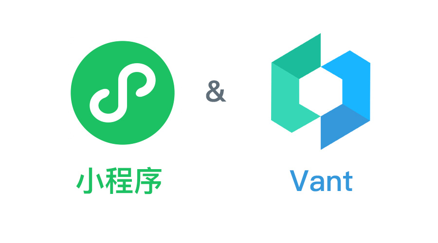

# 小程序中使用npm安装vant组件按需引入减少代码包大小

在小程序中使用 vant 组件库主要有以下两种方式：

* 下载源代码包放入项目中，可以自己删掉没用到的组件，不过后期只能自己手动更新，会不太好维护
* 通过 npm 的方式安装管理依赖，后期更新可以直接交给 npm 来管理，方便维护

正常项目中我们可能都会选择 npm 的方式，但是这种方式 vant 和小程序并不支持像我们一般的前端项目中的按需引入，小程序开发工具构建 npm 时会把整个 vant 的组件编译到 miniprogram_npm 目录中，即使我们在项目中没有通过 usingComponents 申明引用的组件也会被打包进代码包中。



### 减少代码包大小
因为小程序主包有 2M 的限制，如果我们本身只用到了几个组件，最终却打包进了整个组件库，这样不仅不合理也额外占用了咱小程序的包大小。想要按需引入的办法只能自己手动去把 miniprogram_npm 目录中没用到的组件删掉，然后再打包上传。不过每次我们提交版本都要这样去操作的话，不光容易出错也很费时间，这里我们就可以借助 node 和 npm 的 script 脚本来自动处理。

大体思路就是，先直接用 node 去自动扫描读取项目中所有 json 文件 中的 usingComponents，找出项目中实际有用到的 vant 组件，然后再去 miniprogram_npm/@vant/weapp 目录下将没有用到的多余组件删除掉就行了，最后直接把相关代码放到项目中的 script 脚本中操作，这样通过类似 npm run vant 这样一条命令 1 秒钟就可以删除掉未使用到的多余组件，实现了按需引入了。

### 未使用到的 vant 组件也会触发隐私协议
除了减少代码包大小这一项外，其实还有一个更大的痛点，vant 的部分组件会自动触发小程序的隐私协议，比如上传组件 uploader 中用到的：收集你选中的照片或视频信息（wx.chooseImage、wx.chooseMedia、wx.chooseVideo）、收集你选中的文件（wx.chooseMessageFile），这类 api 会自动触发隐私协议授权。

即使你的项目中压根没使用这类组件，上传版本提审的时候小程序还是会自动扫描你 miniprogram_npm 目录下的所有文件，只要代码中有相关的 api 代码就会认为你用到了，然后霸道地强制要求你填写和更新相关隐私说明，随便瞎填一个 99% 会被拒，也不能填写项目中未使用，这样那你自己说未使用就会让你先去把项目中相关的代码删掉再来提审。

### vant-tree-shaking
为了方便使用，脚本代码已经封装成了一个 npm 包 vant-tree-shaking（https://www.npmjs.com/package/vant-tree-shaking）上传到了 npm 公共仓库中，大家可以直接通过 npm 来下载使用：

#### 全局安装
```
npm install -g vant-tree-shaking
```
在小程序开发者工具中上传小程序代码前，直接在项目根目录终端中运行命令：vant-tree-shaking，成功后会在控制台打印出：vant-tree-shaking success。

#### 本地安装
```
npm install -D vant-tree-shaking
```
需要自己在 package.json 配置文件中配置 script 脚本命令，如直接配置自定义命令 vant：
```
{
  "name": "miniapp",
  "version": "1.0.0",
  "main": "app.js",
  "scripts": {
    "vant": "vant-tree-shaking",
  },
  "dependencies": {
    "@vant/weapp": "^1.11.5"
  },
  "devDependencies": {
    "vant-tree-shaking": "^1.0.0"
  }
}
```
在小程序开发者工具中上传小程序代码前，直接在项目根目录终端中运行命令：npm run vant，成功后会在控制台打印出：vant-tree-shaking success。

### 核心代码
主要用到了 node 的 fs、path 这两个模块，来处理文件、目录读取删除和路径的处理，其实也很简单，完整的源码可以参考 github 仓库（https://github.com/cafehaus/vant-tree-shaking），有什么使用问题或建议也欢迎大家积极反馈。

```javascript
// 1、扫描项目中的所有 json 文件，找出项目中使用到的所有 vant 组件
function readFile(filePath) {
  if (!filePath || !fs.existsSync(filePath)) return

  if (fs.statSync(filePath).isDirectory()) {
    let files = fs.readdirSync(filePath) || []
		files.map(m => {
      if (!IGNORE_DIRS.includes(m)) {
        let curPath = path.join(filePath, m)
        readFile(curPath)
      }
		})
  } else {
    getUsingComponents(filePath, vantSet)
  }
}

// 2、项目中使用到的 vant 组件依赖的其他 vant 组件
function readVantDir() {
  const files = fs.readdirSync(VANT_PATH) || []
  files.map(m => {
    if (!COMMON_DIRS.includes(m) && vantSet.has(`van-${m}`)) {
      const curPath = path.join(VANT_PATH, m, 'index.json')
      getUsingComponents(curPath, dependentSet)
    }
  })

  // 3、删除未使用到 vant 组件目录
  const usedVant = new Set([...vantSet, ...dependentSet])
  for (let i = files.length - 1; i >= 0; i--) {
    const cur = files[i]
    if (!COMMON_DIRS.includes(cur) && !usedVant.has(`van-${cur}`)) {
      const curPath = path.join(VANT_PATH, cur)
      deleteDir(curPath)
    }
  }
  console.log('vant-tree-shaking success')
}

/**
 * 读取 json 文件中的 usingComponents 属性值
 * @param {*} filePath 路径
 * @param {*} setList 存符合条件的 vant 组件名的列表
 */
function getUsingComponents(filePath, setList) {
  if (!filePath || !fs.existsSync(filePath) || !isJsonFile(filePath)) return

  try {
    const data = fs.readFileSync(filePath, 'utf8')
    const json = JSON.parse(data)
    const usingComponents = json.usingComponents || {}
    for (const key in usingComponents) {
      if (key.startsWith('van-')) {
        setList.add(key)
      }
    }
  } catch (err) {
    console.error(err)
  }
}
```

实际测试的一个项目，其中只使用到了 vant 的自定义导航栏 van-nav-bar 组件，没有按需引入时整个代码包大小 544KB，按需引入之后只有 156KB。除了代码包减少了以外，也不用再担心其他未使用到的组件默认触发隐私协议而被拒审了。