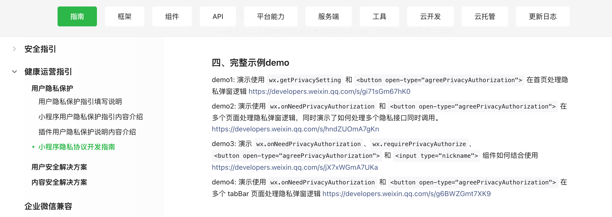

# 适配最新微信小程序隐私协议开发指南，兼容uniapp版本

前一阵微信小程序官方发布了一个用户隐私保护指引填写说明，说是为了规范开发者的用户个人信息处理行为，保障用户合法权益，小程序、插件中涉及处理用户个人信息的开发者，均需补充相应用户隐私保护指引。

估计是有啥政策强制要求，微信自己也还没想好要咋实现就匆匆发布了第一版，然后不出意外各种问题，终于在2023年8月22发布了可以正常接入调试的版本。

逛开发者社区很多人在吐槽这个东西，按照现在的实现方式微信完全可以自己在它的框架层实现，非得让开发者多此一举搞个弹窗再去调它的接口通知它。

吐槽归吐槽，代码还是要改的不是，毕竟不改9月15号之后相关功能就直接挂了！时间紧任务重下面直接说干货。

### 准备工作

* 小程序后台设置用户隐私保护指引，需要等待审核通过：设置-基本设置-服务内容声明-用户隐私保护指引
* 小程序的基础库版本从 2.32.3 开始支持，所以要选这之后的版本
* 在 app.json 中加上这个设置 "__usePrivacyCheck__": true，在2023年9月15号之前需要自己手动加这个设置，15号之后平台就强制了

具体步骤可以参考官方给的[开发文档](https://developers.weixin.qq.com/miniprogram/dev/framework/user-privacy/)，里面也有官方提供的 demo 文件。



### 原生小程序适配代码

直接参考的官方给的 demo3 和 demo4 综合修改出的版本，通过组件的方式引用，所有相关处理逻辑全部放到了 privacy 组件内部，其他涉及到隐私接口的页面只需在 wxml 里引用一下就行了，其他任何操作都不需要，组件内部已经全部处理了。

网上有其他人分享的，要在页面 onLoad、onShow 里获取是否有授权这些，用下面的代码这些都不需要，只要页面里需要隐私授权，引入 privacy 组件后，用户触发了隐私接口时会自动弹出此隐私授权弹窗。


长话短说这一步你总共只需做2个步骤：
* 新建一个 privacy 组件：privacy.wxml、privacy.wxss、privacy.js、privacy.json，完整代码在下方
* 在涉及隐私接口的页面引入 privacy 组件，如果使用的页面比较多，可以直接在 app.json 文件里通过 usingComponents 全局引入

privacy.wxml
```wxml
<view wx:if="{{innerShow}}" class="privacy">
  <view class="privacy-mask"  />
  <view class="privacy-dialog-wrap">
    <view class="privacy-dialog">
      <view class="privacy-dialog-header">用户隐私保护提示</view>

      <view class="privacy-dialog-content">感谢您使用本小程序，在使用前您应当阅读井同意<text class="privacy-link" bindtap="openPrivacyContract">《用户隐私保护指引》</text>，当点击同意并继续时，即表示您已理解并同意该条款内容，该条款将对您产生法律约束力；如您不同意，将无法继续使用小程序相关功能。</view>

      <view class="privacy-dialog-footer">
        <button
          id="btn-disagree"
          type="default"
          class="btn btn-disagree"
          bindtap="handleDisagree"
        >不同意</button>
        <button
          id="agree-btn"
          type="default"
          open-type="agreePrivacyAuthorization"
          class="btn btn-agree"
          bindagreeprivacyauthorization="handleAgree"
        >同意并继续</button>
      </view>
    </view>
  </view>
</view>
```

privacy.wxss
```wxss
.privacy-mask {
  position: fixed;
  z-index: 5000;
  top: 0;
  right: 0;
  left: 0;
  bottom: 0;
  background: rgba(0, 0, 0, 0.2);
}

.privacy-dialog-wrap {
  position: fixed;
  z-index: 5000;
  top: 16px;
  bottom: 16px;
  left: 80rpx;
  right: 80rpx;
  display: flex;
  align-items: center;
  justify-content: center;
}

.privacy-dialog {
  background-color: #fff;
  border-radius: 32rpx;
}

.privacy-dialog-header {
  padding: 60rpx 40rpx 30rpx;
  font-weight: 700;
  font-size: 36rpx;
  text-align: center;
}

.privacy-dialog-content {
  font-size: 30rpx;
  color: #555;
  line-height: 2;
  text-align: left;
  padding: 0 40rpx;
}

.privacy-dialog-content .privacy-link {
  color: #2f80ed;
}

.privacy-dialog-footer {
  display: flex;
  padding: 20rpx 40rpx 60rpx;
}

.privacy-dialog-footer .btn {
  color: #FFF;
  font-size: 30rpx;
  font-weight: 500;
  line-height: 100rpx;
  text-align: center;
  height: 100rpx;
  border-radius: 20rpx;
  border: none;
  background: #07c160;
  flex: 1;
  margin-left: 30rpx;
  justify-content: center;
}

.privacy-dialog-footer .btn::after {
  border: none;
}

.privacy-dialog-footer .btn-disagree {
  color: #07c160;
  background: #f2f2f2;
  margin-left: 0;
}
```

privacy.js
```javascript
let privacyHandler
let privacyResolves = new Set()
let closeOtherPagePopUpHooks = new Set()

if (wx.onNeedPrivacyAuthorization) {
  wx.onNeedPrivacyAuthorization(resolve => {
    if (typeof privacyHandler === 'function') {
      privacyHandler(resolve)
    }
  })
}

const closeOtherPagePopUp = (closePopUp) => {
  closeOtherPagePopUpHooks.forEach(hook => {
    if (closePopUp !== hook) {
      hook()
    }
  })
}

Component({
  data: {
    innerShow: false,
  },
  lifetimes: {
    attached: function() {
      const closePopUp = () => {
        this.disPopUp()
      }
      privacyHandler = resolve => {
        privacyResolves.add(resolve)
        this.popUp()
        // 额外逻辑：当前页面的隐私弹窗弹起的时候，关掉其他页面的隐私弹窗
        closeOtherPagePopUp(closePopUp)
      }
      
      closeOtherPagePopUpHooks.add(closePopUp)

      this.closePopUp = closePopUp
    },
    detached: function() {
      closeOtherPagePopUpHooks.delete(this.closePopUp)
    }
  },
  pageLifetimes: {
    show: function() {
      this.curPageShow()
    }
  },
  methods: {
    handleAgree(e) {
      this.disPopUp()
      privacyResolves.forEach(resolve => {
        resolve({
          event: 'agree',
          buttonId: 'agree-btn'
        })
      })
      privacyResolves.clear()
    },
    handleDisagree(e) {
      this.disPopUp()
      privacyResolves.forEach(resolve => {
        resolve({
          event: 'disagree',
        })
      })
      privacyResolves.clear()
    },
    popUp() {
      if (this.data.innerShow === false) {
        this.setData({
          innerShow: true
        })
      }
    },
    disPopUp() {
      if (this.data.innerShow === true) {
        this.setData({
          innerShow: false
        })
      }
    },
    openPrivacyContract() {
      wx.openPrivacyContract({
        success: res => {
          console.log('openPrivacyContract success')
        },
        fail: res => {
          console.error('openPrivacyContract fail', res)
        }
      })
    },
    curPageShow() {
      if (this.closePopUp) {
        privacyHandler = resolve => {
          privacyResolves.add(resolve)
          this.popUp()
          // 额外逻辑：当前页面的隐私弹窗弹起的时候，关掉其他页面的隐私弹窗
          closeOtherPagePopUp(this.closePopUp)
        }
      }
    }
  }
})
```

privacy.json
```json
{
  "component": true,
  "usingComponents": {}
}
```

### uniapp版本

uniapp 版本也可以直接用上面的代码，新建的 privacy 组件放到微信小程序对应的 wxcompnents 目录下，这个目录下是可以直接放微信小程序原生的组件代码的，因为目前只有微信小程序有这个东西，后期还可能随时会更改，所以没必要再额外去封装成 vue 组件了。

页面引用组件的时候直接用条件编译去引用：
```json
{
  // #ifdef MP-WEIXIN
  "usingComponents": {
    "privacy": "/wxcomponents/privacy/privacy"
  }
  // #endif
}
```

在 vue 页面里使用组件也要用条件编译：
```html
<template>
  <view>
    <!-- #ifdef MP-WEIXIN -->
    <privacy />
    <!-- #endif -->
  </view>
</template>
```

注意uniapp官方目前还没有来适配微信这，目前开发调试 __usePrivacyCheck__ 这个设置放到 page.json 文件里无效的，要放到 manifest.json 文件的 mp-weixin 下面：
```json
{
  "name" : "uni-plus",
  "appid" : "__UNI__3C6F1BF",
  "mp-weixin" : {
    "appid" : "wx123456789",
    "__usePrivacyCheck__" : true
  }
}
```
