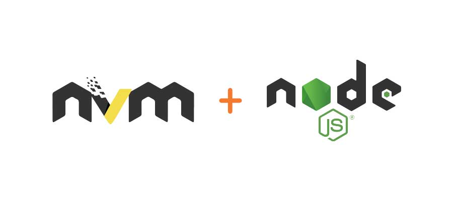
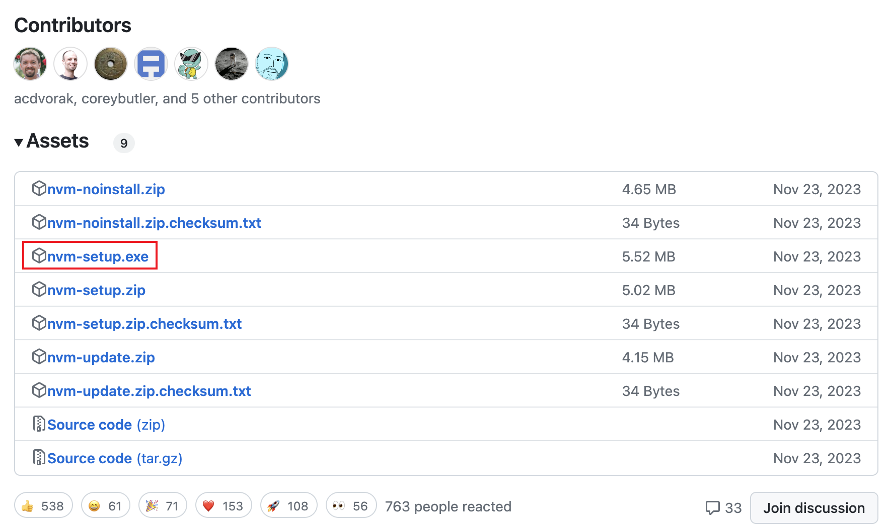

# mac和windows上安装nvm管理node版本

NVM 是 node version manager 的缩写，它是一个用来管理电脑上 node 版本的命令行工具，在日常前端开发中是一个跟 node 一样会经常用到的工具，可以很方便的让我们快速切换不同的node版本。



## mac 上安装 nvm

### 1、下载安装 nvm
下载安装可以直接使用官方推荐的 cURL or Wget 命令，可以参考 [nvm 官方仓库](https://github.com/nvm-sh/nvm/tree/master)里的说明:

```shell
curl -o- https://raw.githubusercontent.com/nvm-sh/nvm/v0.40.0/install.sh | bash
```

```shell
wget -qO- https://raw.githubusercontent.com/nvm-sh/nvm/v0.40.0/install.sh | bash
```

当然，也可以使用 brew 命令来安装，brew 是 mac 系统上一款软件管理工具，通过它可以很方便的安装、卸载第三方软件，类似于node里的npm包管理工具，如果你的 mac 上有安装 brew，可以在终端中输入下方命令安装 nvm：

```shell
brew install nvm
```

### 2、执行 nvm 脚本安装文件
在 mac 中，source 命令是一个非常有用的命令，它用于在当前shell环境中执行指定的shell脚本文件，这里我们就需要借助 source 命令来执行下 nvm 安装脚本。我们需要先查看上一步骤中 nvm 的安装目录，直接输入：

```shell
brew list nvm
```

比如我的 mac 上查看到的安装目录：
```
/usr/local/Cellar/nvm/0.39.1_1/etc/bash_completion.d/nvm
/usr/local/Cellar/nvm/0.39.1_1/libexec/ (2 files)
/usr/local/Cellar/nvm/0.39.1_1/nvm-exec
/usr/local/Cellar/nvm/0.39.1_1/nvm.sh
```

这里我们需要的就是最后一个 nvm.sh 的那个，直接用 source 命令执行：
```shell
source /usr/local/Cellar/nvm/0.39.1_1/nvm.sh
```

其实除了上面自己查找nvm脚本的位置，还有一种不需要先找出脚本位置更简单的方式，推荐大家直接用这一种方式，在终端中输入：
```shell
source ~/.nvm/nvm.sh
```

### 3、设置环境变量
到这里如果我们直接在终端命令中输入 nvm 或 nvm -v，不出意外应该会报错：zsh: command not found: nvm，这是因为我们还没设置环境变量，终端命令执行时找不到 nvm 这个命令。我们需要同时设置 .zshrc 和 .bash_profile 这两个文件，具体步骤和要设置的变量内容都是一样的：

#### a、打开配置文件
用 vim 命令来编辑配置文件，注意设置 .bash_profile 文件时，后面的文件名改成 .bash_profile：
```shell
vim ~/.zshrc
```

#### b、添加环境变量
按键盘上的 i 键进入编辑模式，然后在文件中添加如下内容：
```shell
export NVM_DIR="$([ -z "${XDG_CONFIG_HOME-}" ] && printf %s "${HOME}/.nvm" || printf %s "${XDG_CONFIG_HOME}/nvm")"
[ -s "$NVM_DIR/nvm.sh" ] && \. "$NVM_DIR/nvm.sh" # This loads nvm
```
添加好之后按键盘上的 esc 退出键，然后再输入 :wq 就会自动保存然后退出编辑模式。

#### c、重新加载配置文件
这里也需要借助 source 命令，注意设置 .bash_profile 文件时，后面的文件名改成 .bash_profile：
```shell
source ~/.zshrc
```

### 4、卸载之前的 node
为了统一管理我们可以将系统上之前安装的 node 卸载掉，注意如果你的系统之前还没安装过 node 就不需要这一步了，直接输入下面的命令删除所有 node 和 npm 相关的文件：

```shell
sudo rm /usr/local/bin/node
sudo rm -rf /usr/local/share/man/man1/node.1
sudo rm -rf /usr/local/lib/dtrace/node.d
sudo rm -rf ~/.node-gyp
sudo rm -rf /usr/local/bin/npm
sudo rm -rf ~/.npm
sudo rm -rf /usr/local/lib/node_modules
```

### 关闭终端后node不能用
用 nvm use xx.xx.x 设置了node版本后，关闭终端发现，node、npm 都是：
```bash
zsh: command not found: node
zsh: command not found: npm

# 或者
bash: node: command not found
bash: npm: command not found
```

通过 nvm list 查看发现有个 default 默认的版本，直接在终端 nvm use 设置的只对当前终端有效，关闭终端后就失效了，解决办法可以通过如下命令直接设置 default 的版本：
```bash
nvm alias default 16.20.2
```

## 在 windows 上安装 nvm

windows 上我们可以直接下载安装文件然后点点就行了，没有 mac 上那么麻烦。直接在[官方下载地址](https://github.com/coreybutler/nvm-windows/releases)中下载 nvm-setup.exe 这个文件：



然后直接点击这个 exe 安装文件跟着提示点就行了。

## 常用 nvm 命令

``` shell
## 安装指定版本，版本号可模糊指定：nvm install v16.6.0、nvm install 16.6
nvm install <version>

# 卸载指定版本
nvm uninstall <version>

# 切换到某个版本
nvm use <version>

# 列出本地所有安装的版本，也可以用 nvm list
nvm ls

# 列出所有可安装的远程node版本
nvm ls-remote

# 安装最新稳定版本
nvm install stable

# 显示当前使用的版本
nvm current

# 查看 nvm 版本
nvm -v
```
