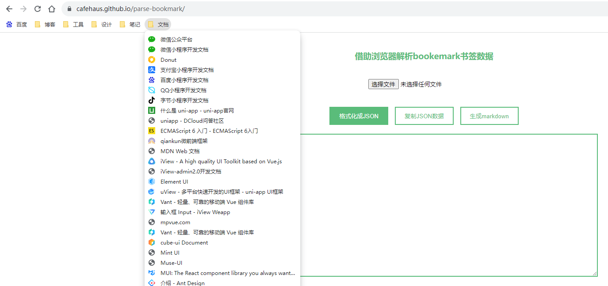

# 根据markdown文件反向转换成chrome浏览器书签html

之前为了把浏览器书签放到博客里维护，特意写了一个 bookmark 转 json/markdown 的小工具：[parse-bookmark](https://cafehaus.github.io/parse-bookmark)。

前几天手贱直接把 bookmark 的源文件给删了，这下这么多年收藏整理的书签只有自己博客里的一个 markdown 文件了，毕竟还是直接用浏览器自带的 bookmark 查看会方便好多，只能想办法怎么根据现在的 markdowm 文件转换回 bookmark.html 文件了。

markdown 文件长这样：
```markdown
# 我的书签bookmark

### 博客
* [我的博客](https://cafehaus.github.io/blog)
* [知乎](https://zhuanlan.zhihu.com/)
* [简书](https://www.jianshu.com/)

### 工具
* [在线图片压缩](https://tinyjpg.com/)
* [TinyPNG – Developer API](https://tinypng.com/developers)
* [在线GIF动图压缩](https://docsmall.com/gif-compress)

...
```

从谷歌浏览器中导出的书签长这样：
```html
<!DOCTYPE NETSCAPE-Bookmark-file-1>
<!-- This is an automatically generated file.
     It will be read and overwritten.
     DO NOT EDIT! -->
<META HTTP-EQUIV="Content-Type" CONTENT="text/html; charset=UTF-8">
<TITLE>Bookmarks</TITLE>
<H1>Bookmarks</H1>
<DL><p>
    <DT><H3 ADD_DATE="1691296878" LAST_MODIFIED="1692859249" PERSONAL_TOOLBAR_FOLDER="true">书签栏</H3>
    <DL><p>
        <DT><H3 ADD_DATE="1692858364" LAST_MODIFIED="1692858643">博客</H3>
        <DL><p>
            <DT><A HREF="https://cafehaus.github.io/blog">我的博客</A>
            <DT><A HREF="https://zhuanlan.zhihu.com/">知乎</A>
            <DT><A HREF="https://www.jianshu.com/">简书</A>
        </DL><p>
        <DT><H3 ADD_DATE="1692858766" LAST_MODIFIED="1692859444">工具</H3>
        <DL><p>
            <DT><A HREF="https://tinyjpg.com/" ADD_DATE="1692858571">在线图片压缩]</A>
            <DT><A HREF="https://tinypng.com/developers" ADD_DATE="1692858571">TinyPNG – Developer API</A>
            <DT><A HREF="https://docsmall.com/gif-compress" ADD_DATE="1692858571">在线GIF动图压缩</A>
        </DL><p>
    </DL><p>
</DL><p>
```

所以现在需要做的就是怎么能更快速地从上面的 markdown 文件转换成下面的 html 格式文件，注意这里的 html 文件和我们平时前端开发里写的 html 还有点不太一样。

转换步骤：
### 1、复制 markdown 里的每一条书签

刚开始本来是打算自己手动一个一个复制过来修改的，先把主要内容和格式搞过来，这一步完成后大概长这样，大部分工作都是复制粘贴，还算比较轻松：
```html
<!DOCTYPE NETSCAPE-Bookmark-file-1>
<!-- This is an automatically generated file.
     It will be read and overwritten.
     DO NOT EDIT! -->
<META HTTP-EQUIV="Content-Type" CONTENT="text/html; charset=UTF-8">
<TITLE>Bookmarks</TITLE>
<H1>Bookmarks</H1>
<DL><p>
    <DT><H3 ADD_DATE="1691296878" LAST_MODIFIED="1692859249" PERSONAL_TOOLBAR_FOLDER="true">书签栏</H3>
    <DL><p>
        <DT><H3 ADD_DATE="1692858364" LAST_MODIFIED="1692858643">博客</H3>
        <DL><p>
            * [我的博客](https://cafehaus.github.io/blog/)
            * [知乎](https://zhuanlan.zhihu.com/)
            * [简书](https://www.jianshu.com/)
        </DL><p>
    </DL><p>
</DL><p>
```

### 2、替换每条书签的开始部分

这一步直接用开发工具的全局替换就行了，将 * [ 替换成 DT 和 A 标签，A 标签的 HREF 属性先默认为空，等后面再处理：
```html
<!DOCTYPE NETSCAPE-Bookmark-file-1>
<META HTTP-EQUIV="Content-Type" CONTENT="text/html; charset=UTF-8">
<TITLE>Bookmarks</TITLE>
<H1>Bookmarks</H1>
<DL><p>
    <DT><H3 ADD_DATE="1691296878" LAST_MODIFIED="1692859249" PERSONAL_TOOLBAR_FOLDER="true">书签栏</H3>
    <DL><p>
        <DT><H3 ADD_DATE="1692858364" LAST_MODIFIED="1692858643">博客</H3>
        <DL><p>
            <DT><A HREF="">我的博客](https://cafehaus.github.io/blog/)
            <DT><A HREF="">知乎](https://zhuanlan.zhihu.com/)
            <DT><A HREF="">简书](https://www.jianshu.com/)
        </DL><p>
    </DL><p>
</DL><p>
```

### 3、替换 A 标签的 HREF 属性

刚开始我也是自己一个一个手动先选中 ctrl x 剪切掉后面的地址，然后粘贴到前面的 HREF 里，大概剪切粘贴了1/3实在觉得这样效率太慢了，也没心思再剪切粘贴了。

然后就开始来写个脚本直接用正则替换内容，无非就是用正则匹配出来后面的地址然后放到 HREF 里去：

```javascript
const fs = require('node:fs')
const path = require('node:path')

fs.readFile(path.join(__dirname, './bookmarks_2023_8_24.html'), 'utf-8', async (err, data) => {
    if (err) return console.error(err)
    const reg = /<DT><A HREF="">([A-Za-z0-9\u4e00-\u9fa5.-–-—+_~:·,!?#？•’'›♡：、，；。！|【】\[\]\$￥\(\)（）「」&《》\s🃏📓❍]*)\]\((http\S+)\)<\/A>/g
    const text = data.replaceAll(reg, '<DT><A HREF="$2">$1</A>')

    fs.writeFile(path.join(__dirname, './bookmarks.html'), text, (err, data) => {
        if (err) return console.error(err)
        console.log('success')
    })
})
```

总共也就 13 行代码就搞定了，果然科技才是第一生产力，几个小时的手工活用代码1秒钟搞定！



注意因为转换的数据里没有设置 icon 这个属性，所以默认在书签里打开前面的图标默认都是灰色的，只要访问当前书签后，浏览器会自动更新前面的小 icon 的。
