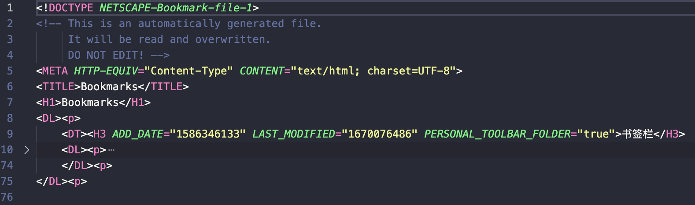
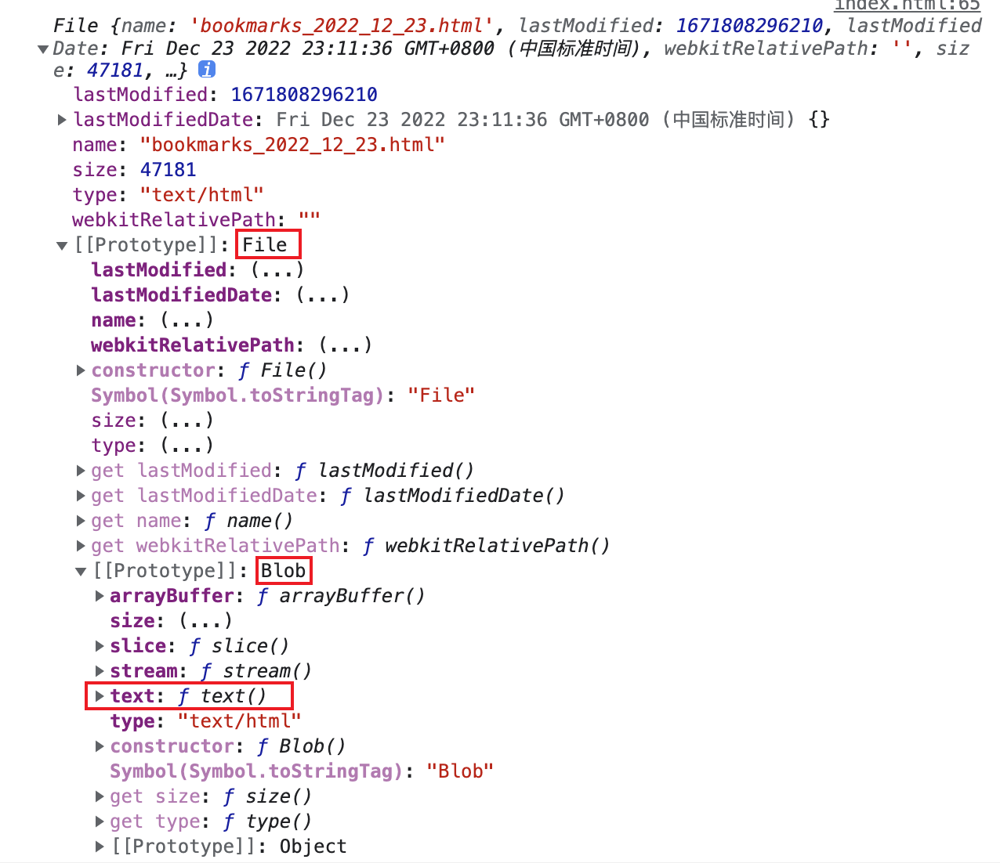
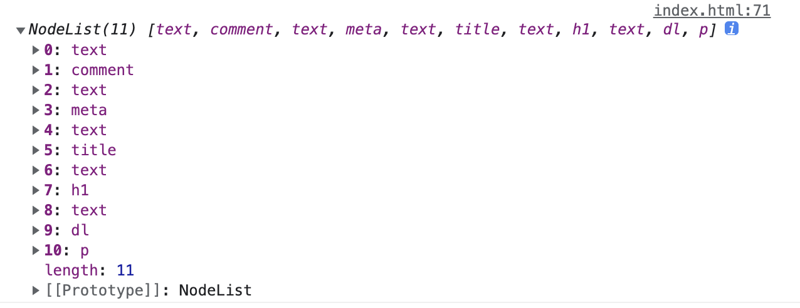

# 浏览器书签bookmark转json格式

一直使用谷歌浏览器，因为某些原因登录谷歌账号不方便，所以公司和家里的浏览器上收藏的好多书签也不能同步，以前都是直接导出来，然后自己手动导入同步。

最近打算把所有书签整理下放到自己的 blog 上维护，blog 是用 vuepress2 搭建的，里面的 markdown 页面本身也是可以直接写 html 标签的。原以为直接导出的 bookmark.html 文件直接粘贴到 md 中就能用的，还是 to young to simple，倒出来的 html 文件长这样：



和我们正常的 html 页面不太一样，所有标签名和属性名全部大写了，DT、P标签都没有结束标签，即未严格标签嵌套，直接放到 vuepress 的 md 中运行和打包都会报错的。

## 自己手动替换修改

首先想到的当然是看能不能直接简单修改下能解决，直接全局替换和修改下标签确实可以，直接用 vscode 全局替换下就行：

* 1. 删掉第一个 DL 标签前面的代码
* 2. 全局删掉所有开始 P 标签
* 3. H3 和 A 结束标签末尾加上 DT 结束标签
* 4. 如果报错：Unexpected EOF in tag...删掉报错标签上除了常规属性，如 href 属性之外的其他属性
* 5. DL、DT、H3、A 标签全部替换成小写，否则 build 时会报错：TypeError: Invalid value used as weak map key

## 借助浏览器解析标签

借助 input 的 file 属性可以在浏览器中加载出来 bookmark.html 的文件 File 信息，也就跟我们平时实现的上传选择文件功能一样。

File 接口继承了 Blob 的方法和属性，里面有一个 text 方法，[Blob.text()](https://developer.mozilla.org/zh-CN/docs/Web/API/Blob/text) 方法返回一个 Promise 对象，包含 blob 中的内容，使用 UTF-8 格式编码。和 FileReader 的 readAsText() 有点类似，我们可以借助这个方法把文件里面的信息转成文本。



注意 File 对象中只存在于浏览器环境中，在 node 环境中米有，不过在 node 中我们可以直接用 fs.readFile 来读取文件内容。

#### 思路：
* 1. 先通过 File 对象读取 bookmark.html 成字符串文本
* 2. 然后再将文本直接借助浏览器的 DOM 节点的 innerHTML 渲染成 html 标签，这一步浏览器会自动帮我们转成节点列表 NodeList，也不需要我们自己在额外处理标签未严格嵌套的问题
* 3. 然后就可以直接遍历 NodeList 来格式化我们想要的数据了，注意书签数据在最外层的 dl 节点下



<iframe src="https://cafehaus.github.io/parse-bookmark" height="300" width="400" />

**注意**
生成 markdown 文件时，超链接的文字内容里带标签的话，vuepress build 编译时会报错：Compiling with vite[vite:vue] Element is missing end tag，解决方式将标签的尖括号去掉：
```markdown
<!-- 错误方式 -->
[HTML的<pre>标签中嵌套HTML标签时被解析的解决方案](http://xxx.com)

<!-- 正确方式 -->
[HTML的pre标签中嵌套HTML标签时被解析的解决方案](http://xxx.com)
```

## nodejs 版本

大题思路其实和浏览器版本一样，只不过解析 dom 节点我们需要借助第三方 dom 库，如 htmlparser2

## 系统自动生成的书签json文件

Chrome 浏览器其实有自动生成的json文件，具体位置：

* windows 系统 C:\Users\Administrator\AppData\Local\Google\Chrome\User Data\Default\Bookmarks
* mac 系统 	/Users/${一般是你的电脑账号名}/Library/Application Support/Google/Chrome/Default/Bookmarks

也可以直接在谷歌浏览器地址栏输入 chrome://version，会自动加载出有关谷歌浏览器的各种信息。