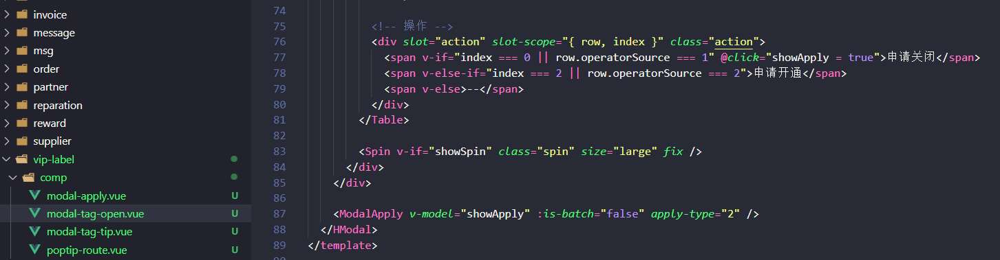
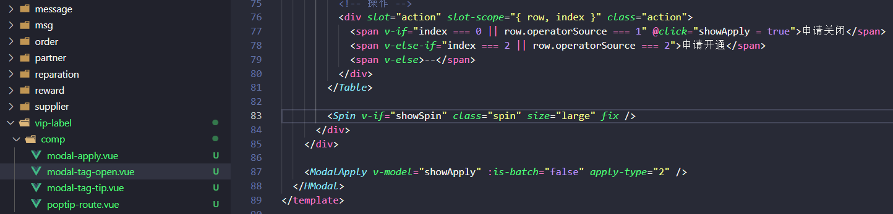

# vscode编辑器Volar插件导致vue的自定义标签不变颜色

>Vetur 插件作为 Vue2 配套的 VSCode 插件，它的主要作用是对 Vue 单文件组件提供高亮、语法支持以及语法检测，随着 Vue3 正式版发布，Vue 团队官方推荐 Vue Language Features (Volar) 插件来代替 Vetur 插件，不仅支持 Vue3 语言高亮、语法检测，还支持 TypeScript 和基于 vue-tsc 的类型检查功能。

就是看了上面的安利，于是装了 Volar 插件，然后就发现 vue 自定义标签不变颜色了，之前 html 标签是粉色，自定义的组件标签是蓝色，这一下全变成一个颜色了，开发时不好区分，vscode 主题用的 Dracula Official：

害我把其他其他插件一个个删了才排查出来罪魁祸首居然是 Volar 插件，果断卸载装回 Vetur 插件，然后就又恢复到以前了

