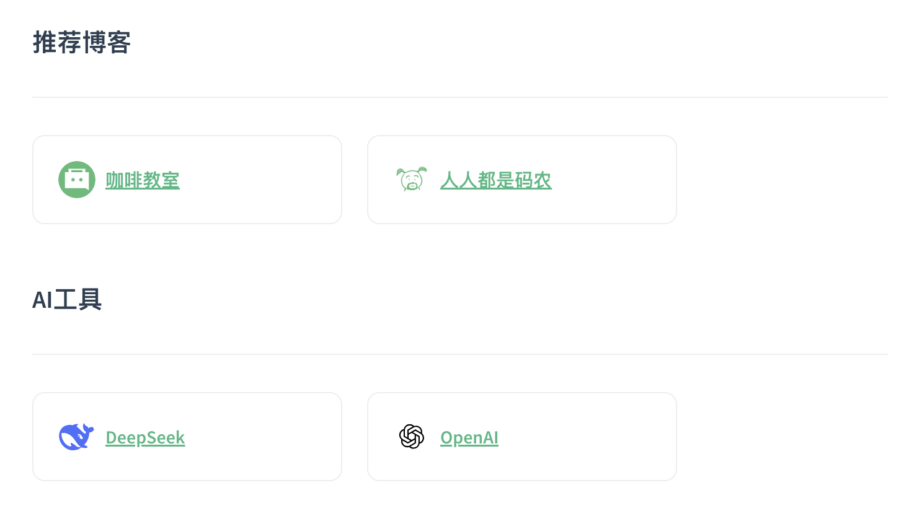

# 用markdown语法制作一个网址导航页面

之前为了让谷歌浏览器里的书签放到博客 markdown 文件下，写过一个书签和 markdown 互转的小工具 [parse-bookmark](https://github.com/cafehaus/parse-bookmark)，当初也是为了能直接在博客中生成一个网址导航的页面，方便随时随地都可以打开博客网址查找使用平时收集的一些常用网站。

在公司内部文档中也收集整理了很多网址，直接一行一行地记录或者用个表格记录感觉又不好看，也参考了很多其他人的大部分也都是用的表格直接一列一列地记录：网站名、网址、备注。然后就一直想着怎么能生成一个有网站icon、网站名、网站描述这些信息的导航页面。

### 在 markdown 文档中写html
文档中本身是支持直接写 markdown 的，但是样式只能写成内联样式，然后就写了一个如下的 html 代码直接贴到文档中：

```html
#### 推荐博客
---
<div style="display: flex;align-items: center;flex-wrap: wrap;margin-right: 20px;">
    <a href="https://cafe123.cn" target="_blank" style="display: flex;align-items: center;margin: 0 20px 20px 0;padding: 20px;border-radius: 10px;border: 1px solid #EEE;width:250px;">
        
        <span style="white-space:nowrap;overflow:hidden;text-overflow: ellipsis;">cafehaus</span>
    </a>
</div>
```

按照上面的也确实可以生成出一个有模有样的网站导航页面了，但是每次想要新加一个网址时都要自己复制一遍 a 标签里的内容来修改，当网址多了的时候看着也很乱，每次想新增或者修改一个网址的时候都要在一堆html标签中寻寻觅觅。

理想的方式应该只用关心网址相关的数据就行了，相同的模板化代码自动生成最好，于是就想到了由网址导航的 json 数据直接给生成 markdown 内容出来。这也就是 markdown-web-nav 项目的由来，具体功能包括：

* 导入json数据直接生成markdown页面数据
* 可以在网页上便捷新增、编辑需要的网址数据(无需懂代码)
* 实时预览最终的网址导航效果
* 一键复制最终的markdown数据(可以直接粘贴到文档中使用)
* 导出markdown文件、json文件
* 可记录最近的历史修改记录，后期修改更方便

如果你不懂代码或者不知道如何修改json数据也没关系，可以直接在网页上使用。

### 使用 markdown-web-nav 工具制作网址导航页面步骤

总共分为如下 4 个步骤，其实也很简单：

#### 1、打开 markdown-web-nav 网页工具
在浏览器中打开[markdown-web-nav](https://cafehaus.github.io/markdown-web-nav)，网站内容区左侧为级联网址数据管理区，可以在这里编辑新增、编辑、删除需要的网址数据。

右侧为效果预览区，当我们修改了网址数据后，可以在这里实时查看到用markdown渲染出来一样的最新的效果。



#### 2、新增网址导航数据
进入网页后默认有几个示例数据，可以直接在示例的基础上修改、新增就行了。点击顶部的“新增导航分类”可以新增一个分类，然后可以在分类下再新增我们需要的网址导航数据。

点击分类和网站数据后面的编辑图标可以编辑详细信息，点击分类和网站数据后面的减号图标可以删除当前元素，点击分类右侧的加号图标可以新增当前类目下的网站信息。

同时也可以点击顶部的“上传json网址数据文件”按钮，直接将json数据加载到页面上，不过需注意json数据需按特定格式编写，也可以点击“下载json示例模板”参照模板编写：

```json
{
  "root": [
    {
      "title": "✏️ 精选博客",
      "children": [
        {
          "name": "咖啡教室",
          "url": "https://cafe123.cn",
          "description": "就想开间小小咖啡馆，做做咖啡调调酒",
          "icon": "https://cafe123.cn/logo.svg"
        }
      ]
    },
    {
      "title": "🧑‍💻 AI工具",
      "children": [
        {
          "name": "DeepSeek",
          "url": "https://chat.deepseek.com",
          "description": "我是 DeepSeek，很高兴见到你！",
          "icon": "https://chat.deepseek.com/favicon.svg"
        }
      ]
    }
  ]
}
```

如果想要恢复到历史某个版本进行修改，可以鼠标放到顶部的“修改历史”按钮上，里面会记录我们最近的修改历史，点击某个修改时间可以加载对应时间点的修改数据，不过操作前建议先点“导出json”按钮将当前的数据备份到自己电脑本地。


##### 如何找到网站 icon 图标的链接？

新增网站信息时网站名称和网站地址必填，为了美观建议填上网址图标地址，不过很多人可能不知道如何找到网站 icon 图标的链接，大多网站就是在域名后面跟上如下一些后缀：

* /favicon.ico
* /logo.png
* /logo.svg
* /images/logo.png

可以自己在浏览器中网址后面加上上面的后缀看能不能正常打开图片，如果打开失败也可以鼠标右键-检查（快捷键F12），打开浏览器调试台，然后选到network后刷新一下浏览器，从加载的资源中也可以找到我们需要的图标地址。


#### 3、复制markdown数据
网址导航数据添加完成后，可以点击右侧的“复制markdown数据”，直接将最终的markdown数据复制到粘贴板上。同时如果每次修改比较多时也建议点击“导出json“按钮备份一下，可将当前数据导出为一个json文件保存在自己电脑上，下次想再次修改时可以直接通过“上传json网址数据文件”加载回来所有数据。

#### 4、粘贴到支持markdown内容渲染的文档页面中
上一步复制好markdown数据后，我们就可以在支持markdown渲染的文档中粘贴进去就可以了。就过想自己本地修改markdown数据，也可以直接选择“导出markdown”下载到本地进行修改。


