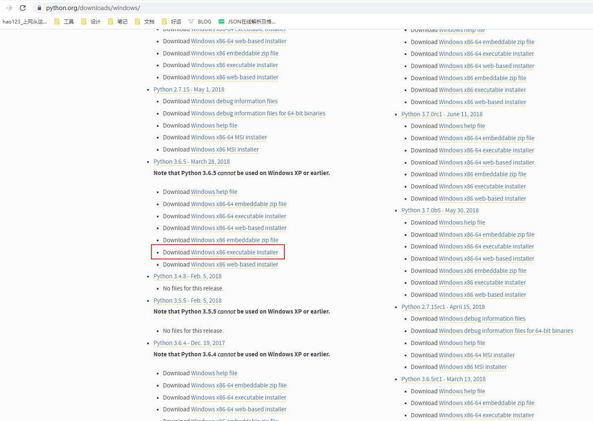
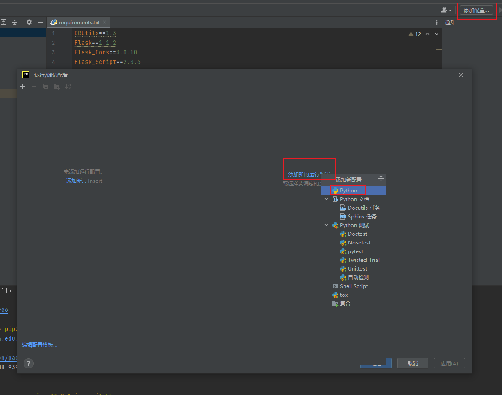
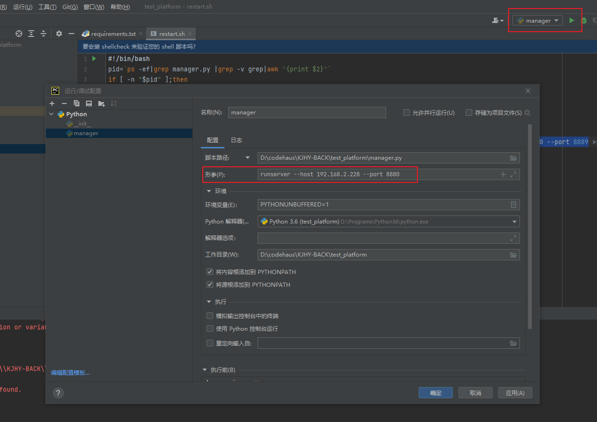
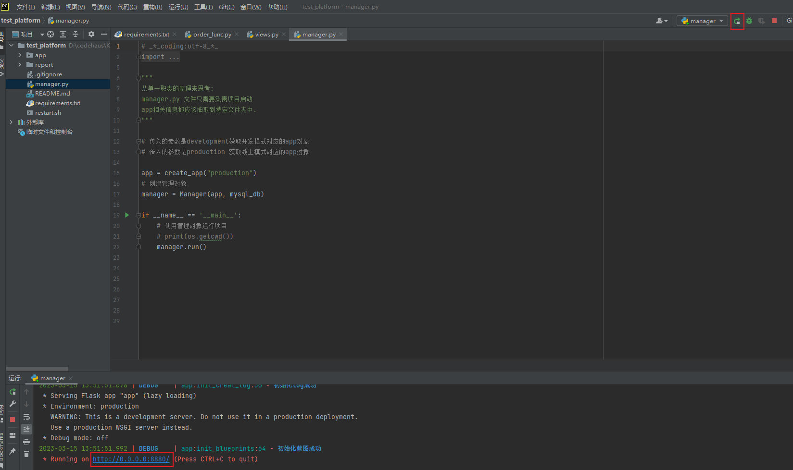

# python的flask项目环境安装和本地运行

公司的一个内部平台，python + flask，拉代码下来本地运行各种报错，经过不懈努力终于跑起来了。

## 运行步骤
### 一、安装环境
安装python环境，此项目装3.6.5 版本，安装的时候可以勾选上自动添加path环境变量，没加的话要自己手动添加，[python官网](https://www.python.org)

### 二、配置解释器
先新建项目虚拟环境，windows 下 python3 在终端输入命令：py -3 -m venv myvenv，后面的 myvenv 就是新建的虚拟环境目录名，会自动在项目生成myvenv这个目录，然后项目的依赖就会安装在这个目录下，这样就可以实现和其他项目隔离环境。

配置 python 解释器，用 python 3.6.5 版本，其他版本可能会有一些奇奇怪怪的问题，点击 pyCharm 右上角的设置图标 - 设置 - 项目:xxx - Python解释器，选上面新建的那个虚拟环境的解释器。

### 三、设置镜像源
设置pip安装依赖国内镜像源，项目临时使用镜像源：pip3 install -i https://pypi.tuna.tsinghua.edu.cn/simple numpy，不设置国内镜像源部份依赖可能安装不上

### 四、安装依赖
点开依赖配置文件 requirements.txt，右键 - Install All Packages 安装所有依赖

### 五、运行
配置运行参数，点击顶部偏右边的：添加配置 - 添加新的运行配置 - python - 配置项目解释器，脚本路径选项目的启动文件（manager.py），形参：runserver --host 0.0.0.0 --port 8880

## 常见问题
* cryptography不要用最新版本39.2，卸载了自己装3.1版：pip3 uninstall cryptography，pip3 install cryptography==3.1
* 遇到报错，根据报错搜索下网上的解决方案，升级 pip，设置国内镜像源