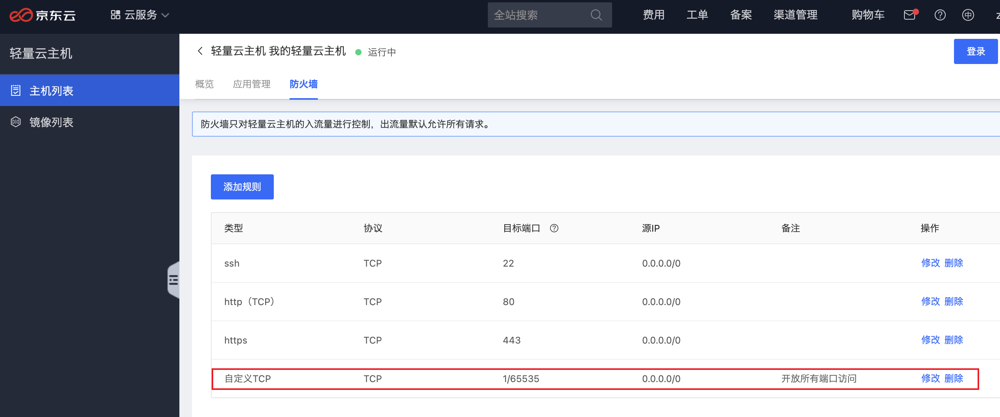

# 京东轻量云主机测评体验

获得了一台[京东云](https://www.jdcloud.com/)新推出的轻量云主机1个月免费体验权限，感谢强哥，感谢京东云！

### 登录服务器

服务器配置：2核4GB，80GB系统盘，系统：CentOS Linux 7 (Core)

#### 拿到公网 IP
先登录到后台拿到公网IP，等下直接远程登录，最右边有一个登录按钮也可以直接点击登录服务器。


服务器管理端感觉交互有点别扭，登录用京东云账号密码一直报密码不正确，明明是正确的，最后扫码登进去了。


#### 用 Tabby 远程登录

先安装[Tabby](https://tabby.sh)，新建配置和连接，点击按钮：+新配置 => SSH连接 => 输入远程 ip 和密码。


### 安装 nginx

```bash
# 下载
wget -c https://nginx.org/download/nginx-1.18.0.tar.gz

# 解压
tar -zxvf nginx-1.18.0.tar.gz 

# 进到目录
cd nginx-1.18.0/

# 配置
./configure 

# 编译安装
make
make install

# 启动
/usr/local/nginx/sbin/nginx -c /usr/local/nginx/conf/nginx.conf
```

最后一步安装 make 可能会报错: 

```bash
*** No rule to make target `build', needed by `default'. Stop
```
安装以下缺少的依赖重新编译就可以了：

```bash
# 安装缺少的依赖
yum -y install make zlib-devel gcc-c++ libtool openssl openssl-devel

# 配置
./configure 

# 编译安装
make
make install

# 启动
/usr/local/nginx/sbin/nginx -c /usr/local/nginx/conf/nginx.conf
```

然后发现继续报错：

```bash
nginx: [emerg] bind() to 0.0.0.0:80 failed (98: Address already in use)
```

是因为服务器上默认已经装了 fastpanel2-nginx，在浏览器中直接输入服务器的公网ip也可以看到 fastpanel 的内容：


注意如果要配置其他端口需要在服务器后台防火墙那自己配置，默认只配置了22、80和443端口



#### 启动和停止

nginx 运行目录：/usr/local/sbin

```bash
# 进入目录
cd /usr/local/sbin

# 启动
nginx

# 指定配置文件启动（平时启动推荐用这种方式）
nginx -c xx.conf

# 给主进程发送一个信号【nginx -s 参数】reopen/stop/quit/reload
# 重启
nginx -s reopen

# 强制关闭
nginx -s stop

# 等待工作进程处理完成后关闭
nginx -s quit

# 修改配置后重新加载生效
nginx -s reload

# 查看 nginx 安装位置
whereis nginx

# 测试 nginx 配置文件
nginx -t [xx.conf]

# 查看 nginx 版本
nginx -v

# 查看 nginx 进程号命令
ps -ef | grep nginx

# 查找并杀死所有 nginx 进程
ps aux | grep nginx | awk '{print $2}' | xargs kill -9
```

#### 用 nginx 部署 vue 项目

* 1、本地打 build 打包后，将 dist 目录压缩
* 2、将 dist 压缩包直接在 Tabby 的 SFTP 上传到 /data/www/blog 目录下，当然这个目录可以自定义
* 3、修改 nginx 配置文件
```conf
http {
    server {
        listen       80;
        server_name  localhost;
        charset utf-8;

        location / {
            root      /data/www/blog;
            index     index.html index.htm;
            try_files $uri $uri/ /index.html;
        }
    }
}
```
端口我们一般就用默认的 80，注意 index 那行最后一个是 index.htm，不是写错了少个 l。try_files 是为了配合前端的 history 路由。

* 4、启动 nginx，启动的时候最好用 -c 指定配置文件，刚开始我就是怎修改怎么配置一直 404，最后把所有进程都杀了，指定配置文件重启 nginx 就好了。猜测可能是因为服务器上好几个地方都装了 nginx，不指定配置文件默认会去取了 /etc/nginx/nginx.conf，导致自己修改 /usr/local/nginx/nginx.conf 发现一直不生效。

最终部署上去了自己的博客，是比部署到 github 上快好多，页面切换基本秒开，毕竟 2核4GB 的配置摆在那，我那小小博客绰绰有余。

#### 用 nginx 部署 Java 项目