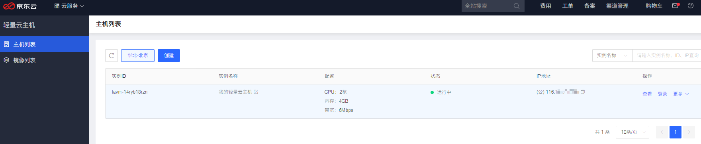
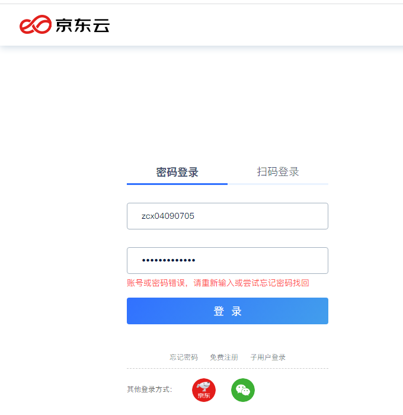
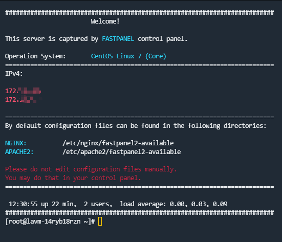
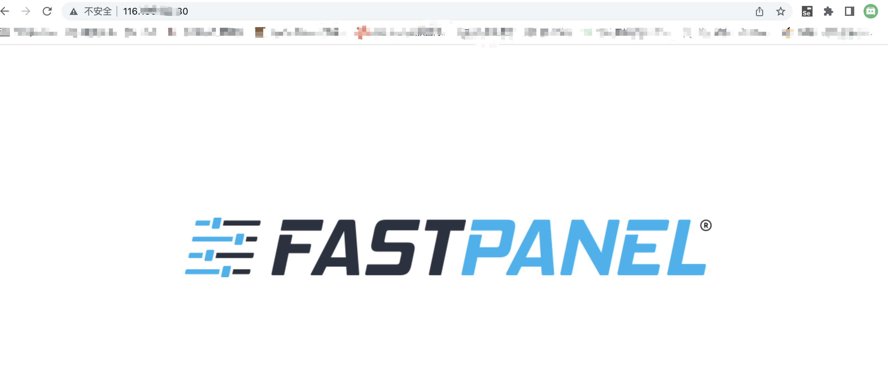

# 京东轻量云主机测评体验

获得了一台[京东云](https://www.jdcloud.com/)新推出的轻量云主机1个月免费体验权限，感谢强哥，感谢京东云！

### 登录服务器

服务器配置：2核4GB，80GB系统盘，系统：CentOS Linux 7 (Core)

#### 拿到公网 IP
先登录到后台拿到公网IP，等下直接远程登录，最右边有一个登录按钮也可以直接点击登录服务器。



服务器管理端感觉交互有点别扭，登录用京东云账号密码一直报密码不正确，明明是正确的，最后扫码登进去了。



#### 用 Tabby 远程登录

先安装[Tabby](https://tabby.sh)，新建配置和连接，点击按钮：+新配置 => SSH连接 => 输入远程 ip 和密码。



### 安装 nginx

```bash
# 下载
wget -c https://nginx.org/download/nginx-1.18.0.tar.gz

# 解压
tar -zxvf nginx-1.18.0.tar.gz 

# 进到目录
cd nginx-1.18.0/

# 配置
./configure 

# 编译安装
make
make install

# 启动
/usr/local/nginx/sbin/nginx -c /usr/local/nginx/conf/nginx.conf
```

最后一步安装 make 可能会报错: 

```bash
*** No rule to make target `build', needed by `default'. Stop
```
安装以下缺少的依赖重新编译就可以了：

```bash
# 安装缺少的依赖
yum -y install make zlib-devel gcc-c++ libtool openssl openssl-devel

# 配置
./configure 

# 编译安装
make
make install

# 启动
/usr/local/nginx/sbin/nginx -c /usr/local/nginx/conf/nginx.conf
```

然后发现继续报错：

```bash
nginx: [emerg] bind() to 0.0.0.0:80 failed (98: Address already in use)
```

是因为服务器上默认已经装了 fastpanel2-nginx，在浏览器中直接输入服务器的公网ip也可以看到 fastpanel 的内容：




