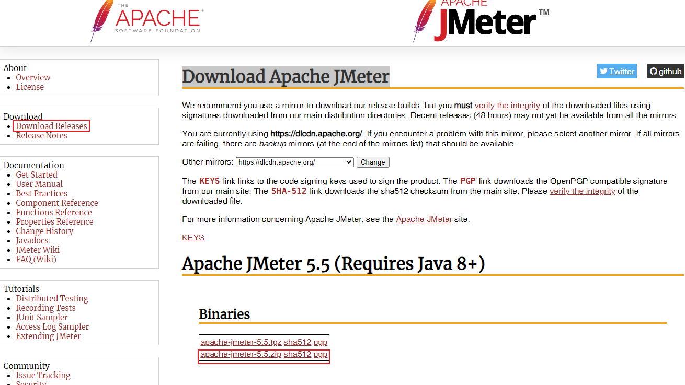
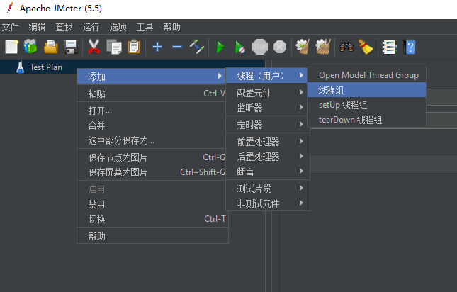
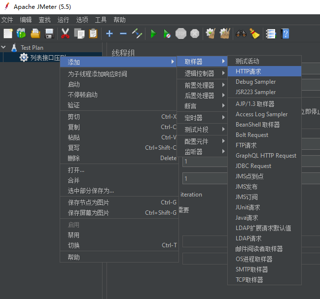
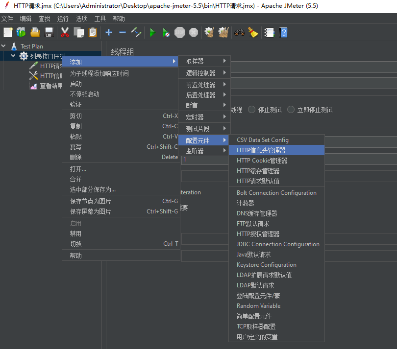
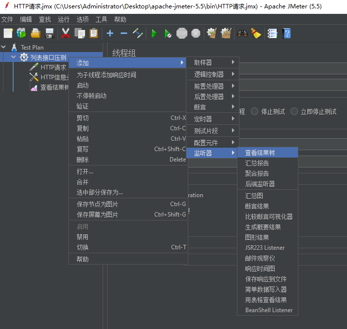
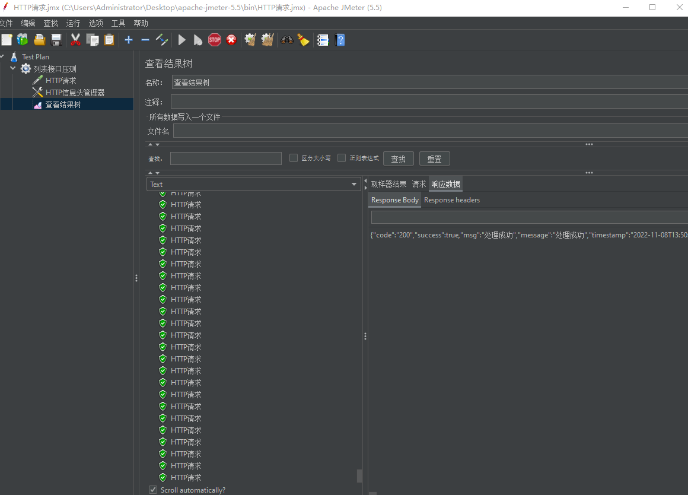

# 用JMeter做接口压力测试

排查线上的一个列表接口响应慢问题，时不时响应时间就是10多秒，后面发现可能是接口压测有问题。

## JMeter

JMeter是Apache组织开发的基于Java的压力测试工具，[Download Apache JMeter](https://jmeter.apache.org/download_jmeter.cgi)

### 使用步骤

* 1、下载安装

因为 JMeter 是用 Java 语言编写的，所以需要自己提前安装好 Java 环境。再去上面的下载链接下载安装包，解压，进入解压包点击 bin/jmeter.bat 启动程序。（注意：以下所有操作都是在 windows 上）。

然后就可以看到打开了小黑窗和 JMeter 操作界面，注意小黑窗不能关，一关的话 JMeter 也自动关闭了。看不懂英文可以在顶部菜单 Options - Choose Language 里切换到中文。

* 2、添加测试计划

在左侧 Test Plan 鼠标右键 - 添加 - 线程（用户） - 线程组，然后自己设置名称、线程数、时间这些

* 3、Http请求

在上面添加的线程组上右键 - 添加 - 取样器 - HTTP请求

* 4、Http请求头

在上面添加的线程组上右键 - 添加 - 配置元件 - HTTP信息头管理器，一般用来设置 Content-Type 或者 token

* 5、查看结果树

在上面添加的线程组上右键 - 添加 - 监听器 - 查看结果树

* 6、启动

点击顶部菜单那个绿色的三角形图标，启动请求，然后就可以在“查看结果树”那实时看到请求结果了。

