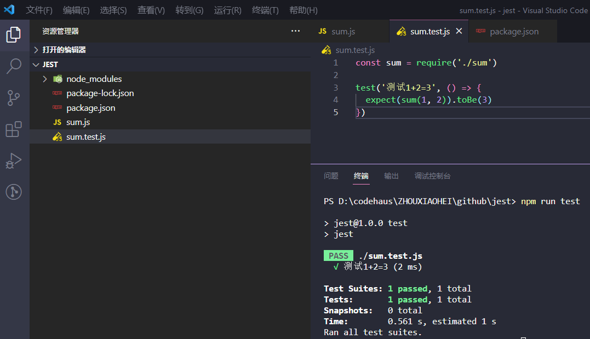

# 用Jest做前端单元测试

## 前端单元测试

前端单元测试概念听着很高大上，应该也是从后端的单元测试借鉴过来的，但在工作中我其实从来没做过。前端各种开发调试工具本身比较优秀了，最简单的 console、debugger 完全可以测试，虽说是一次性的，但是本身前端变化就比较快。

就像测试领域里的 UI 自动化、自动化测试这些，听着很牛比其实应用场景不大，本身 UI 就是前端里变化最快的，今天是绿色背景，明天可能就改成红色的了，老板觉得字体太小，立即马上现在就得改成 60px 加粗，像 selenium 这类自动化测试框架，有的还依赖前端的 dom 结构和选择器，前端布局一变或者改掉类名，你元素都找不到了。一改喔祸，测试脚本又要重写了，本身也需要投入开发资源，还有就是前端本身面向用户的，开发人员开发运行时就能直接清晰看到各种结果。

倒也不是说前端单元测试一无是处，对于我们平常的业务功能测试可能没啥用，但对于框架作者来说还是很有用的，在很多知名的框架代码里我们也都能看到专门的test测试目录。

市面上比较常见的前端单元测试 Jest、Mocha，各种对比 Jest 略胜一筹，所以下面就来初体验下 Jest 吧。

## Jest

### Jest 安装和使用

直接新建个目录用 npm 安装就可以写个 demo 了，[Jest 官方文档](https://jestjs.io/zh-Hans)上也有教程。

```bash
# 初始化
npm init

# 安装（也可以全局安装）
npm install --save-dev jest

#测试：注意先要在 package.json 里加上"scripts": { "test": "jest" }
npm run test
```

求两个数字之和的 sum.js
```js
function sum(a, b) {
  return a + b
}

module.exports = sum
```

测试脚本文件 sum.test.js，测试脚本文件以 xx.test.js 命名
```js
const sum = require('./sum')

test('测试1+2=3', () => {
  expect(sum(1, 2)).toBe(3)
})
```

运行测试的结果：



### 相关概念

* 单元测试：Unit Test，单元测试是开发者编写的一小段代码，用于检验被测代码的一个很小的、很明确的功能是否正确。通常而言，一个单元测试是用于判断某个特定条件（或者场景）下某个特定函数的行为，是针对软件的基本单元（如：函数）所做的测试，而集成测试则是以模块和子系统为单元进行的测试
* 集成测试：Integration Test，也叫组装测试、联合测试、子系统测试、部件测试，在单元测试的基础上，将所有模块按照设计要求（如根据结构图）组装成为子系统或系统，进行集成测试，主要是针对软件高层设计进行测试，一般来说是以模块和子系统为单位进行测试
* 端到端测试：End-to-end Test，是一种用于测试整个应用程序的流程是否符合预期的测试技术，它模拟用户真实的使用场景，通过用户界面测试应用程序

### vue 测试

* [vue3 测试](https://cn.vuejs.org/guide/scaling-up/testing.html)
* [vue2 测试](https://v2.cn.vuejs.org/v2/guide/testing.html)
