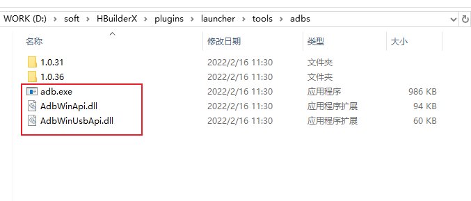
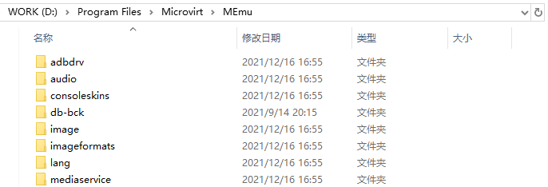
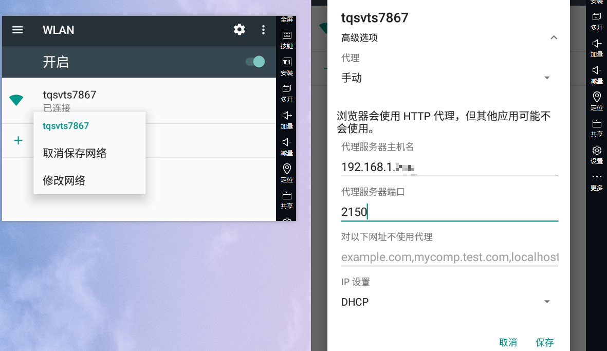
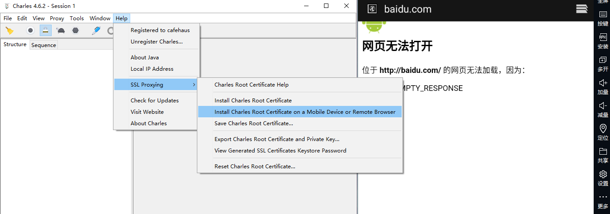
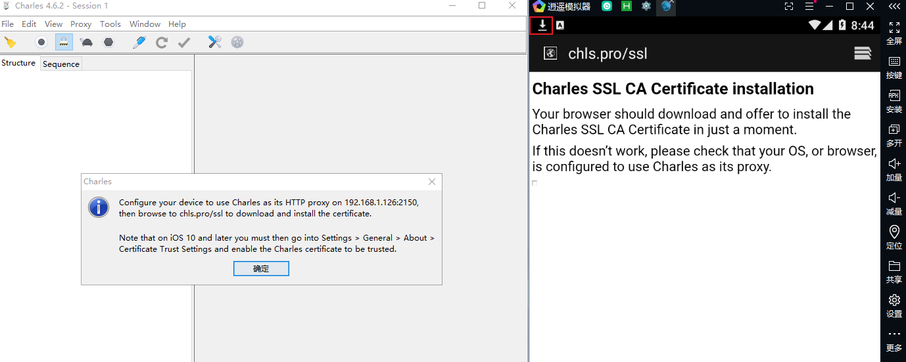
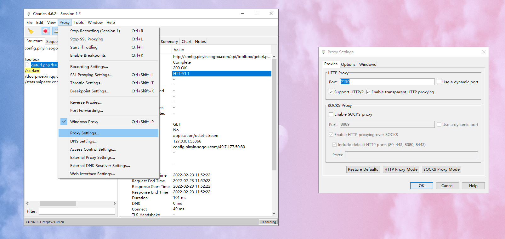
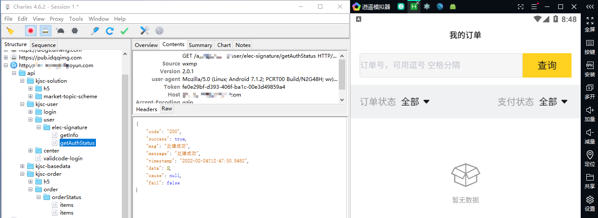
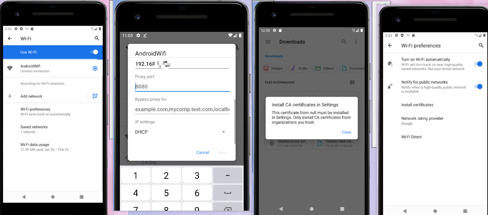
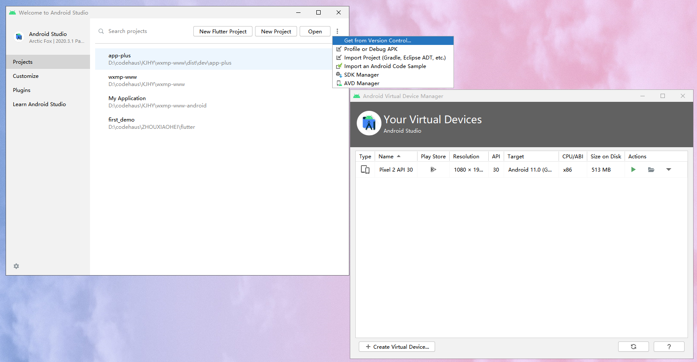

# 安卓模拟器接口抓包教程

[[toc]]

## 一、为啥需要抓包？
用uni-app开发安卓应用时，查看接口数据不能像在浏览器中可以直接通过network查看，只能借助抓包工具来抓包，还有一些线上应用我们也只能通过抓包来排查具体的问题。

## 二、抓包工具
要实现抓包我们需要一个抓包工具：Charles、Fildder，另外还需要一个被抓的对象：模拟器或者手机。安卓模拟器有很多国产模拟器和android官方提供的，本教程分享用逍遥模拟器和android studio自带的模拟器来实现抓包

* Charles（收费软件，可试用30天）
* android studio 模拟器（逍遥模拟器）

## 三、逍遥模拟器抓包
1. 安装 Charles 软件，这个直接去官网网站下载 charlesproxy.com安装就行了
2. 安装逍遥模拟器，同样去官网下载 xyaz.cn
3. 覆盖配置，将BuilderX编辑器安装目录下：BuilderX\plugins\launcher\tools\adbs，里面红框中的三个文件复制下

然后粘贴到逍遥模拟器的安装目录：Microvirt\MEmu，直接替换就行了

4. 打开逍遥模拟器，在 HBuilderX 编辑器里打开项目 - 运行到内置浏览器 - 运行到手机或模拟器中，运行成功后就可以在逍遥模拟器中看到自动打开的app了

  

5. 查看本脑的ipv4网络地址，直接运行 - cmd - ipconfig，如果是连得网线，直接看这个以太网适配器的ipv4地址

  

更改模拟器的wifi网络代理设置，打开模拟器 - 设置 - wifi - 左键长按会弹出修改网络的菜单 - 高级选项 - 代理 - 手动，在代理服务器主机名那输入上面查到的ipv4地址，在自己设置一个端口（要和等下抓包软件里的一样），然后保存就可以了

然后你会发现模拟器里打不开网络了，不要着急，接下来去打开抓包工具

6. 打开 Charles，Help - SSL Proxying - Install Charles Root Certification on a Mobile Device or Remote Browser根据提示去模拟器浏览器上输入地址 chls.pro.ssl下载安装证书

下载后点击左上角那个下载图标，直接点击下载文件，然后随便输一个证书名称点击确定就可以了

7. 设置抓包工具端口，设置成上面手机代理的端口一样

8. 接下来就可以在 Charles 中看到成功抓包到的接口了

## 四、用android studio模拟器抓包

android studio模拟器和逍遥模拟器的主要步骤一样，主要是界面都是英文的，还有就是设置网络代理那有点不一样，还有就是下载的证书文件可能不让直接安装，可以通过Wi-Fi preferences 里的 Install certificates 安装就好了（真机上有的系统网络设置里也有专门的证书安装功能，要从那个地方安装）。

Android Studio 是开发 Android 应用程序的官方 IDE，可以直接去官网下载安装，安装好后要先点右上角的三个点 More Action 菜单里的 SDK Manager 安装系统，再点下面的AVD添加模拟器手机就可以了，运行的时候模拟器比较吃内存，可以直接删了再重新添加。

