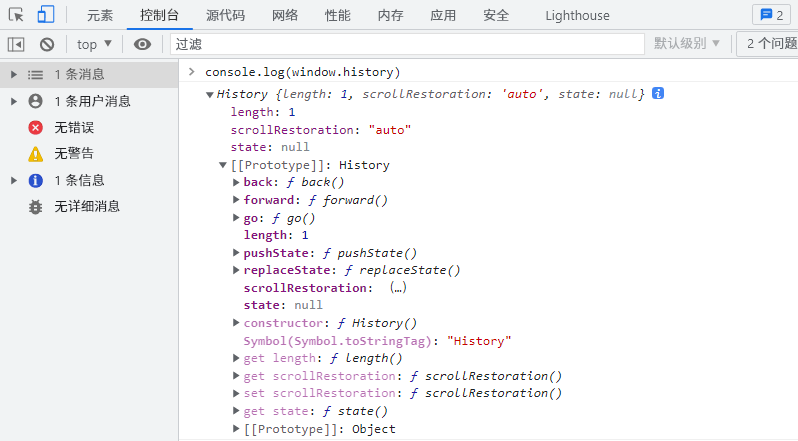
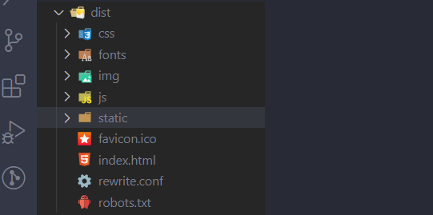

# vue-router的hash模式和history模式
开发中一直在用 vue，也知道 Vue Router 有 hash 和 history 两种模式，hash 模式路径中会带上 # 符号，看着不美观；history 模式路径中则没有 #，路径看着更漂亮，但是需要服务器配合设置，所以我们项目中一般都是使用 history 模式。之前对于  的理解也就限于这些了，后面学了服务器部署、nginx这些但还是一知半解。

直到今天翻看 Vue CLI 文档时，突然对其原理有了新的理解。

### Hash 模式
hash 模式是用 createWebHashHistory() 创建，hash指的是地址中 # 号以及后面的字符，这个 # 就是hash符号，中文名叫哈希符或锚点，哈希符后面的值，我们称之为哈希值。如 http://127.0.0.1/index/#/hello-world，这里的 #/hello-world 就是 hash。

hash 虽然出现在 URL 中，但不会被包括在 HTTP 请求中，对后端完全没有影响，因此改变 hash 不会重新加载页面。由于从未被发送到服务器，所以它不需要在服务器层面上进行任何特殊处理。不过，它在 SEO 中确实有不好的影响。

其实也就跟我们正常在页面中使用的 a 标签锚点一样，只会影响前端页面。

### History 模式
window.history 对象是HTML5提供的用于维护当前标签页浏览历史的对象，主要功能是前进后退和在不刷新页面的情况下，修改地址栏里的URL地址。history 模式就是利用了 HTML5 historyAPI，所以也叫 HTML5 模式，Vue Router 中是用 createWebHistory() 创建。



浏览器中看到的路径就是我们平时正常看到的网址：http://127.0.0.1/index/hello-world，当用户进入这个页面，实际会去向服务器项目根目录下 /index/hello-world 去请求资源，但是我们平时用 vue、react 之类框架开发出的项目打包后是这个样子的：



单页面应用也就一个 index.html 入口文件，其他的资源都是动态引入到 index.html 文件里的，当去向浏览器请求 /index/hello-world 资源时，正常是找不到的，也是 404，这也是 history 模式需要服务器配合设置的原因，就是把请求中所有没有匹配到的资源都默认给指向到 index.html 上去，这也是为什么需要服务器配置的原因。

nginx 参考配置：
```
location / {
  try_files $uri $uri/ /index.html;
}
```

### 相关文档
* [Vue Router](https://router.vuejs.org/zh/)
* [Vue CLI 使用 history.pushState 的路由](https://cli.vuejs.org/zh/guide/deployment.html#%E4%BD%BF%E7%94%A8-history-pushstate-%E7%9A%84%E8%B7%AF%E7%94%B1)