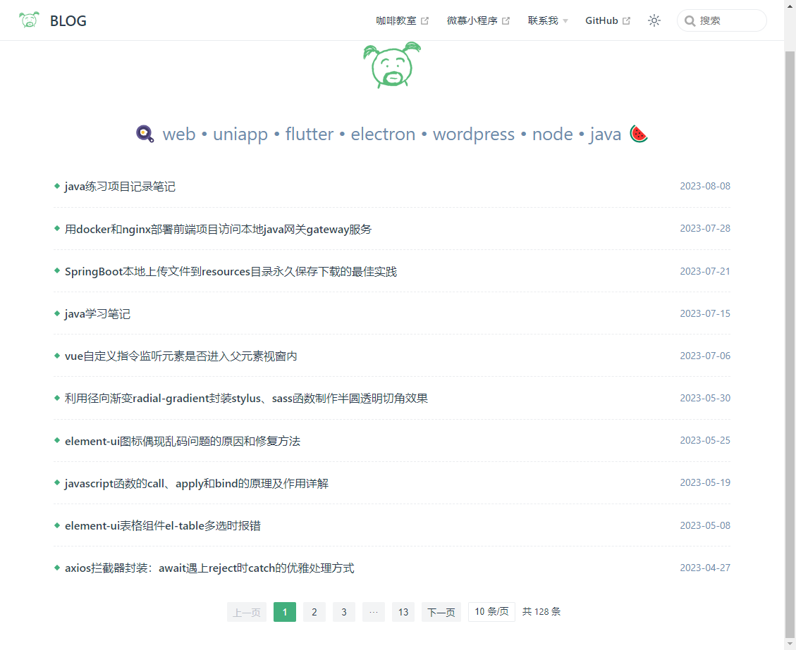

# vuepress博客自动生成分页文章列表

用 vuepress 搭建了一个自己的技术博客，记录自己平时工作和学习中的一些经验总结，但是因为 vuepress 本身是为了方便我们快速搭建技术文档的，直接用来做博客总觉得少了点啥东西，怎么看都像一个文档网站。

本来是打算自己开发一个博客类的 vuepress 主题的，但一直也没想好怎么去做，前几天又突然想要给博客先生成一个文章列表。vuepress 默认的文章详情里是有一个 lastUpdatedTime 最新更新时间的，于是顺藤摸瓜先去找出 vuepress 里的这个 lastUpdatedTime 是咋获取到的。

在 node_modules\@vuepress\plugin-git\lib\node\utils\getUpdatedTime.js 文件里找到了具体的实现方式，其实就是获取的 git 提交日志里的时间，代码如下：

```javascript
"use strict";
Object.defineProperty(exports, "__esModule", { value: true });
exports.getUpdatedTime = void 0;
const execa = require("execa");
/**
 * Get unix timestamp in milliseconds of the last commit
 */
const getUpdatedTime = async (filePath, cwd) => {
    const { stdout } = await execa('git', ['--no-pager', 'log', '-1', '--format=%at', filePath], {
        cwd,
    });
    return Number.parseInt(stdout, 10) * 1000;
};
exports.getUpdatedTime = getUpdatedTime;
```

但是生成文章列表我们肯定是想按照创建文章的时间倒序生成，其实在 getUpdatedTime.js 同级目录里还有一个 node_modules\@vuepress\plugin-git\lib\node\utils\getCreatedTime.js，用这个方法我们就能拿到 markdown 文件的 git 创建时间，然后直接根据这个时间来生成文章列表就可以了。

## 具体实现步骤

### 1、新建文章列表组件
在 .vuepress/components 组件目录下新建一个文章列表 article-list.vue 组件，因为想要做成一个分页列表，这里在自己封装了一个 pagination 分页组件，直接引用第三方组件库里的分页组件也一样。

注意这个列表组件里相当于只是一个模板组件，后面想要生成文章数据的时候，只用通过正则去替换掉 init 方法里 articleList 的赋值，默认是个空数组。

article-list 文章列表组件
```vue
<template>
  <div>
    <div class="article-list">
      <a
        v-for="(item, index) in pageList"
        :key="index"
        class="article-item"
        :href="item.link"
      >
        <p class="title">{{ item.title }}</p>
        <p class="time">{{ item.createTime }}</p>
      </a>
    </div>

    <!-- 分页 -->
    <pagination
      :page-no="page.index"
      :page-size="page.size"
      :total="page.total"
      :continues="3"
      @change-page-no="getPageNo"
      @change-page-size="getPageSize"
    />
  </div>
</template>

<script>
import pagination from './pagination.vue'
export default {
  components: {
    pagination,
  },
  name: 'article-list',
  data() {
    return {
      articleList: [],
      pageList: [],
      page: {
        index: 1,
        size: 10,
        total: 0,
      },
    }
  },
  created() {
    this.init()
  },
  methods: {
    init() {
      this.articleList=[]
      this.page.total = this.articleList.length
      this.getList()
    },

    getPageNo(i) {
      this.page.index = i
      this.getList()
    },

    getPageSize(size) {
      this.page.size = size
      this.page.index = 1
      this.getList()
    },

    getList() {
      const { index, size } = this.page
      this.pageList = this.articleList.slice((index - 1) * size, index * size)
    }
  }
}
</script>
<style lang='scss' scoped>
.article-list {
  .article-item {
    display: flex;
    justify-content: space-between;
    align-items: center;
    &:not(:last-child) {
      border-bottom: 1px dashed var(--c-border);
    }
    .title {
      flex: 1;
      white-space: nowrap;
      overflow: hidden;
      text-overflow: ellipsis;
      color: var(--c-text);
      padding-left: 16px;
      position: relative;
      &:before {
        content: "";
        position: absolute;
        top: 50%;
        left: 2px;
        width: 6px;
        height: 6px;
        transform: rotate(45deg);
        background: var(--c-brand);
        margin-top: -3px;
      }
    }
    .time {
      margin-left: 20px;
      font-size: 14px;
      font-weight: normal;
      color: var(--c-text-lightest);
    }
  }
}
</style>
```

pagination 分页组件
```vue
<template>
  <div class="pagination">
    <button
      :disabled="pageNo === 1"
      @click="$emit('getPageNo', pageNo - 1)"
    >
      上一页
    </button>
    <button
      v-if="startAndEndIndex.start > 1"
      @click="$emit('change-page-no', 1)"
      :class="{ active: pageNo === 1 }"
    >
      1
    </button>
    <button v-if="startAndEndIndex.start > 2">···</button>

    <!-- 连续的页码 -->
    <template v-for="(page, index) in startAndEndIndex.end">
      <button
        v-if="page >= startAndEndIndex.start"
        :key="index"
        :class="{ active: pageNo === page }"
        @click="$emit('change-page-no', page)"
      >
        {{ page }}
      </button>
    </template>

    <button v-if="startAndEndIndex.end < totalPage - 1">···</button>
    <button
      v-if="startAndEndIndex.end < totalPage"
      :class="{ active: pageNo === totalPage }"
      @click="$emit('change-page-no', totalPage)"
    >
      {{ totalPage }}
    </button>
    <button
      :disabled="pageNo === totalPage"
      @click="$emit('change-page-no', pageNo + 1)"
    >
      下一页
    </button>

    <select
      v-model="size"
      class="select"
      @change="$emit('change-page-size', size)"
    >
      <option v-for="s in pageSizes" :key="s" :value="s">{{ s }} 条/页</option>
    </select>

    <span class="total">共 {{ total }} 条</span>
  </div>
</template>

<script>
export default {
  name: 'pagination',
  props: {
    pageNo: { // 页码
      type: Number,
      default: 1,
    },
    pageSize: { // 每页个数
      type: Number,
      default: 10,
    },
    total: { // 总条数
      type: Number,
      default: 0,
    },
    continues: { // 页码连续出现的个数
      type: Number,
      default: 5,
    },
    pageSizes: { // 每页显示个数选择器选项
      type: Array,
      default: [10, 20, 30, 40],
    },
  },
  data() {
    return {
      size: 10,
    }
  },

  computed: {
    // 总页数
    totalPage() {
      return Math.ceil(this.total / this.pageSize)
    },

    // 计算出连续页码的起始数字与结束的数字
    startAndEndIndex() {
      const { continues, pageNo, totalPage } = this
      let start = 0, end = 0
      // 即总页数 < 连续页码
      if (continues > totalPage) {
        start = 1
        end = totalPage
      } else {
        start = pageNo - parseInt(continues / 2)
        end = pageNo + parseInt(continues / 2)
        if (start < 1) {
          start = 1
          end = continues
        }
        if (end > totalPage) {
          start = totalPage - continues + 1
          end = totalPage
        }
      }
      return { start, end }
    },
  },
}
</script>

<style lang="scss" scoped>
.pagination {
  font-size: 13px;
  color: var(--c-text);
  text-align: center;
  margin: 10px 0 40px;
  button {
    min-width: 32px;
    height: 28px;
    padding: 0 8px;
    margin: 10px 5px 0;
    border: 0;
    border-radius: 2px;
    background: var(--c-bg-light);
    outline: none;
    display: inline-block;
    box-sizing: border-box;
    vertical-align: top;
    color: var(--c-text);
    cursor: pointer;
    &[disabled] {
      color: #c0c4cc;
      cursor: not-allowed;
    }
    &.active {
      cursor: not-allowed;
      background: var(--c-brand);
      color: #fff;
    }
  }
  .total {
    display: inline-block;
    margin-top: 10px;
    margin-left: 10px;
  }
  .select {
    appearance: none;
    -webkit-appearance: none;
    outline: none;
    cursor: pointer;
    background: var(--c-bg);
    border: 1px solid var(--c-border);
    border-radius: 2px;
    padding: 0 8px;
    margin-left: 5px;
    margin-top: 10px;
    color: var(--c-text);
    line-height: 26px;
    &::-ms-expand,
    &::-webkit-scrollbar,
    &::-webkit-scrollbar-button {
      display: none;
    }
  }
}
</style>
```

### 2、跟据创建时间生成文章列表数据

博客之前的侧边栏菜单 sidebar 是直接通过 sidebar.js 这个文件单独处理的，里面有直接去遍历博文目录，所以直接可以在里面来同时生成文章列表就行了，完整代码如下：

```javascript
const fs = require('node:fs')
const path = require('node:path')
const IGNORE_FILE = ['guide.md', '.DS_Store'] // 不需要处理的文件

// 参考 @vuepress/plugin-git 插件通过 git log 获取文件新建和修改时间信息
const execa = require('execa')
const getCreatedTime = async (filePath, cwd) => {
  const { stdout } = await execa('git', ['--no-pager', 'log', '--diff-filter=A', '--format=%at', filePath], {
      cwd,
  })
  return Number.parseInt(stdout, 10) * 1000
}

let articleList = []

// 自动读取 note 文件夹目录生成侧边栏菜单
let sidebar = [{ text: 'home', link: '/note/guide' }]
const menuList = fs.readdirSync(path.join(__dirname, '../note'))
menuList.map(m => {
  if (!IGNORE_FILE.includes(m)) {
    let posts = fs.readdirSync(path.join(__dirname, '../note/' + m))

    let children = []
    posts.map(async (n) => {
      if (!IGNORE_FILE.includes(n)) {
        children.push({
          text: n,
          link: `/note/${m}/${n}/index.md`
        })

        let createTimestamp = await getCreatedTime(path.join(__dirname, `../note/${m}/${n}/index.md`))
        if (isNaN(createTimestamp)) createTimestamp = new Date().getTime()
        const date = new Date(createTimestamp)
        const year = date.getFullYear()
        let month = date.getMonth() + 1
        if (month < 10) month = '0' + month
        let day = date.getDate()
        if (day < 10) day = '0' + day

        articleList.push({
          title: n,
          createTimestamp,
          createTime: `${year}-${month}-${day}`,
          link: `/note/${m}/${n}/index.html` // 注意这里路径不能用和 sidebar 一样的 md 文件
        })
      }
    })

    sidebar.push({
      text: m,
      collapsible: true,
      children
    })
  }
})

// 写入首页 article-list.vue 文章列表组件数据
fs.readFile(path.join(__dirname, './components/article-list.vue'), 'utf-8', async (err, data) => {
  if (err) return console.error(err)
  // 按发布时间排下序
  articleList.sort((a, b) => {
    return b.createTimestamp - a.createTimestamp
  })

  let newTxt = data.replace(/this\.articleList=\[[\S\s]*\]/, `this.articleList=${JSON.stringify(articleList, null, 2)}`)
  fs.writeFile(path.join(__dirname, './components/article-list.vue'), newTxt, (err, data) => {
      if (err) return console.error(err)
  })
})

module.exports =  sidebar
```

最后直接在博客首页的 markdown 文件里引入 article-list 组件就行了：
```markdown
---
home: true
heroImage: /images/logo.png
heroText: 
tagline: 🍳 web • uniapp • flutter • electron • wordpress • node • java 🍉
---
<article-list />
```

最终的博客首页文章列表展示效果图：



还是比较满意的，后面还可以从内容里提取出分类、摘要、图片、作者这些信息，让列表更加的丰富，等有空了再来完善。