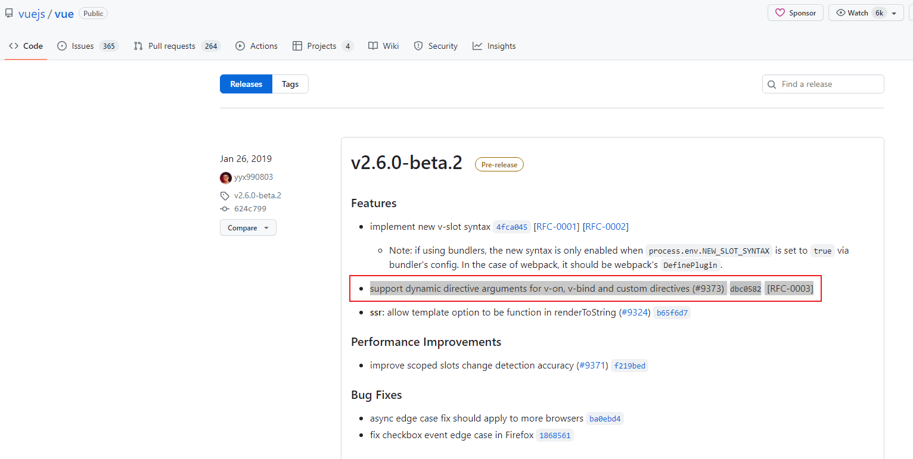

# vue用v-on动态绑定事件名需要2.6以上版本才有效

vue 项目中需要在子组件中动态接收父组件传递的事件名来监听，直接用 v-on 或者 @ 符号加上中括号[]动态绑定事件名是可以实现的，一个简单的 demo 如下：

```vue
<template>
  <!-- <div v-on:[eventName]="handleEvent">动态事件</div> -->
  <div @[eventName]="handleEvent">动态事件</div>
</template>
<script>
export default {
  data() {
    return {
      eventName: 'click',
    }
  },
  methods: {
    handleEvent(e) {
      console.log(e)
    }
  }
}
</script>
```
之前在 iview 的一个项目中这样使用是没问题的，换到 element-ui 的项目中发现上面的写法就是不生效，开始还以为是 UI 框架的问题，最后不断切换 vue 的版本才发现了问题的根源。

不生效的 element-ui 项目中 vue 版本是 2.5.2，生效的 iview 项目中 vue 版本是 2.6.7，不断切换 vue 版本才发现需要 2.6.0 以上版本才支持动态绑定事件名。

最终在 vue 官方的版本更新日志里也找到了答案：v2.6.0-beta.2 - support dynamic directive arguments for v-on, v-bind and custom directives，v2.6.0-beta.2版本才开始支持动态绑定事件名和属性名。



翻看 vue 2.6 版本的源码，找到的几个相关的方法：

#### processAttrs 方法
```js
// vue\src\compiler\parser\index.js
function processAttrs (el) {
  const list = el.attrsList
  let i, l, name, rawName, value, modifiers, syncGen, isDynamic
  for (i = 0, l = list.length; i < l; i++) {
    name = rawName = list[i].name
    value = list[i].value
    if (dirRE.test(name)) {
      // mark element as dynamic
      el.hasBindings = true
      // modifiers
      modifiers = parseModifiers(name.replace(dirRE, ''))
      // support .foo shorthand syntax for the .prop modifier
      if (process.env.VBIND_PROP_SHORTHAND && propBindRE.test(name)) {
        (modifiers || (modifiers = {})).prop = true
        name = `.` + name.slice(1).replace(modifierRE, '')
      } else if (modifiers) {
        name = name.replace(modifierRE, '')
      }
      if (bindRE.test(name)) { // v-bind
        name = name.replace(bindRE, '')
        value = parseFilters(value)
        isDynamic = dynamicArgRE.test(name)
        if (isDynamic) {
          name = name.slice(1, -1)
        }
        if (
          process.env.NODE_ENV !== 'production' &&
          value.trim().length === 0
        ) {
          warn(
            `The value for a v-bind expression cannot be empty. Found in "v-bind:${name}"`
          )
        }
        if (modifiers) {
          if (modifiers.prop && !isDynamic) {
            name = camelize(name)
            if (name === 'innerHtml') name = 'innerHTML'
          }
          if (modifiers.camel && !isDynamic) {
            name = camelize(name)
          }
          if (modifiers.sync) {
            syncGen = genAssignmentCode(value, `$event`)
            if (!isDynamic) {
              addHandler(
                el,
                `update:${camelize(name)}`,
                syncGen,
                null,
                false,
                warn,
                list[i]
              )
              if (hyphenate(name) !== camelize(name)) {
                addHandler(
                  el,
                  `update:${hyphenate(name)}`,
                  syncGen,
                  null,
                  false,
                  warn,
                  list[i]
                )
              }
            } else {
              // handler w/ dynamic event name
              addHandler(
                el,
                `"update:"+(${name})`,
                syncGen,
                null,
                false,
                warn,
                list[i],
                true // dynamic
              )
            }
          }
        }
        if ((modifiers && modifiers.prop) || (
          !el.component && platformMustUseProp(el.tag, el.attrsMap.type, name)
        )) {
          addProp(el, name, value, list[i], isDynamic)
        } else {
          addAttr(el, name, value, list[i], isDynamic)
        }
      } else if (onRE.test(name)) { // v-on
        name = name.replace(onRE, '')
        isDynamic = dynamicArgRE.test(name)
        if (isDynamic) {
          name = name.slice(1, -1)
        }
        addHandler(el, name, value, modifiers, false, warn, list[i], isDynamic)
      } else { // normal directives
        name = name.replace(dirRE, '')
        // parse arg
        const argMatch = name.match(argRE)
        let arg = argMatch && argMatch[1]
        isDynamic = false
        if (arg) {
          name = name.slice(0, -(arg.length + 1))
          if (dynamicArgRE.test(arg)) {
            arg = arg.slice(1, -1)
            isDynamic = true
          }
        }
        addDirective(el, name, rawName, value, arg, isDynamic, modifiers, list[i])
        if (process.env.NODE_ENV !== 'production' && name === 'model') {
          checkForAliasModel(el, value)
        }
      }
    } else {
      // literal attribute
      if (process.env.NODE_ENV !== 'production') {
        const res = parseText(value, delimiters)
        if (res) {
          warn(
            `${name}="${value}": ` +
            'Interpolation inside attributes has been removed. ' +
            'Use v-bind or the colon shorthand instead. For example, ' +
            'instead of <div id="{{ val }}">, use <div :id="val">.',
            list[i]
          )
        }
      }
      addAttr(el, name, JSON.stringify(value), list[i])
      // #6887 firefox doesn't update muted state if set via attribute
      // even immediately after element creation
      if (!el.component &&
          name === 'muted' &&
          platformMustUseProp(el.tag, el.attrsMap.type, name)) {
        addProp(el, name, 'true', list[i])
      }
    }
  }
}
```

#### addHandler 方法
```js
// vue\src\compiler\helpers.js
export function addHandler (
  el: ASTElement,
  name: string,
  value: string,
  modifiers: ?ASTModifiers,
  important?: boolean,
  warn?: ?Function,
  range?: Range,
  dynamic?: boolean
) {
  modifiers = modifiers || emptyObject
  // warn prevent and passive modifier
  /* istanbul ignore if */
  if (
    process.env.NODE_ENV !== 'production' && warn &&
    modifiers.prevent && modifiers.passive
  ) {
    warn(
      'passive and prevent can\'t be used together. ' +
      'Passive handler can\'t prevent default event.',
      range
    )
  }

  // normalize click.right and click.middle since they don't actually fire
  // this is technically browser-specific, but at least for now browsers are
  // the only target envs that have right/middle clicks.
  if (modifiers.right) {
    if (dynamic) {
      name = `(${name})==='click'?'contextmenu':(${name})`
    } else if (name === 'click') {
      name = 'contextmenu'
      delete modifiers.right
    }
  } else if (modifiers.middle) {
    if (dynamic) {
      name = `(${name})==='click'?'mouseup':(${name})`
    } else if (name === 'click') {
      name = 'mouseup'
    }
  }

  // check capture modifier
  if (modifiers.capture) {
    delete modifiers.capture
    name = prependModifierMarker('!', name, dynamic)
  }
  if (modifiers.once) {
    delete modifiers.once
    name = prependModifierMarker('~', name, dynamic)
  }
  /* istanbul ignore if */
  if (modifiers.passive) {
    delete modifiers.passive
    name = prependModifierMarker('&', name, dynamic)
  }

  let events
  if (modifiers.native) {
    delete modifiers.native
    events = el.nativeEvents || (el.nativeEvents = {})
  } else {
    events = el.events || (el.events = {})
  }

  const newHandler: any = rangeSetItem({ value: value.trim(), dynamic }, range)
  if (modifiers !== emptyObject) {
    newHandler.modifiers = modifiers
  }

  const handlers = events[name]
  /* istanbul ignore if */
  if (Array.isArray(handlers)) {
    important ? handlers.unshift(newHandler) : handlers.push(newHandler)
  } else if (handlers) {
    events[name] = important ? [newHandler, handlers] : [handlers, newHandler]
  } else {
    events[name] = newHandler
  }

  el.plain = false
}
```

#### genHandlers 方法
```js
// vue\src\compiler\codegen\events.js
export function genHandlers (
  events: ASTElementHandlers,
  isNative: boolean
): string {
  const prefix = isNative ? 'nativeOn:' : 'on:'
  let staticHandlers = ``
  let dynamicHandlers = ``
  for (const name in events) {
    const handlerCode = genHandler(events[name])
    if (events[name] && events[name].dynamic) {
      dynamicHandlers += `${name},${handlerCode},`
    } else {
      staticHandlers += `"${name}":${handlerCode},`
    }
  }
  staticHandlers = `{${staticHandlers.slice(0, -1)}}`
  if (dynamicHandlers) {
    return prefix + `_d(${staticHandlers},[${dynamicHandlers.slice(0, -1)}])`
  } else {
    return prefix + staticHandlers
  }
}
```