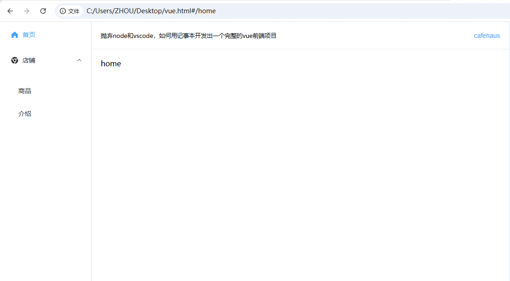

# 抛弃node和vscode，如何用记事本开发出一个完整的vue前端项目

写这篇文章的初衷并不是要大家真的不用node和vscode，说实话前端发展成今天这样，在实际开发中确实离不开node和vscode这类工具了，但往往工具用多了我们自己也成了一个工具人！


### 这篇文章的缘由
最近在开发wordpress插件的时候，需要在插件中生成一个wordpress网站前端页面，按照wordpress的开发路径，是需要在php代码中来动态拼装页面html代码，然后你会发现整个页面的php代码文件中有：php代码、javascript、html、css，可谓眼花缭乱，大部分逻辑就是php中混合着写javascript，写着很别扭也完全没有啥可读性。

然后发现其实可以换一种实现路径，直接用vue开发出一个html页面，php中直接返回这个html文件就可以了，开发时比较好调试，后期也比较好维护，各种效果功能也都能实现。

我们平时vue、react用多了，离开了框架、node、npm、vscode这些好像就不会写代码了，于是就有了这篇抛弃node和vscode，只依赖电脑自带的记事本工具来开发出一个完整的vue3前端项目。

### 前端的本质是html
试想一下如果离开了node、webpack、vite、vue-cli…这些工具，你还能开发出一个完整的前端项目吗？

哪怕是日常工作中用vue、react写代码，但我们最终的产物依然是html文件，各种打包工具、编译工具只不过让我们的开发过程更高效，代码更好维护而已。

比如因为某种特殊情况我们拿到的电脑上没法安装任何第三方工具，或者我们想快速实现一个想法、开发出某个功能，如果还是按照正常的开发路径先来安装各种前端环境，然后初始化一个vue项目…等我们做完这些半天、1天就过去了。

想一想没有vue之前我们是怎么开发前端页面的，记事本就可以直接编写出html，浏览器也是电脑自带的能给我们开发调试的天然环境，前端的本质就是编写出一个html而已。

### 用记事本能开发出vue项目吗？
我们先来看一下一般一个完整的vue项目需要的一些东西：
- 能使用 vue 的语法开发
- vue-router 路由管理
- 引入第三方组件库
- 全局状态管理
- 发送http请求

似乎有上面这些东西，我们日常前端开发中要实现的一些功能都能够开发出来了，所以这里我们就以上面的这些为准来实现。

但是平常我们开发vue都是需要先用脚手架初始化出项目，然后 npm install 安装项目需要的依赖，接着 npm run 编译打包让项目运行起来。但靠一个记事本似乎没办法完成这些工作，不过我们这里换一种平常不常用的开发方式来实现，在 vue 官方的文档上也是有说明的，并且还有示例：

```html
<script src="https://unpkg.com/vue@3/dist/vue.global.js"></script>
<div id="app">{{ message }}</div>
<script>
  const { createApp, ref } = Vue
  createApp({
    setup() {
      const message = ref('Hello vue!')
      return {
        message
      }
    }
  }).mount('#app')
</script>
```

就是通过第三方 cdn 直接全局引入 vue，然后我们就可以在一个 html 文件中来用 vue 开发。你可能会觉得上面的示例太简单了，上面还有那么多功能能这样全部实现出来吗？答案是肯定的。

既然 vue 可以通过 cdn 的方式引入，其他的 vue-router、组件库 element-ui、状态管理 vuex、发送请求 axios...也都是可以通过 cdn 的方式来引入使用的，不过像状态管理本身我们就可以用原生的 localStorage、sessionStorage 来代替，发送请求也可以通过原生的 fetch 来实现，所以为了避免引入太多依赖这两个我们就直接用原生支持的来实现就好了。

### 完整的 vue 项目代码
实现以上功能的完整代码如下，实际就是一个单独的 html 文件，然后我们可以直接复制文件路径到浏览器中打开运行调试的，里面的内容你确实也可以直接通过记事本来打开编辑，保存后刷新下浏览器也就能看到最新的页面效果：



```html
<!DOCTYPE html>
<html lang="en">

<head>
  <meta charset="UTF-8">
  <meta name="viewport" content="width=device-width, initial-scale=1.0">
  <title>cafehaus</title>
  <!-- Vue3 -->
  <script src="https://unpkg.com/vue@3"></script>
  <!-- Vue Router -->
  <script src="https://unpkg.com/vue-router@4"></script>
  <!-- element-ui 样式 -->
  <link rel="stylesheet" href="https://unpkg.com/element-plus/dist/index.css">
  <!-- element-ui 组件库 -->
  <script src="https://unpkg.com/element-plus"></script>
  <!-- element-ui 图标 -->
  <script src="https://unpkg.com/@element-plus/icons-vue"></script>
</head>

<body>
  <div id="app">
    <el-container class="layout">
      <el-aside width="200px">
        <el-scrollbar>
          <el-menu router :default-active="defaultMenuActive">
            <template v-for="(item, index) in menuList" :key="index">
              <template v-if="!item.children || !item.children.length">
                <el-menu-item :index="item.path" :route="item.path">
                  <el-icon v-if="item.icon"><component :is="item.icon"></component></el-icon>
                  <template #title>{{ item.title }}</template>
                </el-menu-item>
              </template>
              <template v-else>
                <el-sub-menu :index="index + ''">
                  <template #title>
                    <el-icon v-if="item.icon"><component :is="item.icon"></component></el-icon>{{ item.title }}
                  </template>
                  <el-menu-item-group>
                    <template v-for="(itm, idx) in item.children" :key="idx">
                      <el-menu-item :index="itm.path" :route="itm.path">
                        <template #title>{{ itm.title }}</template>
                      </el-menu-item>
                    </template>
                  </el-menu-item-group>
                </el-sub-menu>
              </template>
            </template>
          </el-menu>
        </el-scrollbar>
      </el-aside>

      <el-container>
        <el-header>
          <span>抛弃node和vscode，如何用记事本开发出一个完整的vue前端项目</span>
          <el-button type="text" @click="handleNavigate('/home')">cafehaus</el-button>
        </el-header>

        <el-main>
          <el-scrollbar>
            <router-view></router-view>
          </el-scrollbar>
        </el-main>
      </el-container>
    </el-container>
  </div>
</body>
</html>

<script>
  // 1. 创建 vue 实例
  const app = Vue.createApp({
    data() {
      return {
        menuList: [
          { title: '首页', icon: 'home-filled', path: '/home' },
          {
            title: '店铺',
            icon: 'chrome-filled',
            children: [
              { title: '商品', path: '/goods' },
              { title: '介绍', path: '/about' },
            ]
          }
        ],
      }
    },
    computed: {
      defaultMenuActive() {
        const { meta, path } = this.$route
        if (meta.activeMenu) {
          return meta.activeMenu
        }
        return path
      }
    },
    methods: {
      handleNavigate(path) {
        this.$router.push({
          path
        })
      },

      // 发送 http 请求获取用户信息
      getUserInfo() {
        this.sendRequest('/user', { userId: '123' })
          .then(data => console.log(data))
          .catch(error => console.error(error))
      },

      // 发送请求 fetch 公共方法封装
      sendRequest(path, params = {}, method = 'GET') {
        let url = 'https://cafe123.cn' + path
        let options = {
          method: method,
          headers: {
              'Content-Type': 'application/json'
          }
        }

        if (method === 'GET') {
          const queryParams = new URLSearchParams(params).toString();
          if (queryParams) {
            url += '?' + queryParams
          }
        } else if (method === 'POST' || method === 'PUT' || method === 'PATCH') {
          options.body = JSON.stringify(params)
        }

        return fetch(url, options)
          .then(response => {
            if (!response.ok) {
              throw new Error(`HTTP error! status: ${response.status}`)
            }
            return response.json()
          })
          .catch(error => {
            console.error('fetch error:', error)
            throw error
        })
      }
    }
  })

  // 2.1 创建自定义组件对象
  const MyComp = {
    template: `
      <div style="height:40px;background:#57bc78;">
        {{ name }}，{{ message }}
        <el-button @click="changeMessage">Click me</el-button>
      </div>
    `,
    props: {
      name: {
        type: String,
        default: ''
      }
    },
    data() {
      return {
          message: "我是message"
      }
    },
    methods: {
      changeMessage() {
          this.message = new Date().getTime()
      }
    }
  }
  const Home = {
    template: `
      <div>
        home
      </div>
    `,
  }
  const About = {
    template: `
      <div>
        about
      </div>
    `,
  }
  const Goods = {
    template: `
      <div>
        goods
      </div>
    `,
  }
  // 2.2 生成路由表
  const routes = [
    { path: '/home', component: Home },
    { path: '/about', component: About },
    { path: '/goods', component: Goods },
  ]
  // 2.3 创建 router 实例
  const router = VueRouter.createRouter({
    history: VueRouter.createWebHashHistory(),
    routes,
  })
  // 2.4 全局注册自定义组件
  app.component('my-comp', MyComp)
  app.component('home', Home)
  app.component('about', About)
  app.component('goods', Goods)
  // 2.5 使用 vue-router
  app.use(router)

  // 3.1 使用 element-ui 组件
  app.use(ElementPlus)
  // 3.2 注册 element-ui 中的图标组件
  for (const [key, component] of Object.entries(ElementPlusIconsVue)) {
    app.component(key, component)
  }

  // 4. 将 vue 应用实例挂载到页面节点上
  app.mount('#app')
</script>

<style>
body,
div {
  padding: 0;
  margin: 0;
}

.layout {
  height: 100vh
}

.layout .el-scrollbar,
.layout .el-scrollbar__view,
.layout .el-menu {
  height: 100%;
}

.layout .el-header {
  border-bottom: 1px solid #EEE;
  display: flex;
  align-items: center;
  justify-content: space-between;
  font-size: 13px;
}
</style>
```

需要注意的几个地方：
- 本地用 file 协议在浏览器中打开 html 文件，路由需要用 createWebHashHistory
- element-ui 组件库的图标组件需要单独引入和注册
- element-ui 的 menu 菜单组件需要在 computed 中设置下 default-active，否则通过路由跳转或者刷新页面不会保持菜单的选中状态
- 想要直接在 id 为 app 的 div 下全局使用的组件，都需要自己用 app.component 全局注册，局部组件可以直接定义在对应组件的 components 中

### 用 node 将 html 部署到服务器上
上面我们开发好的完整 vue 项目其实就是一个 html 文件，在本地我们可以直接在浏览器中打开，但是如果想要给其他人展示效果，那就需要部署到服务器上。其实要部署到服务器上也很简单，什么 npm、docker、jenkins、express、nginx...这些通通都不需要，只需要依赖 node 就可以了（需要提前在服务器上安装好 node），然后用 node 自带的 http 库就可以启动一个服务器了。

#### 1、进入服务器上新建目录
在服务器中 /data 目录中找个地方新建一个目录，比如我们这里就叫 node-demo
```shell
mkdir node-demo
```

#### 2、新建 index.html 文件
在 node-demo 目录下新建 index.html 文件
```shell
# 1. 进入目录
cd node-demo

# 2. 新建文件
touch index.html

# 3. 编辑文件
vim index.html

# 4. 在键盘上输入 i 进入编辑模式
# 5. 按 ctrl + v 粘贴进去你本地 html 文件中的所有内容
# 6. 按键盘上的 Esc 退出编辑模式
# 7. 输入 :wq 保存文件
```

#### 3、新建 server.js 文件
在 node-demo 目录下新建 server.js 文件
```shell
# 1. 新建文件
touch server.js

# 2. 编辑文件
vim server.js

# 3. 在键盘上输入 i 进入编辑模式
# 4. 按 ctrl + v 粘贴进去下方 server.js 文件中的内容
# 5. 按键盘上的 Esc 退出编辑模式
# 6. 输入 :wq 保存文件
```

server.js
```javascript
/**
 * 原生 node 服务器脚本
 *
 * @author cafehaus
 * @date 2025-01-18
 */
const http = require('node:http')
const fs = require('node:fs')
const path = require('node:path')

const hostname = '127.0.0.1'
const port = 3000

const server = http.createServer((req, res) => {
  fs.readFile(path.join(__dirname, 'index.html'), (err, data) => {
    if (err) {
      res.statusCode = 500
      res.setHeader('Content-Type', 'text/plain')
      res.end('Error loading index.html')
    } else {
      res.statusCode = 200
      res.setHeader('Content-Type', 'text/html')
      res.end(data)
    }
  })
})

server.listen(port, hostname, () => {
  console.log(`Server running at http://${hostname}:${port}/`)
})
```

#### 4、启动 node 服务
在当前目录下输入命令：
```shell
node server.js
```

这样就成功在 3000 端口上启动了服务，注意在电脑上访问或分享给别人时，地址中的 127.0.0.1 这个 ip 要换成你服务器的 ip，在浏览器中打开就可以访问到我们开发的这个 vue 前端页面了，是不是很简单，主打的就是一个快速省事效率第一。

本文的目的并不是让大家放弃 node 和 vscode，也不是让大家日常中就真的用上面的方式来开发，上面提供的完整模板基本囊括了前端中常用的一些东西，可以用来帮助我们简单快速地搭建出前端页面，快速实现我们的一些想法。
