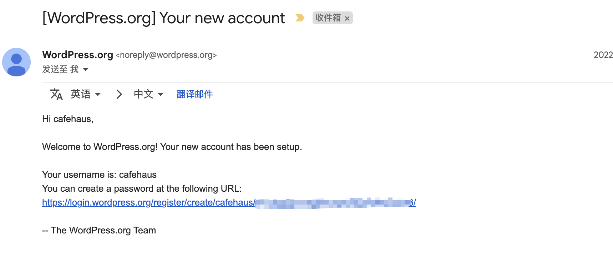
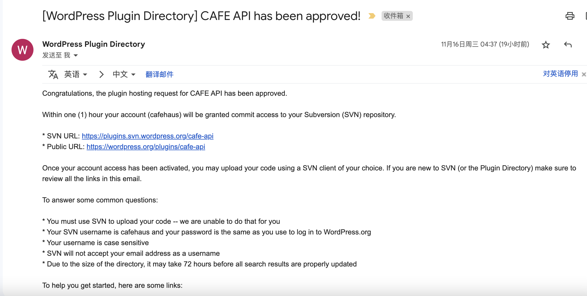
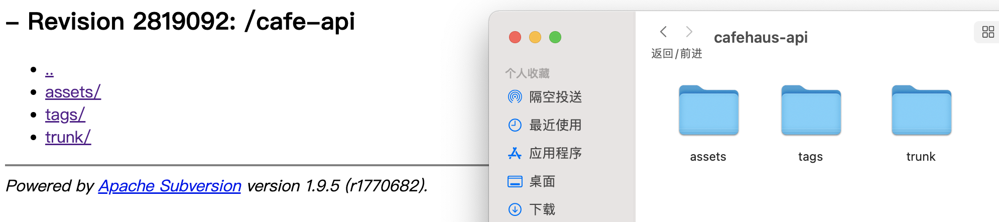
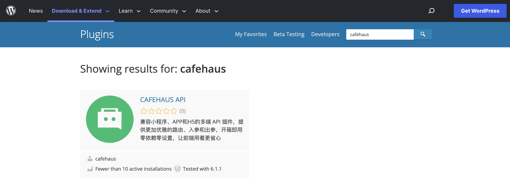

# 开发和发布自己的wordpress插件到官方插件库完全指南

wordpress是一款很流行的开源博客程序，全世界有很多网站都在使用wordpress，程序员们也喜欢拿来做自己的技术博客，对于自己不满意的地方，那肯定也需要自己动手来修改了，下面就介绍从开发到发布一个wordpress插件的完整流程。

## 开发wordpress插件

要开发一款wordpress插件其实只需要两点就可以动手了，只要动起手来了就发现其实没那么难，很多时候我们只是自己把自己困在了一个小屋子里：

* 需要有一点PHP编程基础，如果不会PHP也没关系，比如有JavaScript基础或其他语言基础也是没问题的，语言都是相通的，无非就是实现的细节上有差异，逻辑思想都是一样的，都是变量、数据类型、条件判断、循环、方法、类、模块...这些东西，具体的语法用到了再去查文档就行。
* 有一定英文能力，能看懂wordpress的开发文档

主要参考[WordPress Developers](https://developer.wordpress.org)和[REST API Handbook](https://developer.wordpress.org/rest-api)这两个文档，wordpress官方有提供很多方法可以直接供我们调用。

## 注册开发者账号

如果想要将自己开发的插件发布到wordpress官方插件库里，那首先需要去 [WordPress Developers](https://developer.wordpress.org) 这里注册一个账号。

有几个关键的点需要注意：

* 不要用国内的 QQ 邮箱这些，收不到验证邮件的，亲测用谷歌邮箱注册成功
* 填写好了信息提交注册一直没反应，wordpress的注册流程里有去请求谷歌的一个接口，所以你需要自己想办法科学一下
* 注册邮箱和名字不能重复，已经被注册了的不能再注册，如果注册邮箱和名字还在审核中，也是不能用的，需要等待一周后注册未完成释放了，才可以继续用之前的邮箱和名字

如果有不知道的地方，可以直接给官方的注册帮助邮箱发邮件咨询，邮箱地址 forum-password-resets@wordpress.org，可以直接用QQ邮箱发送和接收都是没问题，而且老外其实都很 nice 的，有啥问题人都很耐心地回复你。

账号注册审核可能刚开始不会给你通过，但是会给你回邮件说明，还会询问你注册账号的用途啥啥的，你直接回复自己开发了一款wordpress插件，想要发布到官方插件库，所以需要注册一个账号。据说是以前开发注册被搞了很多垃圾账号，现在就要人工审核而且也严格了。

审核通过了会给你邮箱里发送一封邮件，然后里面有一个地址，让你去设置密码：



## 提交插件审核

用上面注册的账号登录到 wordpress 开发者后台，在这里 https://wordpress.org/plugins/developers/add/ 提交你的插件。

然后会不断给你发邮件告诉你插件存在的问题，怎么修改，自己按照要求修改就可以了，主要注意里面的一些格式，还有名字不要用比较出名的品牌名、wordpress这些，所有修改要求在3个月之内完成，否则你的插件就被拒了。

## 上传插件到wordpress的svn地址

插件审核通过了会给发送过来代码上传的svn地址和一些要求，按照要求上传代码、封面图和icon图标到 svn 地址上。



打开 svn 地址会发现里面有3个目录：

* trunk：存放代码
* assets：存放banner和icon图
* tags：用来发布各版本



### 上传插件代码

把插件文件放到 trunk 目录中，然后提交并推送到 svn

```bash
cd '你的插件目录'

svn add trunk/*

svn ci -m 'add first version of my plugin'  --username '你的开发者账号登录名' --password '你的开发者账号登录密码'
```

### 发布插件版本

wordpress插件发布新版本，需要先打一个tag后才能发布，会自动在 tags 目录下生成文件，svn的操作如下：

```bash
svn cp trunk tags/1.0.0
svn ci -m "tagging version 1.0.0"
```

### 添加 bannner 和 icon 图

最后还需要上传一个插件列表的 icon 图和插件详情的 banner 图，可以参考文档上的要求 https://developer.wordpress.org/plugins/wordpress-org/plugin-assets/，注意大小和命名：

* banner-772x250.png
* icon-256x256.png

```bash
svn add assets/*

svn ci -m "add banner and icon"
```

通常上传了过一会就可以在wordpress官方插件库里搜到了，如果搜不到就再等等。

